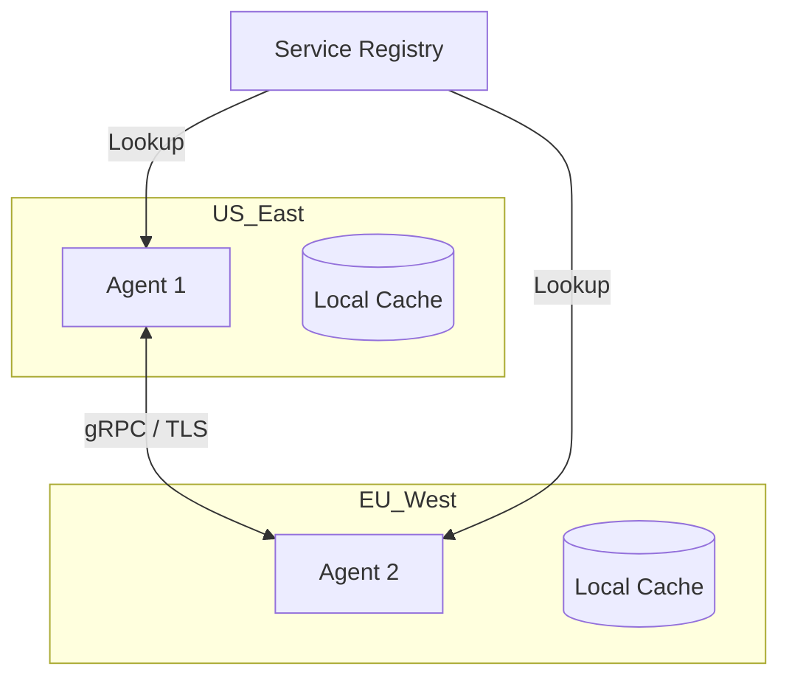

# 🌐 Distributed Agent Systems: Computing Without Borders
> **Level:** Advanced | **Language:** Hinglish | **Goal:** Master the engineering of agentic systems that run across multiple servers, regions, and cloud providers.

---

## 🧭 1. Beginner-friendly Hinglish Explanation
Distributed Agent System ka matlab hai agents ka "Alag-alag computers" par rehna. Sochiye ek agent India ke server par hai, ek USA ke, aur ek Europe ke. Ye teeno milkar kaam karte hain. Agar ek server down bhi ho jaye, toh baaki do kaam karte rahenge. Ye bilkul ek "Global Team" ki tarah hai jo internet ke zariye connected hai. Isme sabse bada challenge hota hai agents ke beech ka "Sync" aur "Speed" maintain karna kyunki data ko samundar paar (Undersea cables) travel karna padta hai.

---

## 🧠 2. Deep Technical Explanation
Distributed systems for agents require specialized infrastructure:
1. **Service Discovery:** Agents must be able to "Find" each other (e.g., using Consul or etcd).
2. **Network Partitioning:** Handling the **CAP Theorem** (Consistency, Availability, Partition Tolerance). Agents must decide if they should keep working even if they lose connection to the master server.
3. **RPC (Remote Procedure Call):** Using gRPC or JSON-RPC to allow Agent A (Server 1) to trigger a tool on Agent B (Server 2).
4. **Clock Sync:** Ensuring all agents agree on the order of events using NTP or Logical Clocks (Lamport Clocks).

---

## 🏗️ 3. Real-world Analogies
Distributed Agent System ek **International Airport** ki tarah hai.
- Flight control (Master) ek jagah hai.
- Ground staff (Worker) har gate par hain.
- Fueling team (Data) alag hai.
Sab alag-alag computers/locations par hain par "Network" (Radio/Internet) se ek hi goal achieve kar rahe hain.

---

## 📊 4. Architecture Diagrams (The Multi-Region Mesh)


---

## 💻 5. Production-ready Examples (The gRPC Definition)
```python
# 2026 Standard: Defining a Remote Agent Interface
# agent.proto
"""
service AgentService {
  rpc ExecuteTask (TaskRequest) returns (TaskResponse);
  rpc Heartbeat (Ping) returns (Pong);
}
"""

# Server side
def ExecuteTask(request):
    # Logic to run agent task locally
    return TaskResponse(status="DONE", output="...")
```

---

## ❌ 6. Failure Cases
- **The Split-Brain Problem:** Network cut hone ki wajah se do groups ban gaye, aur dono group ko laga ki wo "Leader" hain. Isse duplicate actions aur data corruption ho sakta hai.
- **Latency Spikes:** Agent A ko Agent B ka reply aane mein 5 second lag gaye, jisse user ka experience kharab ho gaya.

---

## 🛠️ 7. Debugging Section
- **Symptom:** Agent A says Agent B is dead, but Agent B is actually alive.
- **Check:** **Network Latency and Timeouts**. Shayad network slow hai isliye health check fail ho raha hai. Check your **Distributed Tracing** (Jaeger) to see kahan delay aa raha hai.

---

## ⚖️ 8. Tradeoffs
- **Reliability vs Complexity:** Distributed system kabhi crash nahi hota par use setup aur debug karna 100x mushkil hai ek single server system se.

---

## 🛡️ 9. Security Concerns
- **Man-in-the-Middle (MITM):** Servers ke beech ka data intercept hona. Always use **Mutual TLS (mTLS)** jahan dono servers ek dusre ke certificate verify karein.

---

## 📈 10. Scaling Challenges
- Millions of agents ke beech consistency maintain karna impossible hai. Use **Eventual Consistency** patterns.

---

## 💸 11. Cost Considerations
- **Egress Costs:** Data transfer between cloud regions (e.g., AWS US to EU) mehenga hota hai. Try to keep "Chatty Agents" in the same region.

---

## ⚠️ 12. Common Mistakes
- Hardcoded IP addresses use karna (Use Service Names/DNS).
- Network failures ko handle na karna (Always assume the network will fail).

---

## 📝 13. Interview Questions
1. What is the CAP Theorem and how does it apply to distributed multi-agent systems?
2. How do you handle 'Clock Drift' when logging agent events across servers?

---

## ✅ 14. Best Practices
- Use a **Message Queue** (like Kafka) as the backbone for distributed communication.
- Implement **Circuit Breakers** to stop sending requests to a failing server.

---

## 🚀 15. Latest 2026 Industry Patterns
- **Edge Agent Computing:** Agents jo user ke phone ya local router par chalte hain aur sirf "Final Results" cloud ko bhejte hain.
- **Sovereign Agent Meshes:** Fully decentralized agent networks that run on Peer-to-Peer (P2P) protocols without any central cloud.
