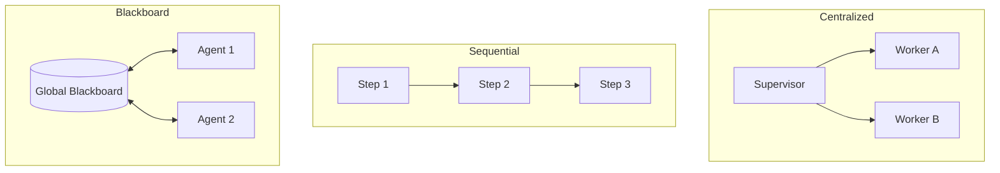

# 🧊 Multi-Agent Coordination Strategies: Orchestrating the Swarm
> **Level:** Advanced | **Language:** Hinglish | **Goal:** Master the different ways to control, synchronize, and lead a team of AI agents for maximum efficiency.

---

## 🧭 1. Beginner-Friendly Hinglish Explanation
Coordination ka matlab hai **"Management"**. 

- **The Problem:** Agar 5 agents ko bina rules ke ek saath chhod diya jaye, toh sab ek dusre se takrayenge ya same kaam baar-baar karenge.
- **The Solution:** Humein ek "System" chahiye jo bataye ki:
  - "Kab kiska turn hai?"
  - "Kise kya information milegi?"
  - "Final decision kaun lega?"

Coordination ek "Orchestra" ke conductor jaisa hai—sab instrument (agents) hain, par conductor (Strategy) unhe harmony mein rakhta hai.

---

## 🧠 2. Deep Technical Explanation
Multi-agent coordination is the process of managing **Inter-dependencies** between agent actions.

### 1. Centralized Coordination (The Supervisor):
- **Mechanism:** A single "Manager" agent manages the task list and assigns sub-tasks to workers.
- **Pros:** Full visibility, easy to debug.
- **Cons:** Single point of failure, manager can become a bottleneck.

### 2. Sequential Coordination (The Chain):
- **Mechanism:** Agents work in a fixed order ($A \to B \to C$).
- **Pros:** Predictable, low complexity.
- **Cons:** Rigid; if Agent A makes a mistake, B and C might follow it blindly.

### 3. Decentralized / Peer-to-Peer (The Mesh):
- **Mechanism:** Agents talk directly to each other and "Negotiate" who does what.
- **Pros:** Flexible, resilient.
- **Cons:** Hard to control, can lead to "Deadlocks".

### 4. Blackboard Coordination:
- **Mechanism:** All agents read from and write to a "Global Shared State" (The Blackboard).
- **Pros:** Great for asynchronous work.
- **Cons:** Requires strict data locking to prevent corruption.

---

## 🏗️ 3. Architecture Diagrams (Coordination Patterns)


---

## 💻 4. Production-Ready Code Example (A Sequential Chain with Validation)
```python
# 2026 Standard: Coordinating agents in a chain

class Coordinator:
    def run_chain(self, initial_task):
        # 1. Start with Research
        data = researcher.execute(initial_task)
        
        # 2. Pass to Analyst for validation
        validation = analyst.execute(data)
        
        if validation["is_valid"]:
            # 3. Pass to Writer
            return writer.execute(data)
        else:
            # 4. Loop back (Dynamic Coordination)
            return self.run_chain(f"Fix this data: {data}")

# Insight: Sequential chains work best for well-defined pipelines.
```

---

## 🌍 5. Real-World Use Cases
- **Autonomous Video Production:** Scriptwriter -> Voiceover -> Video Editor -> QA.
- **Financial Audit:** Data Extractor -> Risk Scorer -> Human-in-the-loop Reviewer -> Final Report.
- **Smart City Traffic:** Thousands of "Traffic Light" agents coordinating locally to reduce congestion.

---

## ❌ 6. Failure Cases
- **Priority Inversion:** A low-priority agent blocking a high-priority agent.
- **Lost Handoff:** Agent A finishes but Agent B never receives the "Start" signal.
- **Split Brain:** Two agents both think they have the authority to "Deploy to Production".

---

## 🛠️ 7. Debugging Guide
| Symptom | Cause | Fix |
| :--- | :--- | :--- |
| **System is 'Hanging'** | Deadlock between agents | Implement a **Global Heartbeat** that kills the process if no state change occurs for 60s. |
| **Agents are repetitive** | Shared state not updated | Ensure the **Blackboard** is updated *before* the next agent is triggered. |

---

## ⚖️ 8. Tradeoffs
- **Manager-led vs Self-organized:** Manager is safer; Self-organized is faster for creative tasks.
- **Synchronous vs Asynchronous:** Sync is easier to reason about; Async is $10x$ more efficient.

---

## 🛡️ 9. Security Concerns
- **Orchestration Hijacking:** If an attacker can inject a message into the "Coordinator", they can take over the entire swarm.
- **Byzantine Agents:** One agent in the team starts lying or giving wrong data to disrupt the coordination.

---

## 📈 10. Scaling Challenges
- **The "N-squared" Problem:** In a mesh, communication grows exponentially with the number of agents. **Solution: Group agents into 'Clusters'.**

---

## 💸 11. Cost Considerations
- **Coordination Tokens:** The "Supervisor" agent uses tokens just to manage others. Keep the supervisor's prompt **extremely lean**.

---

## 📝 12. Interview Questions
1. What is the difference between Centralized and Decentralized coordination?
2. How do you handle a "Deadlock" in a multi-agent system?
3. Explain the "Blackboard" pattern.

---

## ⚠️ 13. Common Mistakes
- **No Leader:** In a crisis, decentralized agents might fail to reach a consensus. Always have a "Tie-breaker" mechanism.
- **Hardcoded Order:** Not allowing the system to skip a step if it's already done.

---

## ✅ 14. Best Practices
- **Use LangGraph:** For complex state-machine based coordination.
- **State Checkpoints:** Save the state after every agent handoff.
- **Visual Tracing:** Use tools like **LangSmith** to see exactly how messages flowed between agents.

---

## 🚀 15. Latest 2026 Industry Patterns
- **Agentic Consensus Protocols:** Borrowing ideas from Blockchain (PoS/PoW) to ensure a swarm of agents agrees on a fact.
- **Meta-Orchestrators:** An AI that "Designs the coordination strategy" on the fly based on the problem.
- **Real-time Swarm Visualization:** 3D dashboards showing agents moving data and thoughts in real-time.
