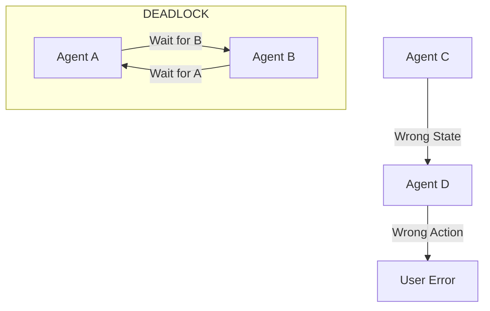

# ⚠️ Multi-Agent Failure Modes: Chaos in the Team
> **Level:** Advanced | **Language:** Hinglish | **Goal:** Master the identification and mitigation of failures that only occur when multiple agents interact.

---

## 🧭 1. Beginner-friendly Hinglish Explanation
Multi-Agent Failure ka matlab hai "Team ka bikharna". Sochiye aapne 5 logon ki team banayi, par sab ek doosre se lad rahe hain ya phir koi kisi ki sun nahi raha. Akela agent sirf "Hallucinate" kar sakta hai, par multi-agent system mein "Deadlocks" (System hang hona), "Race Conditions" (Data corrupt hona), aur "Feedback Loops" (Infinite chatting) jaise khatarnak problems aa sakte hain. Is section mein hum sikhayenge ki in team-level problems ko kaise rokein.

---

## 🧠 2. Deep Technical Explanation
Multi-agent failures are emergent and often hard to predict:
1. **Deadlock:** Agent A waits for Agent B's output, while Agent B waits for Agent A (Cyclic dependency).
2. **Livelock:** Agents keep changing their state in response to each other but make no progress (Infinite negotiation).
3. **Cascading Failure:** One specialized agent fails (e.g., Searcher), and because every other agent depends on it, the entire system crashes.
4. **State Inconsistency:** Two agents update the shared state simultaneously, causing "Lost Updates" or corrupted context.

---

## 🏗️ 3. Real-world Analogies
Multi-Agent Failure ek **Traffic Jam** ki tarah hai.
- Ek car (Agent) kharab nahi hai.
- Par sab itni bheed (Interaction) mein hain ki koi aage nahi badh paa raha. Ek galti poore shehar (System) ko rok deti hai.

---

## 📊 4. Architecture Diagrams (The Multi-Agent Crash)


---

## 💻 5. Production-ready Examples (Detecting Stagnation)
```python
# 2026 Standard: Monitoring Multi-Agent Progress
class Supervisor:
    def check_stagnation(self, history):
        # If the last 3 messages are identical or from the same agents
        # without changing the state, it's a livelock.
        if is_looping(history):
            print("Livelock detected! Forcing handoff to Human.")
            return "FORCE_ABORT"
        return "PROCEED"
```

---

## ❌ 6. Failure Cases
- **The Chatterbox Problem:** Agents aapas mein 50 messages exchange kar lete hain (Spending $10) sirf "Hi" aur "Hello" bolne mein.
- **Role Drift:** Ek agent doosre agent ki "Specialty" mein ghusne lagta hai, causing confusion.

---

## 🛠️ 7. Debugging Section
- **Symptom:** The system is running, but no response is sent to the user for 5 minutes.
- **Check:** **Trace Graphs**. Trace karein ki message kahan phansa hai. Most likely it's a deadlock or a slow API call in a sequential chain.

---

## ⚖️ 8. Tradeoffs
- **Isolation vs Coordination:** Zyada coordination matlab zyada risks. Kam coordination matlab kam intelligence.

---

## 🛡️ 9. Security Concerns
- **Agent Sabotage:** Ek compromised agent team mein "Wrong context" propagate kar sakta hai jise baaki agents "Truth" samajh kar execute kar dein (Poisoning the swarm).

---

## 📈 10. Scaling Challenges
- As N (number of agents) increases, the number of potential interaction failures increases exponentially ($N^2$).

---

## 💸 11. Cost Considerations
- Failures in multi-agent systems are expensive because multiple LLM calls are "Wasted" before the failure is detected. Use **Low-cost Guardrails**.

---

## ⚠️ 12. Common Mistakes
- **No Global Timeout:** Poore workflow ke liye timeout set na karna.
- **Ignoring logs:** Sirf final output dekhna, internal agent chatter ko ignore karna.

---

## 📝 13. Interview Questions
1. How do you detect and break a 'Deadlock' between two autonomous agents?
2. What is a 'Cascading Failure' and how do you prevent it in a distributed agent system?

---

## ✅ 14. Best Practices
- Every multi-agent system needs a **Supervisor/Watcher** that is NOT part of the worker pool.
- Implement **Health Checks** for every agent node.

---

## 🚀 15. Latest 2026 Industry Patterns
- **Chaos Engineering for Agents:** Automatically killing random agents in a team to see if the system can autonomously recover (Agent-level Netflix Chaos Monkey).
- **Consensus Monitors:** Systems jo detect karte hain agar agents "Agreement" par nahi pahunch paa rahe and automatically simplify the task.
