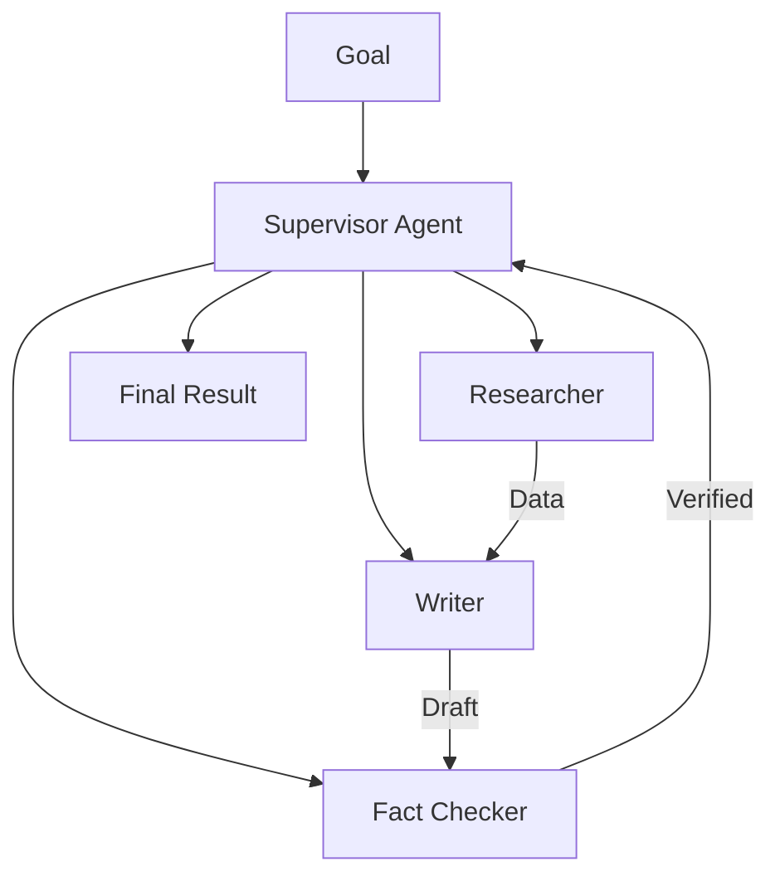

# 👥 Multi-Agent Fundamentals: The Power of Teams
> **Level:** Beginner | **Language:** Hinglish | **Goal:** Master the core principles of designing and managing systems where multiple specialized agents work together to solve a single complex task.

---

## 🧭 1. Beginner-friendly Hinglish Explanation
Multi-Agent Systems ka matlab hai "Specialists ki ek team banana". Sochiye aapko ek video game banana hai. Kya ek hi insaan coding, music, graphics, aur story likh sakta hai? Shayad, par results ache nahi honge. Isse behtar hai ki aap ek Coder, ek Artist, aur ek Musician rakhein. Multi-agent system mein bhi hum har agent ko ek **"Role"** dete hain. Ek search karta hai, ek code likhta hai, aur ek check karta hai. Jab ye sab milkar kaam karte hain, toh complex problems bahut jaldi aur accurately solve ho jati hain.

---

## 🧠 2. Deep Technical Explanation
Multi-agent systems (MAS) involve multiple autonomous entities interacting in a shared environment:
1. **Specialization:** Each agent has a specific Persona, System Prompt, and Toolset.
2. **Orchestration:** A central controller (Supervisor) or a decentralized protocol (Swarm) manages the workflow.
3. **Emergence:** Complex global behaviors emerge from simple local interactions between agents.
4. **Decoupling:** If the 'Coder' agent fails, the 'Researcher' agent can still provide data, making the system more resilient than a single massive agent.

---

## 🏗️ 3. Real-world Analogies
Multi-Agent System ek **Movie Production** ki tarah hai.
- **Director:** Supervisor Agent.
- **Cameraman:** Specialized Worker.
- **Actor:** Specialized Worker.
- **Editor:** Specialized Worker.
Koi bhi akele movie nahi bana sakta; sabka coordination zaroori hai.

---

## 📊 4. Architecture Diagrams (The Collaborative Team)


---

## 💻 5. Production-ready Examples (The Team Definition)
```python
# 2026 Standard: Defining a Multi-Agent Team
from crewai import Agent, Task, Crew

# Specialist 1: The Researcher
researcher = Agent(
    role="Market Analyst",
    goal="Find 2026 trends in AI",
    backstory="Expert in trend analysis"
)

# Specialist 2: The Writer
writer = Agent(
    role="Tech Blogger",
    goal="Write a post on trends",
    backstory="Professional tech writer"
)

# Coordination
crew = Crew(agents=[researcher, writer], tasks=[...])
```

---

## ❌ 6. Failure Cases
- **Role Confusion:** Do agents ek hi kaam karne ki koshish kar rahe hain (Duplicate effort).
- **Communication Overhead:** Agents aapas mein itni baat kar rahe hain ki tokens aur time waste ho raha hai bina progress ke.

---

## 🛠️ 7. Debugging Section
- **Symptom:** The final output is disconnected or lacks coherence.
- **Check:** **Shared Context**. Kya Writer ko pata hai Researcher ne kya dhoondha? Make sure your orchestrator (CrewAI/LangGraph) passes the state correctly between agents.

---

## ⚖️ 8. Tradeoffs
- **Precision vs Complexity:** Multi-agent systems smarter hote hain par unhe debug karna aur maintain karna 10x mushkil hai.

---

## 🛡️ 9. Security Concerns
- **Agent Impersonation:** Ek malicious agent team join karke galat data feed kar sakta hai. Use **Agent Authentication**.

---

## 📈 10. Scaling Challenges
- Scaling to 50+ agents creates a "Noise" problem. Use **Hierarchical Teams** (Teams of Teams) instead of one flat list.

---

## 💸 11. Cost Considerations
- Multi-agent calls are very expensive. Use **Small Models** (Llama-3-8B) for 80% of tasks and only use GPT-4o for the Manager.

---

## ⚠️ 12. Common Mistakes
- Agents ke roles ko overlap kar dena.
- Feedback loops na banana (Agent A finishes, Agent B reviews).

---

## 📝 13. Interview Questions
1. When should you use a Multi-Agent system instead of a single LLM with tools?
2. What is 'Emergent Behavior' in agent swarms?

---

## ✅ 14. Best Practices
- Every agent must have a **Clear and Unique Persona**.
- Use **Sequential or Parallel** workflows based on task dependencies.

---

## 🚀 15. Latest 2026 Industry Patterns
- **Agentic Mesh:** Dynamic multi-agent teams that assemble themselves based on the user's query.
- **LLM-as-a-Service Teams:** Standardized agent roles (e.g., "The Audit Agent") that can be hired by other agents across different platforms.
