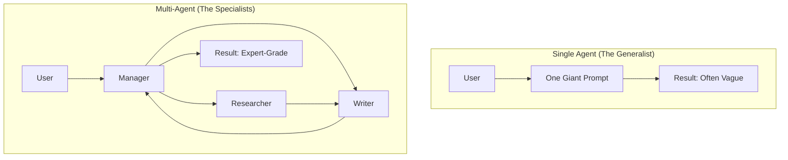

# 🤝 Multi-Agent Systems (MAS) Fundamentals: The Power of the Team
> **Level:** Fundamentals | **Language:** Hinglish | **Goal:** Master the core concepts of building networks of specialized agents that collaborate to solve complex problems.

---

## 🧭 1. Beginner-Friendly Hinglish Explanation
Multi-Agent System (MAS) ka matlab hai **"AI ki team"**.

- **The Problem:** Ek akela agent har cheez ka expert nahi ho sakta. Agar aap ek badi company chala rahe hain, toh aapko alag-alag departments chahiye (Sales, HR, Tech). 
- **The Solution:** MAS mein hum alag-alag agents banate hain aur unhe "Specialized Roles" dete hain.
  - Researcher Agent (Pahai karne wala).
  - Writer Agent (Likhne wala).
  - Critic Agent (Galthiyan nikaalne wala).
- **The Magic:** Jab ye teeno aapas mein baat karte hain, toh final output ek "Super-Expert" jaisa hota hai.

MAS ka main rule hai: **"Divide and Conquer"**.

---

## 🧠 2. Deep Technical Explanation
Multi-Agent Systems distribute cognitive workload, specialized knowledge, and tool access across a network of agents.

### 1. Key Components:
- **Agent Roles:** Distinct personas and system prompts (e.g., "The Cautious Auditor").
- **Communication Mesh:** The infrastructure for agents to pass messages.
- **Shared Context:** A "Blackboard" or "Global State" where agents read and write information.

### 2. Orchestration Patterns:
- **Sequential:** A -> B -> C (Pipeline).
- **Hierarchical:** A "Manager" oversees "Workers".
- **Collaborative Swarm:** Agents "Self-organize" based on availability and skill.

### 3. Emerging Intelligence:
A well-designed MAS is more than the sum of its parts. It reduces **"Model Bias"** because different agents can double-check each other's work.

---

## 🏗️ 3. Architecture Diagrams (Single vs Multi-Agent)


---

## 💻 4. Production-Ready Code Example (Defining a Team in CrewAI/AutoGen style)
```python
# 2026 Standard: Orchestrating a simple agent team

class Agent:
    def __init__(self, role, backstory, tools):
        self.role = role
        self.backstory = backstory
        self.tools = tools

# 1. Define Specialists
researcher = Agent(
    role="Academic Researcher",
    backstory="You are an expert at finding primary sources and verifying facts.",
    tools=["GoogleSearch", "ArxivSearch"]
)

writer = Agent(
    role="Technical Writer",
    backstory="You excel at simplifying complex data into readable reports.",
    tools=["FileWrite"]
)

# 2. Define the Interaction
def run_team(topic):
    data = researcher.do_work(f"Find 5 facts about {topic}")
    report = writer.do_work(f"Write a report based on this data: {data}")
    return report
```

---

## 🌍 5. Real-World Use Cases
- **Software Engineering:** One agent writes code, another writes tests, and a third runs the CI/CD pipeline.
- **Financial Analysis:** Different agents monitor different stock sectors and a "Portfolio Manager" agent decides on the trades.
- **Customer Support Swarms:** A "Triage Agent" routes complex queries to a "Technical Expert" and simple ones to an "Auto-responder".

---

## ❌ 6. Failure Cases
- **Communication Loops:** Two agents keep saying "Thank you" to each other forever. **Fix: Set a message limit.**
- **Persona Drift:** A "Writer" agent starts trying to "Research" instead of using the researcher's output.
- **Context Explosion:** Every agent sends its full history to everyone else, hitting the token limit.

---

## 🛠️ 7. Debugging Guide
| Symptom | Cause | Fix |
| :--- | :--- | :--- |
| **Output is inconsistent** | Agents have conflicting instructions | Use a **Unified System Instruction** for the whole team. |
| **Agents are idle** | No clear 'Next Step' | The Manager agent must explicitly say: "Agent B, it's your turn." |

---

## ⚖️ 8. Tradeoffs
- **Accuracy vs. Cost:** MAS is much more accurate but $5x-10x$ more expensive in tokens.
- **Complexity vs. Resilience:** Multi-agent systems are harder to build but don't "Crash" as easily as a single giant prompt.

---

## 🛡️ 9. Security Concerns
- **Internal Prompt Injection:** A rogue agent (or a compromised one) giving a "Bad Command" to its teammate.
- **Privilege Escalation:** A worker agent tricking a manager agent into revealing an API key.

---

## 📈 10. Scaling Challenges
- **Latency:** 10 agents running in sequence can take 2-3 minutes to finish a task. **Solution: Parallelize independent tasks.**

---

## 💸 11. Cost Considerations
- **Model Mixing:** Use **GPT-4o** for the Manager and **Llama-3-8B** for the Workers. This saves $80\%$ cost.

---

## 📝 12. Interview Questions
1. When should you use a Multi-Agent system instead of a single LLM call?
2. What is a "Supervisor" in MAS?
3. How do you handle "State Sharing" between multiple agents?

---

## ⚠️ 13. Common Mistakes
- **Over-Agentizing:** Making an agent for something that can be done with a 1-line Python function.
- **No Evaluation:** Not having an "Editor" agent to check the final team output.

---

## ✅ 14. Best Practices
- **Small, Specialized Tools:** Don't give every agent every tool.
- **Limit Inter-agent Chat:** Only allow agents to talk if they have something useful to share.
- **Structured Handshakes:** Use JSON for data passing between agents.

---

## 🚀 15. Latest 2026 Industry Patterns
- **Agentic Mesh:** Agents that "Find" each other via a service registry and form teams automatically.
- **Self-Healing Teams:** If Agent A fails, the Manager automatically spawns a different type of agent to try a new strategy.
- **Federated MAS:** Agents owned by different companies working together on a shared task without revealing their internal data.
