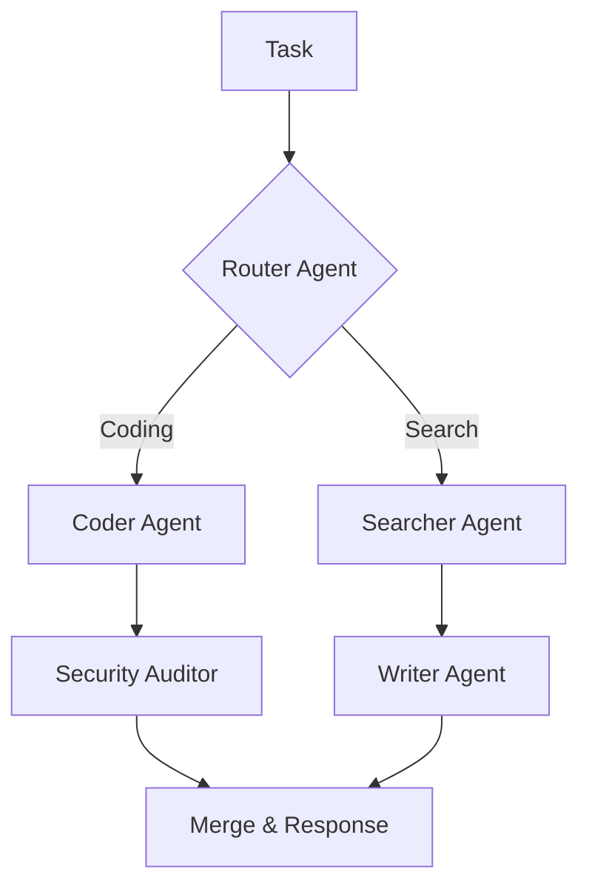

# 🎼 Orchestration Strategies: Managing the Symphony
> **Level:** Intermediate | **Language:** Hinglish | **Goal:** Master the different patterns for controlling the flow of tasks and information in a multi-agent system.

---

## 🧭 1. Beginner-friendly Hinglish Explanation
Orchestration ka matlab hai "Direction dena". Sochiye ek orchestra mein 50 log hain. Agar har koi apni marzi se bajane lage, toh sirf shor (noise) hoga. Isliye ek "Conductor" (Orchestrator) chahiye jo bataye ki kab kisko bajana hai. AI Agents mein Orchestration wahi "Logic" hai jo batata hai ki: Pehle Agent A kaam karega, fir uska result Agent B ke paas jayega, aur agar error aaye toh Agent C ke paas. Bina orchestration ke, multi-agent systems sirf chaos hain.

---

## 🧠 2. Deep Technical Explanation
Orchestration defines the topology and execution flow:
1. **Sequential Chain:** Agent A -> Agent B -> Agent C (Simple pipeline).
2. **Hierarchical (Manager-Worker):** A 'Manager' agent decomposes the task and assigns it to 'Worker' agents, then synthesizes the results.
3. **Cyclic (Iterative):** Agent A generates, Agent B reviews. If fails, back to A.
4. **DAG (Directed Acyclic Graph):** Complex workflows where tasks run in parallel based on dependencies (e.g., in LangGraph).
5. **Dynamic/Reactive:** The next agent is selected at runtime based on the previous agent's output.

---

## 🏗️ 3. Real-world Analogies
Orchestration ek **Restaurant Kitchen** ki tarah hai.
- **Head Chef (Orchestrator):** Order leta hai aur batata hai: "Tum sabji kaato, tum sauce banao".
- **Line Cooks (Agents):** Apna specialized kaam karte hain.
- **Final Plate (Output):** Head Chef check karke customer ko bhejta hai.

---

## 📊 4. Architecture Diagrams (The Workflow Mesh)


---

## 💻 5. Production-ready Examples (Graph-based Orchestration)
```python
# 2026 Standard: LangGraph Topology
from langgraph.graph import StateGraph, END

workflow = StateGraph(MyState)

# Add Nodes (Agents)
workflow.add_node("researcher", research_agent)
workflow.add_node("writer", writing_agent)

# Add Edges (Flow)
workflow.add_edge("researcher", "writer")
workflow.add_edge("writer", END)

# Compile
app = workflow.compile()
```

---

## ❌ 6. Failure Cases
- **The Bottleneck:** Ek slow agent poore system ko rok raha hai.
- **Lost Message:** Workflow phans gaya kyunki ek edge (connection) toot gaya ya state update nahi hui.

---

## 🛠️ 7. Debugging Section
- **Symptom:** The system is stuck in an infinite loop between Agent A and B.
- **Check:** **Termination Condition**. Kya loop ke paas "Exit" rasta hai? Har loop mein ek counter rakhein aur `max_iterations` ke baad force exit karein.

---

## ⚖️ 8. Tradeoffs
- **Centralized (Manager):** Easy to control but a single point of failure.
- **Decentralized (Swarm):** Hard to control but highly resilient.

---

## 🛡️ 9. Security Concerns
- **Orchestration Injection:** Agar user orchestrator ke logic ko manipulate kar sake (e.g., "Skip the auditor step"), toh unsafe actions execute ho sakte hain.

---

## 📈 10. Scaling Challenges
- Complex DAGs with 100+ nodes are hard to visualize and debug. Use **Sub-graphs** to modularize the workflow.

---

## 💸 11. Cost Considerations
- Router agents extra tokens consume karte hain. Simple cases mein hard-coded `if-else` logic use karein to save costs.

---

## ⚠️ 12. Common Mistakes
- Circular dependencies without exit logic.
- Har task ke liye manager agent use karna (Over-engineering).

---

## 📝 13. Interview Questions
1. What is the advantage of using a Graph (LangGraph) over a linear Chain for orchestration?
2. How do you handle 'State Persistence' in a long-running multi-agent workflow?

---

## ✅ 14. Best Practices
- Keep your agents **Atomic** (They should do one thing well).
- Always include a **Human-in-the-loop** node for critical decision points.

---

## 🚀 15. Latest 2026 Industry Patterns
- **Autonomous Orchestrators:** Agents jo runtime par khud apna graph design karte hain based on the complexity of the task.
- **Serverless Agent Workflows:** Deploying every agent as a Lambda function, orchestrated by an event-driven bus.
