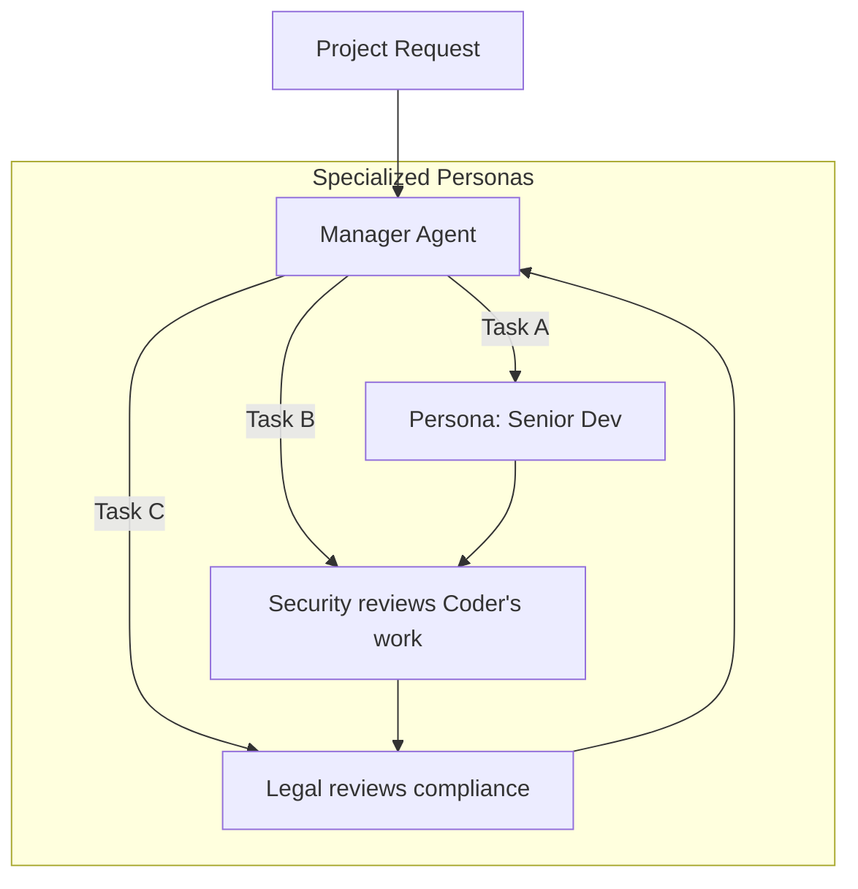

# 🎭 Role-Based Agent Assignment: The Specialist Pattern
> **Level:** Advanced | **Language:** Hinglish | **Goal:** Master the art of defining distinct personas and assigning specific responsibilities to agents within a team.

---

## 🧭 1. Beginner-Friendly Hinglish Explanation
Role-Based Assignment ka matlab hai **"Kise kya banna hai"**.

- **The Problem:** Agar aap AI ko bologe "Tum sab kuch ho," toh wo "Aadha-adhura" (Jack of all trades, master of none) ban jayega.
- **The Solution:** Humein har AI ko ek "Identity" deni padti hai.
  - "Tum ek **Senior Security Engineer** ho, tumhara kaam sirf vulnerabilities dhoondna hai."
  - "Tum ek **UX Designer** ho, tumhara kaam interface ko sundar banana hai."

Jab AI ko apna "Role" pata hota hai, toh uski "Attention" narrow ho jati hai aur quality $10x$ badh jati hai. Ye bilkul ek film ke cast jaisa hai—hero, villain, aur sidekick, sabka apna kaam fix hai.

---

## 🧠 2. Deep Technical Explanation
Role-based assignment leverages the **Persona-driven Prompting** technique to constrain the model's output space.

### 1. The Anatomy of a Role:
- **Persona:** Who the agent is (Expertise, Years of experience, Tone).
- **Incentives:** What the agent cares about (e.g., "Prioritize security over speed").
- **Constraints:** What the agent cannot do.
- **Tools:** The specific subset of APIs only this role can access.

### 2. Static vs. Dynamic Roles:
- **Static:** Roles are defined at the start of the session (Researcher, Writer).
- **Dynamic:** The system identifies what roles are needed and "Spawns" them on the fly.

### 3. Context Separation:
Each role only receives the context relevant to its job. This prevents the "Noise" from other departments from confusing the specialist.

---

## 🏗️ 3. Architecture Diagrams (Role Separation)


---

## 💻 4. Production-Ready Code Example (Defining Specialized Roles)
```python
# 2026 Standard: Defining agents with distinct Personas

class AgentRole:
    def __init__(self, name, expertise, goal, constraint):
        self.system_prompt = f"""
        You are {name}, a {expertise}.
        Your Goal: {goal}
        Constraint: {constraint}
        DO NOT perform tasks outside your expertise.
        """

# 1. Define the 'Security' Persona
security_agent = AgentRole(
    name="CyberGuard",
    expertise="Top-tier Security Researcher",
    goal="Find potential SQL injections in provided code.",
    constraint="Do not suggest new features, only find bugs."
)

# 2. Define the 'Developer' Persona
dev_agent = AgentRole(
    name="FastCode",
    expertise="Full-stack Developer",
    goal="Write a fast API endpoint for user login.",
    constraint="Ignore security for now, focus on speed."
)

# Insight: By separating 'Speed' and 'Security' into two agents, 
# you get the best of both without compromising.
```

---

## 🌍 5. Real-World Use Cases
- **Medical Consultation Swarms:** One agent is a "Radiologist", another a "Neurologist", and a third a "General Practitioner".
- **Legal Case Analysis:** One agent is a "Prosecutor", another a "Defense Attorney", and they debate the case.
- **Enterprise ERP:** A "Warehouse Agent" handles inventory, while a "Logistics Agent" handles shipping.

---

## ❌ 6. Failure Cases
- **Role Overlap:** Two agents think they are the "Lead Developer" and start overwriting each other's code.
- **Persona Hallucination:** The agent becomes "Too much" of a character (e.g., a "Grumpy Boss" agent starts being rude to the user).
- **Communication Barrier:** A "Math Expert" agent uses terms that the "Summary Agent" doesn't understand.

---

## 🛠️ 7. Debugging Guide
| Symptom | Cause | Fix |
| :--- | :--- | :--- |
| **Agent is doing others' work** | Prompt is too generic | Add a "Negative Constraint": "You are NOT a researcher, only a writer." |
| **Quality is low** | Persona is too broad | Narrow the expertise (e.g., instead of "Programmer", use "React Hooks Expert"). |

---

## ⚖️ 8. Tradeoffs
- **Narrow vs Broad Roles:** Narrow is accurate but needs more agents; Broad is cheaper but more prone to error.
- **Persona Intensity:** How much of the "Character" should the AI adopt? Too much can lead to "Acting" instead of "Working".

---

## 🛡️ 9. Security Concerns
- **Social Engineering within Swarms:** A "Worker" agent with a "Persuasive" persona tricking the "Admin" agent into giving it more permissions.
- **Instruction Bleed:** The persona's "Personality" overriding the core safety instructions.

---

## 📈 10. Scaling Challenges
- **Management Overhead:** Managing 50 specialized personas and keeping their system prompts updated.

---

## 💸 11. Cost Considerations
- **Small Models for Simple Roles:** A "Summarizer" role doesn't need GPT-4o. Use a 7B model.

---

## 📝 12. Interview Questions
1. Why is role-based assignment better than a single generalist prompt?
2. How do you define a "Constraint" for a specific persona?
3. What is the difference between a static and a dynamic role?

---

## ⚠️ 13. Common Mistakes
- **Vague Backstories:** Giving a backstory like "You are a helpful assistant." (Too generic).
- **Incentive Misalignment:** Forgetting to tell the agent *why* its role matters.

---

## ✅ 14. Best Practices
- **Use Multi-stage Prompts:** First, define the role. Second, define the task.
- **Peer Review:** Always have one role "Check" the output of another role (e.g., Auditor checks Coder).
- **Distinct Toolsets:** Only give a role the tools it absolutely needs for its expertise.

---

## 🚀 15. Latest 2026 Industry Patterns
- **Persona Banks:** Libraries of thousands of fine-tuned expert personas that can be "Plugged in" to any agent.
- **Evolutionary Personas:** Agents that "Update" their own personas based on successful or failed outcomes (Self-optimizing roles).
- **Cross-Agent Personality Matching:** Ensuring that the "Manager" agent and "Worker" agents have compatible communication styles to reduce friction.
