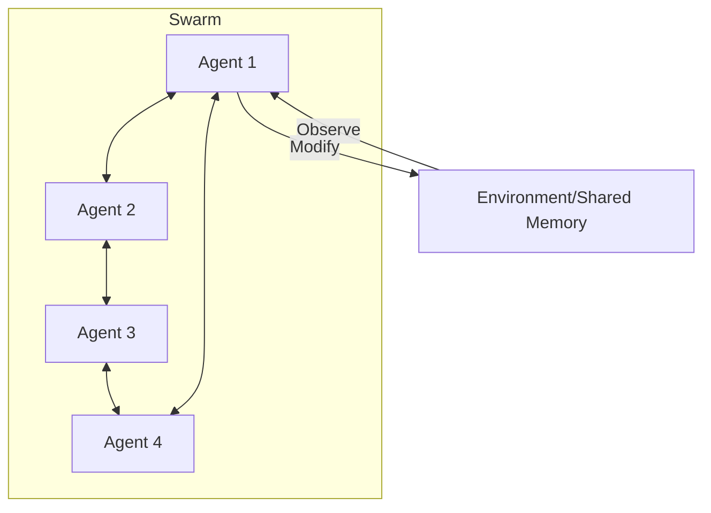

# 🐝 Swarm Intelligence: Collective Autonomous Action
> **Level:** Advanced | **Language:** Hinglish | **Goal:** Master the decentralized multi-agent architecture where complex global behavior emerges from simple, local interactions.

---

## 🧭 1. Beginner-friendly Hinglish Explanation
Swarm Intelligence ka matlab hai "Bheed ki samajhdaari". Sochiye ek akeli cheenti (ant) bahut kamzor hai, par "Ant Colony" milkar ek bada phool utha sakti hai aur rasta dhoondh sakti hai bina kisi "Manager" ke. AI Swarms mein bhi hum hazaron chhote-chhote agents banate hain jo aapas mein simple rules follow karte hain. Yahan koi "Supervisor" nahi hota. Agents ek dusre ko dekh kar (Observation) aur message chhod kar (Stigmergy) kaam karte hain. Ye system bahut "Resilient" hota hai—agar 100 agents crash ho jayein, toh baaki 900 kaam karte rahenge.

---

## 🧠 2. Deep Technical Explanation
Swarm architectures focus on decentralized coordination:
1. **Stigmergy:** Agents communicate by modifying the environment (e.g., leaving a "Pheromone" or a status flag in a database).
2. **Local Rules:** Every agent follows simple logic: *If I see X, I do Y*.
3. **Emergence:** No agent knows the full plan, but the "Swarm" achieves the goal (e.g., solving a massive data sorting problem).
4. **Self-Organization:** The swarm dynamically adjusts its shape and task allocation based on environment changes.

---

## 🏗️ 3. Real-world Analogies
Swarm Intelligence ek **Birds ki flight (Flocking)** ki tarah hai.
- Har chidiya sirf apne padosi ko dekhti hai aur takrane se bachti hai.
- Result mein poora jhund ek sundar pattern banata hai bina kisi "Lead bird" ke instructions ke.

---

## 📊 4. Architecture Diagrams (Decentralized Swarm)


---

## 💻 5. Production-ready Examples (Swarm Interaction Logic)
```python
# 2026 Standard: Decentralized Swarm Loop
class SwarmAgent:
    def step(self, local_env):
        # 1. Observe local neighbors/data
        # 2. Apply simple logic
        if local_env['status'] == "UNFINISHED":
            self.do_work()
            update_env(status="DONE") # Stigmergy
        
        # 3. Random walk (to explore other tasks)
        self.move_to_next_task()
```

---

## ❌ 6. Failure Cases
- **Swarm Chaos:** Bina proper rules ke agents ek dusre ke kaam ko "Overwrite" karne lagte hain.
- **Herding Effect:** Saare agents ek hi useless task par focus karne lagte hain, baaki tasks ignore ho jate hain.

---

## 🛠️ 7. Debugging Section
- **Symptom:** The swarm is doing nothing.
- **Check:** **Environment Signals**. Kya pheromones/flags sahi se save ho rahe hain? Agar agents "Environment" ko read nahi kar paa rahe, toh swarm kaam nahi karega.

---

## ⚖️ 8. Tradeoffs
- **Reliability vs Predictability:** System kabhi fail nahi hota par aap ye predict nahi kar sakte ki kaam exactly kitni der mein hoga.

---

## 🛡️ 9. Security Concerns
- **Sybil Attack:** Ek attacker hazaron fake malicious agents swarm mein inject kar sakta hai taaki collective decision ko manipulate kiya ja sake.

---

## 📈 10. Scaling Challenges
- Thousands of agents concurrent database updates karne ki koshish karenge toh "Locking" issues honge. Use **Eventually Consistent** storage.

---

## 💸 11. Cost Considerations
- Swarms bahut mehenge ho sakte hain agar har agent LLM call kar raha hai. Use **Hard-coded Logic** for swarm agents and LLM only for high-level "Policy" updates.

---

## ⚠️ 12. Common Mistakes
- Centralized supervisor banane ki koshish karna (Then it's not a swarm).
- Too complex local rules (Keep them simple!).

---

## 📝 13. Interview Questions
1. What is 'Stigmergy' in the context of autonomous agent swarms?
2. Why are swarm architectures more 'Fault-Tolerant' than hierarchical ones?

---

## ✅ 14. Best Practices
- Use **Gossip Protocols** for decentralized communication.
- Implement **Global Constraints** in the environment to prevent runaway swarm behavior.

---

## 🚀 15. Latest 2026 Industry Patterns
- **Large-Scale Data Swarms:** Agents jo autonomously millions of documents ko sort aur index karte hain distributed servers par.
- **Self-Healing Infrastructure Swarms:** Agents jo server farm mein ghumte hain aur "Detect" karte hain kahan load high hai ya kahan hardware fail ho raha hai to fix it locally.
