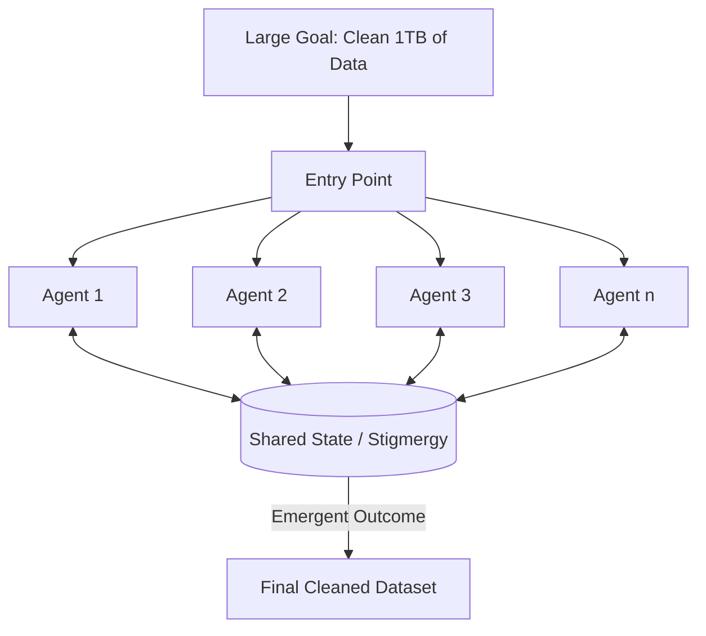

# 🐝 Swarm Intelligence & Emergent Behavior: The Power of Many
> **Level:** Extreme Advanced | **Language:** Hinglish | **Goal:** Master the concepts of large-scale decentralized agent systems where intelligence "Emerges" from simple interactions.

---

## 🧭 1. Beginner-Friendly Hinglish Explanation
Swarm Intelligence ka matlab hai **"Cheetiyon (Ants) jaisi buddhi"**.

- **The Concept:** Ek akeli cheeti bahut simple hoti hai. Par hazaron cheetiyan milkar complex raste bana leti hain aur bade goals poore kar leti hain bina kisi "Boss" ke.
- **The AI Version:** Hum hazaron "Chote" aur "Saste" (Small Language Models) agents ko ek saath chhod dete hain. 
  - Har agent sirf ek simple rule follow karta hai.
  - Par pura group milkar ek "Badi Problem" solve kar leta hai.

**Emergent Behavior** wo "Magic" hai jahan system wo kaam karne lagta hai jo use kisi ne sikhaya nahi tha, par wo agents ke aapas mein interact karne se khud-ba-khud ho gaya.

---

## 🧠 2. Deep Technical Explanation
Swarm intelligence in agents is based on **Decentralized, Self-Organized Systems**.

### 1. Simple Rules -> Complex Outcomes:
Agents follow local rules (e.g., "If you see a bug, report it; If a bug is already reported, check its priority"). 
- No central controller (Supervisor) is needed.

### 2. Stigmergy (Communication via Environment):
Agents don't talk directly; they leave "Signs" in a shared environment (like a Blackboard or Vector DB). 
- *Example:* Agent A leaves a note "Database X is slow". Agent B reads this and decides to optimize the query.

### 3. Emergent Behavior:
The phenomenon where a complex pattern (like a "Global Optimization") arises from many small local actions. In LLMs, this looks like a swarm of 100 small models outperforming one giant model (The "MoE" or Mixture of Experts concept at the agent level).

---

## 🏗️ 3. Architecture Diagrams (The Swarm)


---

## 💻 4. Production-Ready Code Example (Conceptual Swarm Worker)
```python
# 2026 Standard: A simple swarm logic for parallel tasks

class SwarmWorker:
    def __init__(self, agent_id):
        self.id = agent_id

    def work(self, shared_blackboard):
        while True:
            # 1. Look for a small task on the blackboard
            task = shared_blackboard.get_available_task()
            if not task: break
            
            # 2. Execute using a SMALL model (e.g. Llama-3-8B)
            result = self.execute_small_task(task)
            
            # 3. Post result back (Stigmergy)
            shared_blackboard.post_result(self.id, result)

# Insight: Swarms are $100x$ more scalable than 'Supervisor' patterns.
```

---

## 🌍 5. Real-World Use Cases
- **Distributed Web Scraping:** 1000 tiny agents scraping 1000 different sites and merging data into a single "World Knowledge Graph".
- **Cybersecurity Defense:** A swarm of agents monitoring different network packets and collectively "Voting" on a potential attack.
- **Scientific Simulation:** Agents simulating individual molecules to find the property of a new material.

---

## ❌ 6. Failure Cases
- **Chaos / Entropy:** Without a "Leader", the agents might start working in opposite directions, canceling each other's work.
- **Resource Exhaustion:** A swarm of 10,000 agents can easily crash a database or exceed API rate limits in seconds.
- **Feedback Loops (Oscillation):** Agent A fixes X -> Agent B thinks it's a bug and reverts it -> (Repeat).

---

## 🛠️ 7. Debugging Guide
| Symptom | Cause | Fix |
| :--- | :--- | :--- |
| **System is behaving randomly** | Weak local rules | Be more explicit in the "Task Definition" for the swarm workers. |
| **Duplicate work** | No locking mechanism | Use a **'Task Ownership'** flag in the shared state (Blackboard). |

---

## ⚖️ 8. Tradeoffs
- **Resilience vs. Control:** Swarms are impossible to "Kill" (resilient) but very hard to "Guide" (low control).
- **Cost:** Using 1000 tiny models can be cheaper or more expensive than 1 giant model depending on the task complexity.

---

## 🛡️ 9. Security Concerns
- **Byzantine Fault Tolerance:** If $10\%$ of your swarm is "Malicious" (Hacked), can the other $90\%$ still find the correct answer? **Fix: Use Majority Voting.**
- **Swarm Hijacking:** A "Single Message" in the blackboard that tricks all agents simultaneously.

---

## 📈 10. Scaling Challenges
- **State Synchronization:** Keeping the "Blackboard" updated in real-time for 1000 agents without becoming a bottleneck. **Solution: Use 'Distributed Key-Value Stores' (Redis Cluster).**

---

## 💸 11. Cost Considerations
- **Cheap Inference:** Swarms only work financially if you use **Quantized Local Models** (running on your own GPUs) instead of paid APIs.

---

## 📝 12. Interview Questions
1. What is "Stigmergy" in agentic systems?
2. How does emergent behavior differ from planned behavior?
3. What are the advantages of a decentralized swarm over a hierarchical team?

---

## ⚠️ 13. Common Mistakes
- **No Global Monitor:** Having a swarm without a "Health Check" dashboard. (You need to see the "Big Picture" even if the agents don't).
- **Complex Workers:** Trying to make swarm agents "Smart". They should be "Simple and Fast".

---

## ✅ 14. Best Practices
- **Small Tasks:** Break the problem into tiny, $10$-second tasks.
- **Self-Cleaning Blackboard:** Automatically remove old or irrelevant data from the shared state.
- **Consensus Metrics:** Use mathematical averages or voting to decide on the swarm's final output.

---

## 🚀 15. Latest 2026 Industry Patterns
- **Language-Model Swarms (LMS):** Massive-scale deployments of 1B-3B parameter models working on edge devices (Phones/IoT) to solve global problems.
- **Neuro-Evolutionary Swarms:** Agents that "Die" if they fail and "Reproduce" (copy their prompt) if they succeed, leading to an evolving swarm.
- **Swarm Intelligence as a Service:** Cloud providers offering "Swarm Clusters" that you can rent for heavy data-processing tasks.
