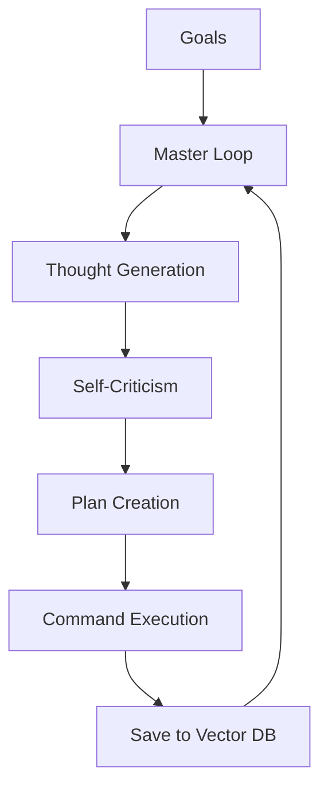

# 🤖 AutoGPT Architecture: The Pioneer of Autonomy
> **Level:** Intermediate | **Language:** Hinglish | **Goal:** Master the historical and architectural foundations of AutoGPT, the system that popularized autonomous agent loops.

---

## 🧭 1. Beginner-friendly Hinglish Explanation
AutoGPT wo pehla system tha jisne dikhaya ki AI sirf chat nahi kar sakta, balki "Apne aap kaam" bhi kar sakta hai. Iska concept simple tha: Ek AI ko 5 Goals do, aur wo unhe poora karne ke liye khud se "Task List" banayega, internet par search karega, files save karega, aur tab tak nahi rukega jab tak goals achieved na ho jayein. AutoGPT ne duniya ko sikhaya ki "Prompting" se bada "Agentic Workflow" hai.

---

## 🧠 2. Deep Technical Explanation
AutoGPT architecture is built on a recursive feedback loop:
1. **Thought-Reasoning-Plan:** The model generates its "Thought", the "Reasoning" behind it, and a "Plan" for the next step.
2. **Command Execution:** The model selects a command (tool) from a predefined list (e.g., `google_search`, `write_file`).
3. **Criticism:** The model is forced to "Self-Criticize" its thought to reduce hallucinations.
4. **Memory Integration:** Using a local vector store (like JSON or Pinecone) to remember past steps and avoid repeating mistakes.

---

## 🏗️ 3. Real-world Analogies
AutoGPT ek **Solo Entrepreneur** ki tarah hai.
- Wo khud hi Manager hai, khud hi Researcher, aur khud hi Executor.
- Wo apni "To-Do List" har subah khud banata hai aur sham tak unhe khatam karne ki koshish karta hai.

---

## 📊 4. Architecture Diagrams (The Auto-Loop)


---

## 💻 5. Production-ready Examples (The Core Prompt Pattern)
```python
# 2026 Standard: The 'Thought' Structure
system_prompt = """
You are an autonomous agent. Output your response in this JSON format:
{
  "thoughts": {
    "text": "description of what I am thinking",
    "reasoning": "why I chose this",
    "plan": "- step 1\n- step 2",
    "criticism": "constructive self-criticism"
  },
  "command": {
    "name": "command_name",
    "args": {"arg1": "val1"}
  }
}
"""
```

---

## ❌ 6. Failure Cases
- **The Infinite Search:** Agent google par search karte-karte bhool gaya ki asli goal kya tha.
- **Hallucinated Commands:** Agent ne aise commands invent kar liye jo system mein exist hi nahi karte.

---

## 🛠️ 7. Debugging Section
- **Symptom:** AutoGPT is stuck in a loop of "Thinking" but not "Acting".
- **Fix:** System prompt mein strict instructions dein ki "Every thought MUST lead to a command execution". Verify the JSON schema parsing logic.

---

## ⚖️ 8. Tradeoffs
- **Generality vs Reliability:** AutoGPT har kaam kar sakta hai (General), par wo har kaam mein "Be-bharosa" (Unreliable) hai.

---

## 🛡️ 9. Security Concerns
- **Recursive Prompt Injection:** Agar agent ne internet se malicious content read kiya, toh wo content agent ki "Next Thought" ko manipulate kar sakta hai to delete files.

---

## 📈 10. Scaling Challenges
- Token costs explode rapidly in AutoGPT loops. It's not suitable for high-scale user applications without heavy optimization.

---

## 💸 11. Cost Considerations
- One complex goal can cost $5-$20 in GPT-4 tokens. Modern alternatives use **Agentic Pruning** to reduce costs.

---

## ⚠️ 12. Common Mistakes
- Infinite loops allow karna (No budget cap).
- Vector memory na use karna (Agent restarts its logic every turn).

---

## 📝 13. Interview Questions
1. How does AutoGPT manage long-term goals using a short-term context window?
2. What is the role of 'Self-Criticism' in the AutoGPT loop?

---

## ✅ 14. Best Practices
- Always use a **Workspace Folder** so the agent can only read/write files in one safe place.
- Implement **Continuous vs Step-by-Step** mode (Asking for user approval after every command).

---

## 🚀 15. Latest 2026 Industry Patterns
- **AutoGPT-as-a-Library:** Moving away from the standalone CLI to using AutoGPT-like loops inside specific business apps.
- **Forge Architecture:** The new AutoGPT standard that allows developers to build specialized agents using a shared "Forge" framework.
