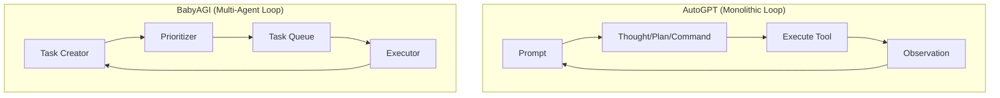

# 🤖 AutoGPT & BabyAGI Concepts: The Pioneers of Autonomy
> **Level:** Advanced | **Language:** Hinglish | **Goal:** Master the historical and architectural foundations of the first viral autonomous agents and how they evolved into today's systems.

---

## 🧭 1. Beginner-Friendly Hinglish Explanation
AutoGPT aur BabyAGI AI ki duniya ke **"Pehle Autonomous Drivers"** the.

- **The Problem:** 2023 ke shuruat mein ChatGPT sirf "Chat" kar sakta tha. Aapko har step khud likhna padta tha.
- **The Breakthrough:**
  - **AutoGPT:** Isne dikhaya ki AI khud se "Google Search" kar sakta hai, "File" likh sakta hai, aur "Loop" mein tab tak kaam kar sakta hai jab tak goal pura na ho.
  - **BabyAGI:** Isne dikhaya ki AI kaise apni "Tasks" ki list khud bana sakta hai aur unhe prioritize kar sakta hai (Bilkul ek baby ki tarah jo dheere-dheere seekhta hai).

Ye dono aaj ke modern agents (jaise Devin ya GPT-4o agents) ke "Dadaji" (Grandparents) hain.

---

## 🧠 2. Deep Technical Explanation
AutoGPT and BabyAGI introduced the **Recursive Task Loop** architecture.

### 1. AutoGPT Architecture (The Infinite Loop):
- **Core Logic:** A single LLM call that outputs: `THOUGHT`, `REASONING`, `PLAN`, `CRITICISM`, and `COMMAND`.
- **The Command:** A tool call (e.g., `write_file`, `google_search`).
- **The Criticism:** The model's own evaluation of its thought process (Self-correction).

### 2. BabyAGI Architecture (The Task Manager):
Introduced the concept of **Task Management Agents**:
1. **Task Creation Agent:** Generates new tasks based on the result of the previous task.
2. **Task Prioritization Agent:** Reorders the task list so the most important thing is at the top.
3. **Execution Agent:** Performs the actual work.

### 3. The Shared Context:
Both relied on **Vector Databases** (like Pinecone) to store "Memory" so the agent wouldn't repeat itself.

---

## 🏗️ 3. Architecture Diagrams (AutoGPT vs BabyAGI)


---

## 💻 4. Production-Ready Code Example (BabyAGI Style Task Logic)
```python
# 2026 Standard: Conceptual Task Prioritization

def task_prioritizer(task_list, goal):
    prompt = f"""
    Current Task List: {task_list}
    Ultimate Goal: {goal}
    
    Re-order the task list to be more efficient. 
    Ensure dependencies (like 'search' before 'summarize') are met.
    Return the new list as JSON.
    """
    new_list = llm.generate_json(prompt)
    return new_list

# Insight: Prioritization prevents the agent from 
# doing 'Writing' before 'Researching'.
```

---

## 🌍 5. Real-World Use Cases (Historical Influence)
- **Autonomous Market Research:** The original "AutoGPT" use case—finding a competitor and summarizing their pricing.
- **Auto-Social Media:** BabyAGI scripts that generate, schedule, and post content based on a single niche keyword.

---

## ❌ 6. Failure Cases
- **The Loop of Death:** AutoGPT was famous for getting stuck in a loop of "Searching for the same thing" and spending $\$50$ in 10 minutes.
- **Task Inflation:** BabyAGI would sometimes create 1000 tasks for a simple "Hello World" job.
- **Context Loss:** After 10 turns, the original goal would "Drift" away.

---

## 🛠️ 7. Debugging Guide
| Symptom | Cause | Fix |
| :--- | :--- | :--- |
| **Agent is searching infinitely** | Observation not updated | Ensure the **Tool Result** is clearly labeled in the next prompt. |
| **Agent creates too many tasks** | Task Creator is too 'Creative' | Constrain it: "Only create max 3 sub-tasks at a time." |

---

## ⚖️ 8. Tradeoffs
- **Breadth (AutoGPT) vs. Depth (BabyAGI):** AutoGPT tries to do many things; BabyAGI focuses on managing the queue.
- **Framework vs. Custom:** Using these "Legacy" frameworks (AutoGPT repo) vs. building your own clean loop with LangGraph.

---

## 🛡️ 9. Security Concerns
- **Runaway Token Costs:** These architectures are prone to infinite loops. **MANDATORY: Set `max_iterations` to 10 or 20.**
- **Local File Deletion:** AutoGPT had a `delete_file` tool; if it halluncinated a path, it could be disastrous.

---

## 📈 10. Scaling Challenges
- **Complexity:** As the task queue grows, the "Prioritizer" LLM gets confused.
- **Latency:** Each step in the BabyAGI loop is 3-4 separate LLM calls.

---

## 💸 11. Cost Considerations
- **Small Model Prioritization:** You don't need GPT-4o to re-order a list. Use **Llama-3-8B** to save money.

---

## 📝 12. Interview Questions
1. What was the main innovation of BabyAGI?
2. Why did early autonomous agents (AutoGPT) fail in production?
3. What is "Self-Criticism" in the AutoGPT prompt?

---

## ⚠️ 13. Common Mistakes
- **No Human-in-the-loop:** Thinking you can just leave AutoGPT running overnight. (Don't do it!).
- **Unstructured Tasks:** Creating tasks as "Full sentences" which are hard to parse. Use **JSON Objects**.

---

## ✅ 14. Best Practices
- **Summarize Results:** Periodically compress the "Done" list so the LLM stays focused.
- **Use Pydantic:** Force the Task Creator to output a strict schema.
- **Set a Budget:** Kill the agent if it exceeds $\$5.00$.

---

## 🚀 15. Latest 2026 Industry Patterns
- **Memory-Augmented BabyAGI:** Using RAG to remember how similar tasks were solved in the past to avoid re-planning.
- **Hierarchical AutoGPT:** A "Master AutoGPT" that spawns "Sub-AutoGPTs" for specialized sub-tasks.
- **The Devin Revolution:** Modern versions of these concepts that are actually stable enough to use for real software engineering.
