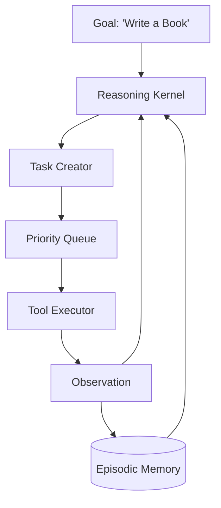

# 🚀 Autonomous Agent Fundamentals: The Engine of Self-Reliance
> **Level:** Fundamentals | **Language:** Hinglish | **Goal:** Master the core principles of building agents that operate independently without human-in-the-loop for every step.

---

## 🧭 1. Beginner-Friendly Hinglish Explanation
Autonomous Agent ka matlab hai **"Swayam-Chalit"** (Self-driving) AI.

- **The Concept:** Sochiye ek Tesla car. Aap use sirf "Destination" (Goal) batate hain, aur wo rasta khud chunthi hai, breaks khud lagati hai, aur steering khud ghumati hai. 
- **The AI Version:** Hum agent ko sirf **Goal** dete hain (e.g., "Ek company ki research report banao").
  1. Agent khud se plan banata hai.
  2. Khud tools use karta hai.
  3. Khud apni galthiyan sudharta hai.
  4. Jab tak report ready nahi hoti, wo kaam karta rehta hai.

Autonomous agents ka matlab hai "Human" sirf start karta hai aur end result leta hai—beech ka sara kaam AI ka hai.

---

## 🧠 2. Deep Technical Explanation
Autonomy in agents is the highest level of agency, characterized by **Independent Decision Making** and **Closed-loop Execution**.

### 1. The Autonomous Loop:
- **Goal Perception:** Understanding the high-level objective.
- **Task Generation:** Decomposing the objective into a dynamic task list.
- **Task Execution:** Running the top task using available tools.
- **Outcome Assessment:** Checking if the task succeeded and if the goal is closer.
- **Replanning:** Adjusting the task list based on reality.

### 2. Levels of Autonomy:
- **Level 1 (Reactive):** Only responds to direct commands.
- **Level 2 (Proactive):** Suggests next steps but waits for approval.
- **Level 3 (Autonomous):** Executes whole workflows and only asks for help if it hits a wall.

### 3. Key Architectures:
- **AutoGPT Style:** Breadth-first task generation.
- **BabyAGI Style:** Priority-based task queueing.

---

## 🏗️ 3. Architecture Diagrams (The Autonomous Brain)


---

## 💻 4. Production-Ready Code Example (Minimal Autonomous Controller)
```python
# 2026 Standard: The loop that never sleeps (until goal met)

def run_autonomous_agent(goal):
    task_list = ["Initialize project"]
    context = ""
    
    while task_list:
        # 1. Pick the highest priority task
        current_task = task_list.pop(0)
        
        # 2. Execute
        print(f"🛠️ Agent is doing: {current_task}")
        result = execute_task(current_task, context)
        
        # 3. Update Context & Check Goal
        context += f"\nTask: {current_task} Result: {result}"
        if goal_achieved(goal, context):
            return "🎯 Goal Accomplished!"
            
        # 4. Generate next tasks
        new_tasks = generate_next_tasks(goal, context)
        task_list.extend(new_tasks)
```

---

## 🌍 5. Real-World Use Cases
- **Autonomous Researchers:** Agents that spend days scouring the web to find investment opportunities.
- **Self-Healing Servers:** Agents that monitor logs and "Fix" bugs or restart services autonomously.
- **Autonomous Coding (Devin):** Taking a GitHub issue and working through it until a Pull Request is generated.

---

## ❌ 6. Failure Cases
- **The Infinite Cycle:** Task A -> Task B -> Task A... (Agent is stuck).
- **Goal Drift:** The agent starts researching "AI" and ends up researching "The history of silicon".
- **Action Over-reach:** The agent deletes important data while trying to "Clean the system".

---

## 🛠️ 7. Debugging Guide
| Symptom | Cause | Fix |
| :--- | :--- | :--- |
| **Agent is taking too long** | Tasks are too broad | Force the **Task Creator** to make "Atomic" tasks (max 2 minutes each). |
| **Agent is doing nonsense** | Context window overflow | Use **Summarization** of previous results to keep the goal clear. |

---

## ⚖️ 8. Tradeoffs
- **Autonomy vs. Control:** Higher autonomy means less human work but higher risk of errors.
- **Speed vs. Cost:** Multi-turn loops can burn thousands of tokens in minutes.

---

## 🛡️ 9. Security Concerns
- **Runaway Agency:** An agent spends $\$500$ on API calls in 10 minutes. **Fix: Set 'Hard Budgets' and 'Max Iterations'.**
- **System Sabotage:** An autonomous agent with terminal access running a `rm` command by mistake. **MANDATORY: Use Sandboxing.**

---

## 📈 10. Scaling Challenges
- **State Management:** Saving the progress of an agent that works for 24 hours straight.
- **Resource Locking:** Two autonomous agents trying to edit the same file.

---

## 💸 11. Cost Considerations
- **Cheap Models for Routine Tasks:** Use an 8B model for "Task Generation" and a 400B model for "High-level Reasoning".

---

## 📝 12. Interview Questions
1. What is the difference between a "Chain" and an "Autonomous Loop"?
2. How do you prevent "Goal Drift" in autonomous agents?
3. What is the role of the "Task Prioritizer" in BabyAGI?

---

## ⚠️ 13. Common Mistakes
- **No Human Checkpoints:** Letting an agent run for 1000 turns without checking in.
- **Vague Goals:** Giving a goal like "Make the website better". (Use SMART goals!).

---

## ✅ 14. Best Practices
- **Define a 'Stopping Condition':** What does "Done" look like?
- **Log Everything:** Every task, every thought, every result.
- **Human-in-the-loop (HITL):** Require approval for "Sensitive" tasks (e.g., spending money, deleting files).

---

## 🚀 15. Latest 2026 Industry Patterns
- **Agentic OS:** Operating systems where the "Terminal" and "File Manager" are autonomous agents.
- **Self-Optimizing Agents:** Agents that review their own "Failures" at night and update their "System Prompts" for the next day.
- **Swarm Autonomy:** A group of autonomous agents working together without any human supervisor.
