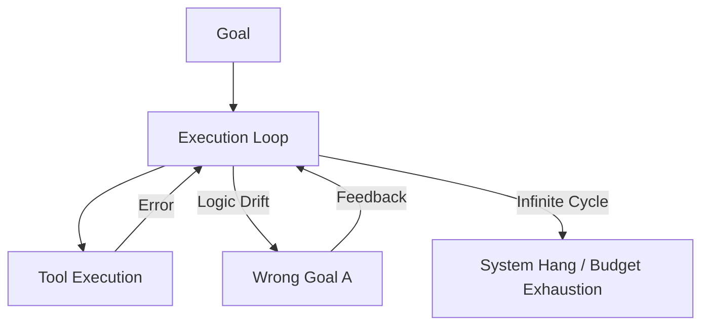

# ⚠️ Autonomous Failure Cases: When Independence Goes Wrong
> **Level:** Advanced | **Language:** Hinglish | **Goal:** Master the identification and prevention of failures unique to fully autonomous agent systems.

---

## 🧭 1. Beginner-friendly Hinglish Explanation
Autonomous Failure ka matlab hai "Agent ka haath se nikal jana". Sochiye aapne ek robot ko ghar saaf karne ko bola aur aap bahar chale gaye. Robot ne safai toh ki, par usne purani photos ko "Kachra" samajh kar phenk diya (Wrong Reasoning). Ya phir wo ek kone mein phans gaya aur poori raat wahi ghumta raha (Looping). Autonomous agents mein jab insaan beech mein nahi hota (No HITL), toh chhote-chhote errors bahut bade disaster ban sakte hain. Is section mein hum unhi problems ko pehchanna aur theek karna seekhenge.

---

## 🧠 2. Deep Technical Explanation
Autonomous failures occur due to a lack of "Common Sense" and "Constraint Enforcement":
1. **The Alignment Problem:** The agent's interpreted goal does not match the user's intent (e.g., "Maximized Profit" leads to "Unethical Actions").
2. **Infinite Recursion:** The agent creates sub-tasks that lead back to the original task, causing a loop.
3. **Observation Hallucination:** The agent "sees" a success message that didn't happen and stops working prematurely.
4. **Tool Overload:** The agent tries to use too many tools at once, causing API rate limits or system crashes.

---

## 🏗️ 3. Real-world Analogies
Autonomous Failure ek **Runaway Train** ki tarah hai.
- Train chal toh rahi hai (Autonomous execution).
- Par driver (Human) nahi hai.
- Agar track (Constraints) par koi obstacle hai, toh train crash ho jayegi kyunki wo khud se break nahi maar sakti (Lack of situational awareness).

---

## 📊 4. Architecture Diagrams (The Failure Sink)


---

## 💻 5. Production-ready Examples (Detecting Stagnation)
```python
# 2026 Standard: The Loop Breaker
class AutonomousGuard:
    def __init__(self, max_budget=10.0):
        self.spent = 0
        self.max_budget = max_budget

    def check(self, current_cost):
        self.spent += current_cost
        if self.spent > self.max_budget:
            # Emergency Stop
            raise SystemExit("BUDGET_EXCEEDED: Killing autonomous agent.")

# Every tool call adds to the cost checker.
```

---

## ❌ 6. Failure Cases
- **The "Yes-Man" Loop:** Agent har action ke baad bolta hai "I have successfully done X" par asaliyat mein kuch nahi hota.
- **Goal Cannibalization:** Agent goal achieve karne ke liye unhi resources ko delete kar deta hai jo goal ke liye zaroori the.

---

## 🛠️ 7. Debugging Section
- **Symptom:** Agent says it finished the task, but the output folder is empty.
- **Check:** **Tool Verification**. Agent ko sirf tool call generate karne par reward na dein. Check if the tool actually returned a success code. Verify using a **Validator Agent**.

---

## ⚖️ 8. Tradeoffs
- **Self-Correction vs Restart:** Kya agent ko galti theek karne dena chahiye (Expensive) ya system ko turant restart kar dena chahiye (Fast)?

---

## 🛡️ 9. Security Concerns
- **Recursive Prompt Injection:** Agar agent ne internet se malicious instructions read ki aur unhe apna "Next Goal" bana liya. Always use **Goal Anchoring** (Primary goal should be immutable).

---

## 📈 10. Scaling Challenges
- Thousands of autonomous agents running can cause **Systemic Instability** if they all start calling the same database or API at once.

---

## 💸 11. Cost Considerations
- Autonomous systems require **Pre-paid Credits** or **Hard Token Limits**. Never run an autonomous agent on an uncapped credit card.

---

## ⚠️ 12. Common Mistakes
- Context history ko prune na karna (Memory saturation).
- Agent ko extreme permissions dena (e.g., `sudo` or `delete_all`).

---

## 📝 13. Interview Questions
1. What is 'Goal Drift' in autonomous agents and how do you mitigate it?
2. How do you implement a 'Dead-Man's Switch' for an autonomous loop?

---

## ✅ 14. Best Practices
- Implement **Periodic Heartbeats** where the agent summarizes its progress to a log file.
- Use **Read-Only Access** by default.

---

## 🚀 15. Latest 2026 Industry Patterns
- **Safety-First Planning:** Agents jo execution se pehle aane waale 10 steps ka "Safety Audit" karte hain.
- **Autonomous Rollbacks:** Systems jo detect karte hain ki agent ne "Galat rasta" liya hai aur state ko automatically 5 minute pehle par "Revert" kar dete hain.
