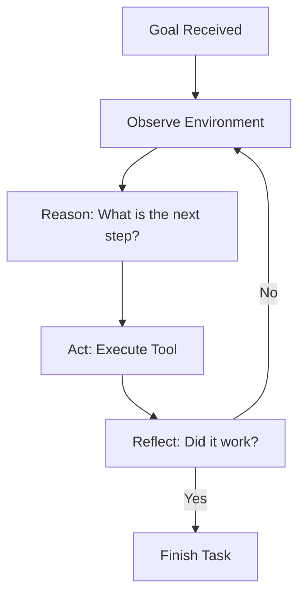

# 🔄 Autonomous Loop Logic: The Engine of Independence
> **Level:** Beginner | **Language:** Hinglish | **Goal:** Master the fundamental "Observe-Reason-Act" loop that allows agents to run indefinitely without human intervention.

---

## 🧭 1. Beginner-friendly Hinglish Explanation
Autonomous Loop ka matlab hai ek aisi "Ghumti hui machine" jo kabhi nahi rukti jab tak kaam khatam na ho jaye. Sochiye ek automatic vacuum cleaner (Roomba). Wo pehle dekhta hai kahan kachra hai (Observe), fir dimaag lagata hai ki kis raste se jana hai (Reason), aur fir chalta hai (Act). AI Agents mein bhi yahi loop hota hai. Agent user ka goal leta hai aur khud se sawal puchta rehta hai: "Kya goal poora hua? Nahi? Toh agla step kya hai?". Isse hume use baar-baar batane ki zarurat nahi padti ki ab aage kya karna hai.

---

## 🧠 2. Deep Technical Explanation
The autonomous loop is the core control logic of an agent:
1. **Perception/Observation:** Gathering input from the environment (e.g., API results, web content).
2. **Reasoning/Planning:** The LLM decides what to do next based on the current state and the final goal.
3. **Execution:** Taking an action (calling a tool).
4. **Reflection:** Looking at the result of the action and updating the internal state.
**Logic Pattern:** `while not goal_achieved: execute_cycle()`. This is different from a simple script because the "next step" is not hard-coded; it's generated by the LLM at every turn.

---

## 🏗️ 3. Real-world Analogies
Autonomous Loop ek **Thermostat** ki tarah hai.
- **Observe:** Kamre ka temperature check karo.
- **Reason:** Kya ye 24 degree se zyada hai?
- **Act:** AC on karo.
- **Repeat:** Har 5 minute mein check karte raho jab tak 24 na ho jaye.

---

## 📊 4. Architecture Diagrams (The Infinite Loop)


---

## 💻 5. Production-ready Examples (The While-Loop Pattern)
```python
# 2026 Standard: Simple Autonomous Loop
def run_autonomous_agent(goal):
    state = {"goal": goal, "history": [], "is_done": False}
    
    while not state["is_done"]:
        # 1. Reason
        action = llm.get_next_action(state)
        
        # 2. Act
        result = execute_tool(action)
        
        # 3. Update State
        state["history"].append({"action": action, "result": result})
        
        # Check termination
        if "FINAL_ANSWER" in action:
            state["is_done"] = True
```

---

## ❌ 6. Failure Cases
- **The Infinite Loop:** Agent ek hi step baar-baar kar raha hai aur kabhi "Done" nahi bol raha.
- **Token Bleed:** Loop itna lamba chala ki user ka $100 ka budget 10 minute mein khatam ho gaya.

---

## 🛠️ 7. Debugging Section
- **Symptom:** Agent is stuck in a loop.
- **Fix:** Implement a **Max Iterations** limit (e.g., `max_loops = 10`). Loop ke andar ek counter rakhein aur limit hit hone par agent ko "Force Stop" karke report mangwayein.

---

## ⚖️ 8. Tradeoffs
- **Autonomy vs Safety:** Agent ko poori aazadi dena (Autonomous) fast hai par dangerous. Har step par approval mangna (HITL) safe hai par slow.

---

## 🛡️ 9. Security Concerns
- **Runaway Agent:** Ek agent jo autonomously aisi tools use karne lage jo block honi chahiye thi (e.g., mass emailing). Use **Hard Constraints** in the loop.

---

## 📈 10. Scaling Challenges
- Running 1000s of long-running loops requires **Asynchronous Task Queues** (like Celery) so they don't block the main server.

---

## 💸 11. Cost Considerations
- Autonomous loops are the biggest source of "Unexpected Bills". Use **Budget Caps** per session.

---

## ⚠️ 12. Common Mistakes
- Exit condition na likhna.
- History ko clean na karna (Context window overflow).

---

## 📝 13. Interview Questions
1. What are the 4 stages of an autonomous agent loop?
2. How do you prevent an agent from looping indefinitely on a failing task?

---

## ✅ 14. Best Practices
- Every loop must have a **Global Timeout**.
- Use **Structured Logs** to see exactly what happened in each "Iteration".

---

## 🚀 15. Latest 2026 Industry Patterns
- **Stateful Loop Persistence:** Loops jo server restart hone par bhi wahin se resume hote hain jahan chhode the.
- **Multi-Model Loops:** Using a cheap model for "Observation" and an expensive one only for "Reasoning".
