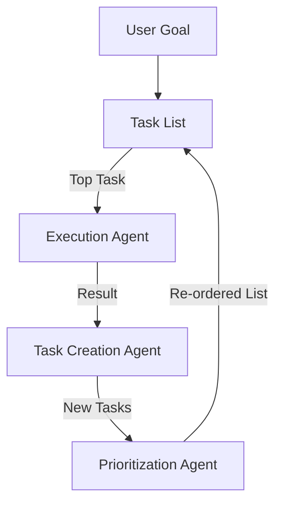

# 👶 BabyAGI Architecture: The Task Management Master
> **Level:** Intermediate | **Language:** Hinglish | **Goal:** Master the minimalist but powerful architecture of BabyAGI, focused on dynamic task creation and prioritization.

---

## 🧭 1. Beginner-friendly Hinglish Explanation
BabyAGI, AutoGPT ka ek chhota aur smarter bhai hai. Iska focus "Doing" se zyada "Planning" par hai. Sochiye aapne ise ek bada goal diya. BabyAGI pehle 3 tasks banayega. Fir wo pehla task khatam karega, aur result dekhkar sochega: "Kya mujhe naye tasks ki zarurat hai?". Wo tasks ko prioritize bhi karta hai taaki sabse zaroori kaam pehle ho. Ye system bahut "Organized" hai aur "Task List" management mein expert hai.

---

## 🧠 2. Deep Technical Explanation
BabyAGI runs a 3-agent system in a loop:
1. **Task Execution Agent:** Completes the first task from the list using the LLM and tools.
2. **Task Creation Agent:** Takes the result of the execution and the goal, and creates NEW tasks that are needed now.
3. **Task Prioritization Agent:** Re-orders the task list so that the most logical next step is at the top.
**Difference from AutoGPT:** BabyAGI has an explicit "Task List" in its state, whereas AutoGPT's plan is more fluid and implicit in its thoughts.

---

## 🏗️ 3. Real-world Analogies
BabyAGI ek **Project Manager** ki tarah hai.
- Ek insaan kaam kar raha hai (Execution).
- Manager dekh raha hai ki kya naya kaam nikal kar aaya (Creation).
- Aur wo board par tasks ko upar-neeche kar raha hai (Prioritization).

---

## 📊 4. Architecture Diagrams (The Triple Agent Loop)


---

## 💻 5. Production-ready Examples (Task Creator Prompt)
```python
# 2026 Standard: The Task Creation Logic
def create_tasks(goal, result, last_task, current_tasks):
    prompt = f"""
    Goal: {goal}
    Last Task Result: {result}
    Current Tasks: {current_tasks}
    Based on the result, create 2-3 new tasks that bring us closer to the goal.
    Return only a JSON list of task descriptions.
    """
    return llm.invoke(prompt)
```

---

## ❌ 6. Failure Cases
- **Task Explosion:** Agent har step par 10 naye tasks bana raha hai, jisse task list kabhi khatam hi nahi ho rahi.
- **Goal Drift:** Naye tasks asli goal se door hote ja rahe hain (e.g., "Research AI" leads to "Research Electricity" leads to "Pay Electricity Bill").

---

## 🛠️ 7. Debugging Section
- **Symptom:** The task list is full of redundant tasks.
- **Fix:** Prioritization agent ko instructions dein ki wo "Duplicate" ya "Similar" tasks ko merge kar de. Check your **Deduplication Logic**.

---

## ⚖️ 8. Tradeoffs
- **Structure vs Speed:** BabyAGI bahut organized hai par iska loop (3 agents) slow aur expensive hai har task ke liye.

---

## 🛡️ 9. Security Concerns
- **Task Injection:** Agar task creator agent malicious input parse kare, toh wo "Delete all data" jaisa task priority list mein sabse upar rakh sakta hai.

---

## 📈 10. Scaling Challenges
- 100+ tasks manage karna prioritizer ke liye mushkil hai (Context window limits). Use **Task Clustering**.

---

## 💸 11. Cost Considerations
- 3 agents per turn = 3x tokens. Use a **Small Model** (Llama-3-8B) for creation/prioritization and a **Large Model** for execution.

---

## ⚠️ 12. Common Mistakes
- Prioritization step ko skip karna (Agent random tasks uthayega).
- Context pass na karna creator agent ko.

---

## 📝 13. Interview Questions
1. How does BabyAGI differ from AutoGPT in terms of task management?
2. What are the roles of the three agents in the BabyAGI loop?

---

## ✅ 14. Best Practices
- Limit the **Maximum Number of Tasks** in the list (e.g., max 10).
- Always include the **User Goal** in every agent's prompt to avoid drift.

---

## 🚀 15. Latest 2026 Industry Patterns
- **BabyAGI with LangGraph:** Implementing the 3-agent loop using a stateful graph for better reliability.
- **Persistent Task Boards:** Storing the task list in a database so the agent can work over several days/weeks.
