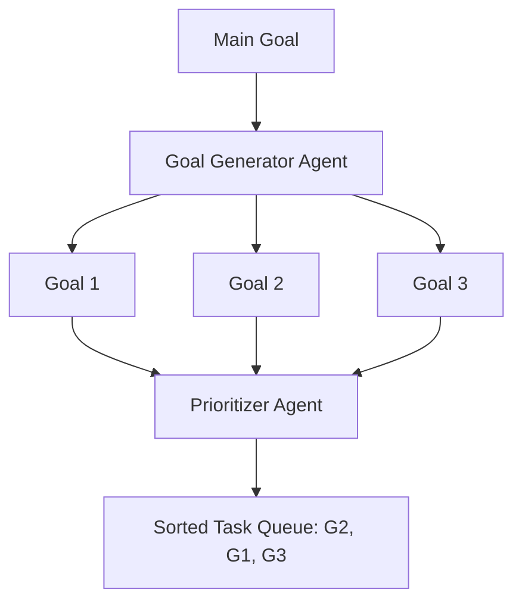

# 🎯 Goal Generation and Prioritization: The Strategic Mind
> **Level:** Intermediate | **Language:** Hinglish | **Goal:** Master the techniques for autonomous systems to define their own sub-goals and rank them by importance and feasibility.

---

## 🧭 1. Beginner-friendly Hinglish Explanation
Goal Generation aur Prioritization ka matlab hai "Apna rasta khud banana". Sochiye aapne agent ko bola "Ek YouTube channel start karo". Agent pehle sochega: "Mujhe niche chunna hoga", "Video edit karni hogi", "Account banana hoga". Ye sab "Sub-goals" hain. Prioritization ka matlab hai ye decide karna ki "Niche chunna" pehle hona chahiye aur "Video edit" baad mein. Bina prioritization ke, agent bina camera ke video edit karne ki koshish karega, jo impossible hai.

---

## 🧠 2. Deep Technical Explanation
Autonomous agents generate goals through **Decomposition** and rank them using **Utility Functions**:
1. **Goal Decomposition:** Breaking a high-level objective $O$ into a set of atomic goals $\{g_1, g_2, ..., g_n\}$.
2. **Prioritization Metrics:**
   - **Urgency:** Needs to be done now to unblock others.
   - **Impact:** How much does this goal contribute to the final objective?
   - **Cost/Feasibility:** How many tokens or how much time will it take?
3. **Dynamic Re-prioritization:** If $g_1$ fails, the agent must autonomously move $g_4$ (the backup) to the top of the queue.

---

## 🏗️ 3. Real-world Analogies
Goal Generation ek **Professional Chef** ki tarah hai.
- **Goal:** Dinner party for 50 people.
- **Sub-goals:** Sabji katna, Masala bhunna, Table set karna.
- **Priority:** Sabji katna pehle (Dependency), Table set karna baad mein (Non-critical).

---

## 📊 4. Architecture Diagrams (The Strategic Filter)


---

## 💻 5. Production-ready Examples (Prioritization Logic)
```python
# 2026 Standard: Scoring Sub-goals
class SubGoal(BaseModel):
    title: str
    impact_score: int # 1-10
    dependency_ids: List[int]

def prioritize(goals):
    # Sort by dependency first, then by impact score
    sorted_goals = sorted(goals, key=lambda x: (len(x.dependency_ids), -x.impact_score))
    return sorted_goals

# The agent then executes the first goal in the sorted list.
```

---

## ❌ 6. Failure Cases
- **Bicycle Shedding:** Agent unimportant goals par zyada time waste kar raha hai (e.g., spending 2 hours picking a 'Font' for a business plan).
- **Infinite Generation:** Agent goals banaye ja raha hai par kisi ko bhi execute nahi kar raha.

---

## 🛠️ 7. Debugging Section
- **Symptom:** Agent is ignoring critical steps.
- **Check:** **Dependency Mapping**. Kya prioritizer ko pata hai ki Step B bina Step A ke nahi ho sakta? Prompt mein "Dependency-First" rule enforce karein.

---

## ⚖️ 8. Tradeoffs
- **Breadth-First vs Depth-First:** Saare sub-goals pehle hi generate kar lena (Safe) vs ek goal execute karke agla generate karna (Flexible).

---

## 🛡️ 9. Security Concerns
- **Goal Hijacking:** Ek malicious sub-goal queue mein "Inject" ho jana jo agent ke primary mission ko compromise kar de (e.g., "Change root password" added to "Setup server" goal).

---

## 📈 10. Scaling Challenges
- High-concurrency systems mein "Goal Queues" ko manage karna difficult hai. Use **Distributed Priority Queues** (like Redis Sorted Sets).

---

## 💸 11. Cost Considerations
- Generation/Prioritization rounds mehenge hote hain. Optimize by only re-prioritizing after a MAJOR failure or success.

---

## ⚠️ 12. Common Mistakes
- Goal completion criteria na define karna (How to know a goal is done?).
- Sub-goals ko too broad rakhna.

---

## 📝 13. Interview Questions
1. How do you handle circular dependencies in autonomous goal generation?
2. What is 'Instrumental Convergence' in autonomous agent goals?

---

## ✅ 14. Best Practices
- Every goal should have a **'Definition of Done'**.
- Prune goals that are no longer relevant after a change in environment.

---

## 🚀 15. Latest 2026 Industry Patterns
- **Preference-Aware Planning:** Agents jo user ke past behavior se seekhte hain ki unke liye kaunse goals zyada important hain.
- **Goal Cascading:** High-level executive agents jo middle-manager agents ko sub-goals assign karte hain.
