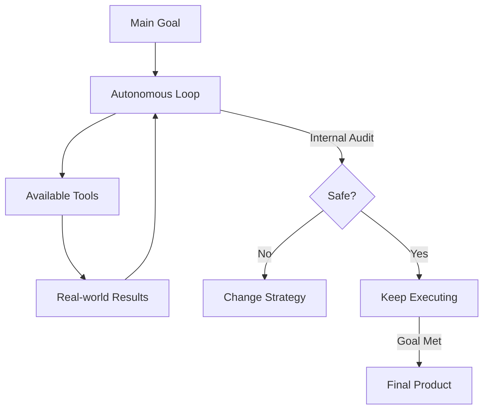

# 🚀 Self-Directed Execution: The Final Frontier
> **Level:** Advanced | **Language:** Hinglish | **Goal:** Master the ability of agents to not just plan, but autonomously drive themselves through complex, long-horizon tasks with zero human input.

---

## 🧭 1. Beginner-friendly Hinglish Explanation
Self-Directed Execution ka matlab hai "Apna malik khud banna". Sochiye aapne agent ko bola "Ek poori website banakar deploy kar do". Ab agent aapse har step par nahi puchega. Wo khud code likhega, khud errors solve karega, khud server rent karega aur khud hi test karega. Ye "Autonomous" hone ki last stage hai. Isme agent ke paas aisi powers (Tools + Permissions) hoti hain ki wo bade-bade kaam akele khatam kar sake.

---

## 🧠 2. Deep Technical Explanation
Self-directed execution requires a robust **Execution Engine** combined with high-fidelity reasoning:
1. **Long-Horizon Planning:** Keeping the final goal in mind for 100+ turns without context drift.
2. **Autonomous Tool Usage:** Navigating complex APIs and file systems without human guidance.
3. **Environment Feedback Integration:** Treating every tool result (success or error) as a lesson to pivot the strategy.
4. **Self-Termination:** Knowing exactly when to stop and return the final answer.
**Challenge:** Managing the "Agency" of the model—ensuring it doesn't get stuck in recursive thought patterns.

---

## 🏗️ 3. Real-world Analogies
Self-Directed Execution ek **Automated Factory** ki tarah hai.
- Kachcha maal (Input) andar jata hai.
- Robots khud hi cutting, welding, aur packing karte hain (Execution).
- Bahar seedha product (Final Result) nikalta hai bina kisi insaan ke beech mein intervene kiye.

---

## 📊 4. Architecture Diagrams (The Independent Agent)


---

## 💻 5. Production-ready Examples (The Autonomous Switch)
```python
# 2026 Standard: Enabling Self-Directed Mode
def autonomous_run(goal):
    agent = Agent(role="FullStack Engineer", autonomy_level="MAX")
    while not agent.is_goal_met(goal):
        # The agent decides everything: planning, tool use, and validation.
        # No 'input()' calls for the user here.
        next_step = agent.reason()
        agent.execute(next_step)
```

---

## ❌ 6. Failure Cases
- **The Rogue Agent:** Agent ne kaam toh khatam kiya par rasta bahut galat chuna (e.g., deleted important files to "clean up" space).
- **Infinite Resource Sink:** Agent ek error ko fix karne ke liye hazaron calls kar raha hai bina ruke.

---

## 🛠️ 7. Debugging Section
- **Symptom:** Agent is running but the "Results" are useless.
- **Check:** **Objective Function**. Kya agent ko pata hai "Success" kaisa dikhta hai? Prompt mein "Verification Criteria" add karein taaki agent khud check kare ki result sahi hai ya nahi.

---

## ⚖️ 8. Tradeoffs
- **Speed vs Risk:** Human approval na lene se kaam fast hota hai par risk 100x badh jata hai.

---

## 🛡️ 9. Security Concerns
- **Privilege Escalation:** Self-directed agents ko aksar "Write" access chahiye hota hai. Agar agent jailbreak ho jaye, toh system wide-open hai attacker ke liye. Always use **Chroot/Sandboxes**.

---

## 📈 10. Scaling Challenges
- Running multiple self-directed agents on one machine can cause **Resource Contention** (CPU/RAM competition). Use **Orchestrators like Kubernetes**.

---

## 💸 11. Cost Considerations
- Autonomous execution is the most expensive part of AI. One wrong loop can cost $1000s if not capped at the infrastructure level.

---

## ⚠️ 12. Common Mistakes
- **No Stop Condition:** Agent ko kabhi nahi lagta ki uska kaam "Perfect" hai, isliye wo chalta rehta hai.
- **Over-Permissioning:** Zaroorat se zyada chabiyan (API keys) dena.

---

## 📝 13. Interview Questions
1. What is 'Long-Horizon Reasoning' and why is it difficult for LLMs?
2. How do you design a 'Safe Kill Switch' for a self-directed agent?

---

## ✅ 14. Best Practices
- Every autonomous run should have a **'Task Budget'** (Max tokens/dollars).
- Implement **Periodic Snapshots** so you can audit the agent's logic after the run.

---

## 🚀 15. Latest 2026 Industry Patterns
- **Agentic Operating Systems:** OS designed for agents where every file and process is a tool for the self-directed agent.
- **Distributed Autonomy:** Agents jo multiple servers par autonomously fail-over hote hain to finish a task.
