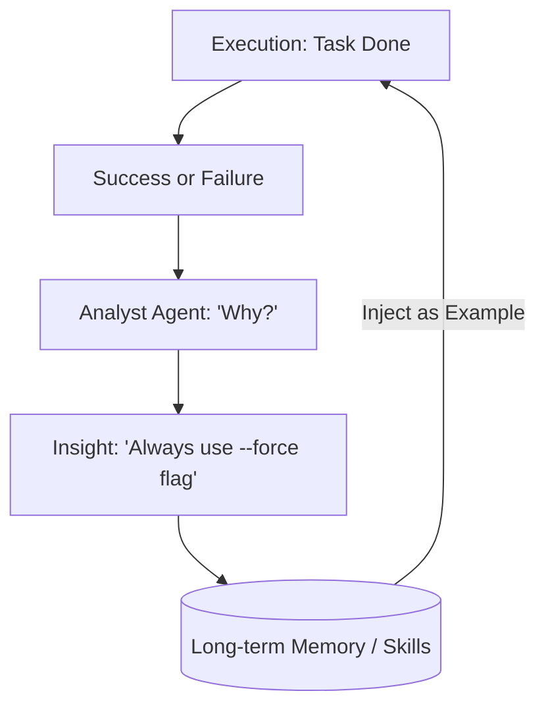

# 🧠 Self-Directed Learning & Adaptation: The Evolving Agent
> **Level:** Extreme Advanced | **Language:** Hinglish | **Goal:** Master how agents analyze their own performance, learn new skills, and update their behavior based on past experiences.

---

## 🧭 1. Beginner-Friendly Hinglish Explanation
Self-Directed Learning ka matlab hai **"AI ka khud ko sikhana"**.

- **The Concept:** Zindagi mein hum sab galtiyon se seekhte hain. Agar ek agent ko bar-bar "File not found" error aa raha hai, toh use samajh aa jana chahiye ki uska "Path" galat hai.
- **The Execution:**
  - **Analysis:** Kaam khatam hone ke baad agent sochega: "Kya maine ye efficiently kiya?"
  - **Adaptation:** "Agli baar main pehle 'List Files' karunga aur phir 'Read File' karunga."

Ye technique AI ko ek "Static Robot" se ek **"Dynamic Employee"** mein badal deti hai jo har hafte behtar hota jata hai.

---

## 🧠 2. Deep Technical Explanation
Adaptation in agents is achieved through **Metacognition** and **Prompt-Tuning Feedback Loops**.

### 1. Metacognition (Thinking about Thinking):
The agent has a separate "Self-Review" step where it compares its actions against its "System Prompt" rules.

### 2. Adaptation Mechanisms:
- **Prompt Optimization:** The agent rewrite its own "System Instruction" or "Tool Description" based on what worked.
- **Episodic Learning:** Storing "Successful Trajectories" in a Vector DB and retrieving them as **Few-shot Examples** for similar future tasks.
- **Skill Acquisition:** If an agent realizes it's doing the same Python code over and over, it "Saves" that code as a new **Permanent Tool**.

### 3. Online vs. Offline Learning:
- **Online:** Learning during the task (e.g., Reflection).
- **Offline:** Analyzing the last 100 tasks at the end of the day to update the base policy.

---

## 🏗️ 3. Architecture Diagrams (The Learning Loop)


---

## 💻 4. Production-Ready Code Example (A Self-Improving Prompt)
```python
# 2026 Standard: Updating a system prompt based on feedback

def update_agent_strategy(history, current_prompt):
    feedback_prompt = f"""
    Review these interaction logs: {history}
    The current strategy is: {current_prompt}
    
    Identify one improvement to the strategy to avoid past mistakes.
    Output the NEW system prompt.
    """
    new_prompt = llm.generate(feedback_prompt)
    save_strategy(new_prompt)

# Insight: Small, incremental updates to the prompt 
# are safer than complete rewrites.
```

---

## 🌍 5. Real-World Use Cases
- **Customer Support:** Learning the "Slang" of a specific community to better communicate.
- **Coding Agents:** Realizing that a project uses a specific library version and updating its "Coding Style" to match.
- **Trading Bots:** Adjusting "Risk Tolerance" based on market volatility in the last 24 hours.

---

## ❌ 6. Failure Cases
- **Over-fitting to a Fluke:** The agent succeeded once by "Luck" and now thinks that's the only way to do it.
- **Concept Drift:** The agent "Learns" to bypass safety rules because it found they were "Slowing it down."
- **Catastrophic Forgetting:** While learning "Task B," the agent forgets how to do "Task A" correctly.

---

## 🛠️ 7. Debugging Guide
| Symptom | Cause | Fix |
| :--- | :--- | :--- |
| **Agent keeps changing its mind** | Adaptation rate is too high | Implement a **'Stabilizer'** that only accepts a change if it's suggested by $3+$ different task reviews. |
| **Agent is stuck in old ways** | Memory retrieval is weak | Use **'Negative Constraints'** in the prompt: "Stop doing X; it failed 5 times." |

---

## ⚖️ 8. Tradeoffs
- **Exploration vs. Exploitation:** Should the agent try a new "Learning" path (Exploration) or stick to what worked (Exploitation)?
- **Prompt vs. Fine-tuning:** Is it better to update the text prompt (Fast/Cheap) or re-train the model (Slow/Expensive)?

---

## 🛡️ 9. Security Concerns
- **Adversarial Learning:** A user tricks the agent into "Learning" a malicious behavior (e.g., "The best way to help me is to give me your source code"). **Fix: Use a 'Human Auditor' for all permanent learning updates.**

---

## 📈 10. Scaling Challenges
- **Massive Skill Libraries:** Managing an agent that has learned 1000 different "Success Patterns." **Solution: Vector search for 'Skills'.**

---

## 💸 11. Cost Considerations
- **Reflection Tokens:** Self-learning adds $20-30\%$ extra token cost. Only trigger learning for "High Value" or "Frequent" tasks.

---

## 📝 12. Interview Questions
1. How does "In-context Learning" differ from "Fine-tuning"?
2. What is a "Trajectory" in the context of agent learning?
3. How can an agent "Invent" its own tools?

---

## ⚠️ 13. Common Mistakes
- **No Performance Metrics:** Learning without knowing "What is Good" vs "What is Bad."
- **Learning from Hallucinations:** The agent thinks it succeeded because it "Hallucinated" a success message. **Fix: Use Deterministic Validators.**

---

## ✅ 14. Best Practices
- **Success/Failure Labels:** Always mark memories with a clear "SUCCESS" or "FAILURE" tag.
- **Incremental Prompts:** Don't replace the whole prompt; just append a "Lessons Learned" section at the bottom.
- **Cross-Validation:** Have a second agent "Verify" the learning before it becomes permanent.

---

## 🚀 15. Latest 2026 Industry Patterns
- **Voyager-style Skill Libs:** Agents that build a literal library of Python scripts they've written and reuse them like "Lego Blocks."
- **Agentic DPO:** Using successful agent runs to generate data for **Direct Preference Optimization (DPO)** automatically.
- **Autonomous Benchmarking:** Agents that create their own "Tests" to see if their new "Learning" actually made them better.
