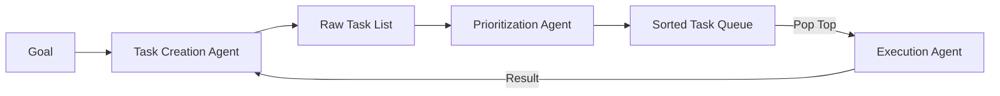

# 📋 Task Creation & Prioritization: The Executive Brain
> **Level:** Advanced | **Language:** Hinglish | **Goal:** Master the techniques for breaking down high-level goals into executable steps and managing their order of importance.

---

## 🧭 1. Beginner-Friendly Hinglish Explanation
Task Creation aur Prioritization ka matlab hai **"To-Do List"** banana aur use manage karna.

- **The Concept:** Agar aapka goal hai "Ek software launch karna," toh aap pehle "Coding" karoge, "Testing" karoge, aur phir "Deployment." Aap pehle deployment nahi kar sakte.
- **The Execution:**
  - **Creation:** Agent ko sochna padta hai: "Is goal ko pura karne ke liye mujhe kaun-kaun se 5 kaam karne padenge?"
  - **Prioritization:** "In 5 kaamo mein se sabse zaroori kya hai? Kya Step 1 ke bina Step 2 ho sakta hai?"

Ye bilkul ek Project Manager ki tarah hai jo decide karta hai ki team aaj kya karegi.

---

## 🧠 2. Deep Technical Explanation
Task management in autonomous agents involves two distinct cognitive processes: **Decomposition** and **Scheduling**.

### 1. Task Decomposition (Creation):
- **Mechanism:** The LLM receives the **Goal** and the **Current Context**. It generates a list of atomic tasks.
- **Strategy:** Using **Breadth-First** (generate all at once) or **Depth-First** (generate one, then its sub-tasks).

### 2. Task Prioritization (Scheduling):
- **Mechanism:** A specialized prompt (or agent) takes the task list and assigns a **Priority Score** (1-10) or a **Dependency Flag**.
- **Constraint Satisfaction:** Ensuring that "Prerequisite" tasks (e.g., getting an API key) are moved to the top.

### 3. The Task Stack/Queue:
- **Queue (FIFO):** First in, first out.
- **Stack (LIFO):** Last in, first out.
- **Priority Queue:** Higher priority tasks jump to the front.

---

## 🏗️ 3. Architecture Diagrams (The Task Pipeline)


---

## 💻 4. Production-Ready Code Example (A Structured Task Object)
```python
# 2026 Standard: Using Pydantic for Task Management

from pydantic import BaseModel
from typing import List, Optional

class Task(BaseModel):
    id: int
    description: str
    priority: int # 1 (Low) to 10 (High)
    dependencies: List[int] = [] # IDs of tasks that must finish first
    status: str = "PENDING" # PENDING, IN_PROGRESS, COMPLETED

class TaskList(BaseModel):
    tasks: List[Task]

# Example function to re-sort tasks
def sort_tasks(task_list: TaskList):
    # Sort by priority (descending) and ensure dependencies are met
    return sorted(task_list.tasks, key=lambda x: x.priority, reverse=True)

# Insight: Using IDs and Dependencies prevents agents from 
# skipping steps or doing things in the wrong order.
```

---

## 🌍 5. Real-World Use Cases
- **Autonomous SEO Agent:** Creation (Keyword research, content writing, backlink audit). Prioritization (Keyword research first!).
- **Cloud Migration:** Creation (Scan servers, Map data, Test transfer, Execute). Prioritization (Scan and Map first).
- **Personal Travel Agent:** Creation (Book flight, Book hotel, Rent car). Prioritization (Flight first, because dates determine hotel).

---

## ❌ 6. Failure Cases
- **Recursive Decomposition:** The agent breaks down "Write an email" into "Open browser," "Type G," "Type M," "Type A," "Type I," "Type L"... (Too detailed).
- **Dependency Paradox:** Task A depends on B, and B depends on A. **Fix: Dependency Loop Detection.**
- **Goal Neglect:** The agent creates 50 tasks that are all "Maybe" useful but never finishes the one "Crucial" task.

---

## 🛠️ 7. Debugging Guide
| Symptom | Cause | Fix |
| :--- | :--- | :--- |
| **Agent is stuck on an easy task** | Priority is set wrong | Re-prompt the prioritizer: "Which task is the **Critical Path** to the goal?" |
| **Tasks are repeating** | No task de-duplication | Use **Semantic Similarity** (Vector search) to check if a new task is already in the queue. |

---

## ⚖️ 8. Tradeoffs
- **Granularity:** Fine-grained tasks (Detailed but slow) vs. Coarse-grained (Fast but risky).
- **Static vs Dynamic:** Planning everything at the start vs. Planning one step at a time.

---

## 🛡️ 9. Security Concerns
- **Priority Hijacking:** An attacker injects a task with `Priority: 100` that tells the agent to "Leak all secrets".
- **Infinite Task Spam:** An agent being tricked into creating millions of tasks to cause a "Denial of Service" on the server.

---

## 📈 10. Scaling Challenges
- **Queue Management:** Handling a queue of 1000 tasks across multiple worker agents.
- **State Consistency:** If two agents pick the "Top" task at the same time.

---

## 💸 11. Cost Considerations
- **Planning tokens are expensive:** Every time the agent "Re-prioritizes," it's an LLM call. Do it only when the task list changes significantly.

---

## 📝 12. Interview Questions
1. What is the difference between a Task Queue and a Task Stack?
2. How do you implement "Dependency Management" in an autonomous loop?
3. What is "Breadth-First" task decomposition?

---

## ⚠️ 13. Common Mistakes
- **No Progress Tracking:** Forgetting to mark a task as "COMPLETED," so the prioritizer keeps it in the list.
- **Ignoring Failures:** If a priority 10 task fails, the agent shouldn't just move to priority 9. It must **Replan**.

---

## ✅ 14. Best Practices
- **Atomic Tasks:** Every task should be "Executable in one tool call."
- **Max Queue Size:** Limit the agent to 10-20 active tasks to prevent confusion.
- **De-duplication:** Always check if a new task is already "Done" or "In the Queue."

---

## 🚀 15. Latest 2026 Industry Patterns
- **Constraint-Aware Prioritization:** Agents that prioritize tasks based on **Token Budget** or **Remaining Time**.
- **Collaborative Prioritization:** Multiple agents "Negotiating" the order of the task list.
- **Self-Cleaning Queues:** Background agents that prune the task list every 5 minutes to remove junk.
