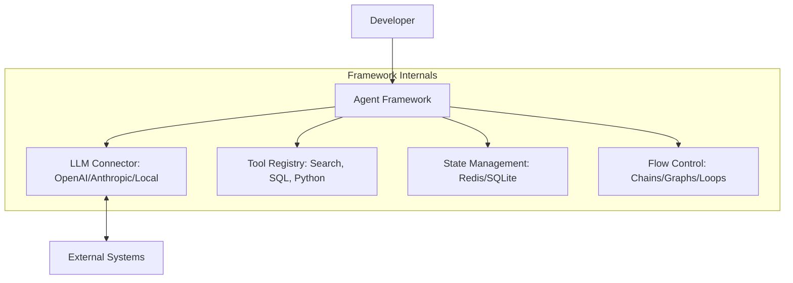

# 🏗️ Agent Development Frameworks: The Builder's Toolkit
> **Level:** Fundamentals | **Language:** Hinglish | **Goal:** Understand the landscape of libraries and platforms used to build, orchestrate, and deploy AI agents in 2026.

---

## 🧭 1. Beginner-Friendly Hinglish Explanation
Agent Frameworks ka matlab hai **"AI banane ke Ready-made Saanche"** (Templates).

- **The Problem:** Agar aap zero se agent banaoge, toh aapko "Memory," "Tool-use," "Error handling," aur "API calls" sab khud code karna padega. Isme mahino lag sakte hain.
- **The Solution:** Frameworks humein ye sab cheezein "Built-in" dete hain.
  - **LangChain:** Ek bahut bada toolkit jisme har tarah ki connectivity hai.
  - **CrewAI:** Jab aapko agents ki "Team" (Role-playing) banani ho.
  - **AutoGen:** Microsoft ka system jab agents ko aapas mein bahut zyada "Baat-cheet" karni ho.

Framework use karne se aapka focus "System" banane par nahi, balki "Problem solve" karne par hota hai.

---

## 🧠 2. Deep Technical Explanation
Agent frameworks provide the **Abstraction Layer** between the LLM and the application logic.

### 1. The Core Pillars of any Framework:
- **Orchestration:** How the loop is managed (Sequential, DAG, or Autonomous).
- **Tooling:** How functions are converted to JSON schemas and executed safely.
- **Memory:** How state is persisted across turns (SQLite, Redis, Vector DB).
- **Tracing:** Logging every step for debugging (LangSmith, Phoenix).

### 2. Taxonomy of Frameworks (2026):
- **Library-based:** You write the code (LangGraph, PydanticAI).
- **Low-code/No-code:** Drag-and-drop interfaces (Flowise, Dify).
- **Managed API:** Big providers handle everything (OpenAI Assistants, Claude Analysis Tool).

### 3. The Shift to 'State Machines':
Modern frameworks (like LangGraph) move away from "Black Box" loops and towards **Directed Acyclic Graphs (DAGs)**, giving developers $100\%$ control over the agent's path.

---

## 🏗️ 3. Architecture Diagrams (Framework Layers)


---

## 💻 4. Production-Ready Code Example (A Generic Framework Blueprint)
```python
# 2026 Standard: Conceptual overview of a Framework call

# 1. Initialize the Model
model = Framework.load_model("gpt-4o")

# 2. Define the Agent
agent = Framework.create_agent(
    role="Legal Researcher",
    tools=[search_tool, pdf_tool],
    memory=Framework.persistent_memory(db="redis")
)

# 3. Execute the Task
task = "Analyze the merger agreement for risks."
result = agent.run(task)

# Insight: Frameworks handle the 'While Loop' and 'Tool JSON' behind the scenes.
```

---

## 🌍 5. Real-World Use Cases
- **Enterprise Search:** Using **Dify** to build a RAG-based agent for internal HR docs.
- **Multi-agent Writing:** Using **CrewAI** to manage a team of "Researcher", "Writer", and "Editor" agents.
- **Code Assistants:** Using **LangGraph** to build a complex state-aware coding agent that can self-correct.

---

## ❌ 6. Failure Cases
- **Abstractions Overload:** The framework is so "Heavy" that you can't see the raw prompt, making it impossible to debug hallucinations.
- **Vendor Lock-in:** Using a managed framework (like OpenAI Assistants) makes it hard to switch to a local Llama-3 model later.
- **Version Hell:** Frameworks evolve so fast that code written 3 months ago doesn't run today.

---

## 🛠️ 7. Debugging Guide
| Symptom | Cause | Fix |
| :--- | :--- | :--- |
| **Agent is 'Silent'** | Error swallowed by framework | Enable **Verbose Logging** or use a **Tracing tool** like LangSmith. |
| **Tool call fails** | Schema mismatch in framework | Check the **Pydantic model** used for the tool definition. |

---

## ⚖️ 8. Tradeoffs
- **Control vs. Convenience:** Custom code (Control) vs. Framework (Convenience).
- **Stateful vs. Stateless:** Complex frameworks manage state for you; simple ones require you to pass the history manually.

---

## 🛡️ 9. Security Concerns
- **Hidden Prompts:** Frameworks often inject their own "Secret System Prompts" which might have security flaws.
- **Dependency Vulnerabilities:** A bug in a minor library of the framework could lead to a full system compromise.

---

## 📈 10. Scaling Challenges
- **Memory Bloat:** Frameworks that store "Everything" in memory can crash under high load. **Solution: Offload to external databases.**

---

## 💸 11. Cost Considerations
- **Token Overhead:** Frameworks add "System messages" and "Formatting" that can increase token usage by $20-50\%$.

---

## 📝 12. Interview Questions
1. What is the difference between LangChain and LangGraph?
2. Why is "State Management" the hardest part of building agents?
3. How do you choose between a library-based framework and a no-code platform?

---

## ⚠️ 13. Common Mistakes
- **Using a framework for simple RAG:** If you just need to search a PDF, you don't need a heavy agent framework.
- **Not using Tracing:** Building an agent without seeing the internal "Thought" logs.

---

## ✅ 14. Best Practices
- **Start Simple:** Use a lightweight library (like PydanticAI) before moving to heavy frameworks.
- **Stay Model-Agnostic:** Ensure your framework can switch between different LLM providers easily.
- **Document the Graph:** If using LangGraph, always maintain a visual diagram of the state flow.

---

## 🚀 15. Latest 2026 Industry Patterns
- **PydanticAI Revolution:** Moving towards frameworks that use standard Python types and are "Developer First" rather than "Prompt First".
- **Agentic IDE Integration:** Frameworks being baked directly into VS Code and Cursor for seamless development.
- **Edge Frameworks:** Lightweight agent toolkits designed to run specifically on mobile chips (Apple Intelligence style).
