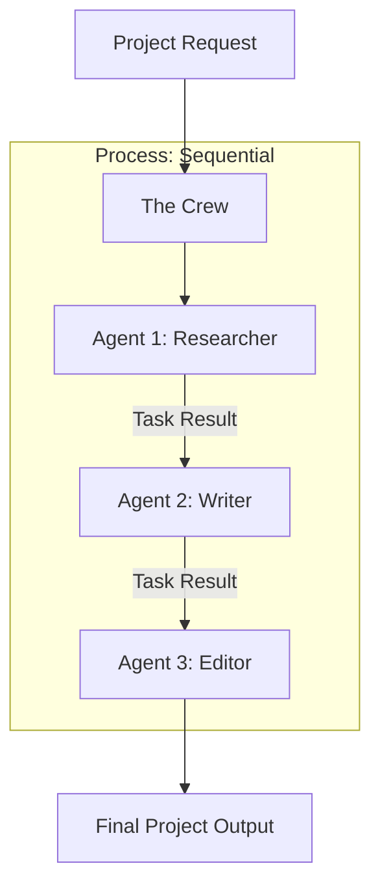

# 🛳️ CrewAI Framework: Orchestrating Role-Playing Agents
> **Level:** Advanced | **Language:** Hinglish | **Goal:** Master the framework designed specifically for creating collaborative teams of agents with distinct personas and cooperative workflows.

---

## 🧭 1. Beginner-Friendly Hinglish Explanation
CrewAI ka matlab hai **"AI ki Film Cast"** banana.

- **The Concept:** Socho aap ek film bana rahe ho. Aapko ek Director chahiye, ek Actor chahiye, aur ek Cameraman. 
- **The Execution:** CrewAI mein hum:
  1. **Agents** banate hain (Actor, Director).
  2. Unhe **Tasks** dete hain (Script padho, Shoot karo).
  3. Unka ek **Crew** banate hain jo aapas mein milkar kaam karta hai.
- **The Logic:** CrewAI "Process" par focus karta hai—yaani pehle kaun kaam karega aur uske baad kaun.

Ye framework tab best hai jab aapko ek line-by-line project complete karwana ho.

---

## 🧠 2. Deep Technical Explanation
CrewAI is built on top of LangChain but focuses on **Role-Based Collaboration**.

### 1. The Four Pillars of CrewAI:
- **Agents:** The actors with `Role`, `Goal`, and `Backstory`. Backstory is the secret sauce that makes the agent stay in character.
- **Tasks:** The specific unit of work. Includes a `description`, an `expected_output`, and the assigned `agent`.
- **Tools:** Capabilities given to agents (Search, Calculator, custom Python code).
- **Process:** The workflow manager. 
  - `Sequential`: A -> B -> C.
  - `Hierarchical`: A Manager agent assigns tasks and reviews outputs.

### 2. Guardrails & Self-Correction:
CrewAI has built-in mechanisms for agents to "Self-reflect" on their task output before handing it over to the next agent.

### 3. Agent Delegation:
Agents can automatically delegate sub-tasks to other agents in the crew if they feel another agent is better suited for the job.

---

## 🏗️ 3. Architecture Diagrams (The Crew Workflow)


---

## 💻 4. Production-Ready Code Example (A Research & Write Crew)
```python
# 2026 Standard: Implementing a multi-agent crew

from crewai import Agent, Task, Crew, Process

# 1. Define Agents
researcher = Agent(
  role='Senior Researcher',
  goal='Uncover latest 2026 AI trends',
  backstory='You are a curious tech journalist with an eye for detail.',
  verbose=True,
  allow_delegation=False
)

writer = Agent(
  role='Technical Writer',
  goal='Write a blog post about AI trends',
  backstory='You are a master at explaining complex tech simply.',
  verbose=True
)

# 2. Define Tasks
task1 = Task(description='Search for 2026 AI breakthroughs', agent=researcher)
task2 = Task(description='Write a 500-word post based on task1', agent=writer)

# 3. Form the Crew
my_crew = Crew(
  agents=[researcher, writer],
  tasks=[task1, task2],
  process=Process.sequential # Sequential order
)

# 4. Kickoff
result = my_crew.kickoff()
```

---

## 🌍 5. Real-World Use Cases
- **Marketing Agency:** One agent does SEO research, another writes copy, a third generates images.
- **Financial Report Generation:** A "Data Harvester" agent collects stock prices, an "Analyst" agent calculates metrics, and a "Report" agent formats the PDF.
- **Trip Planning:** "Flights Agent" + "Hotels Agent" + "Local Guide Agent" = A perfect itinerary.

---

## ❌ 6. Failure Cases
- **Persona Confusion:** If backstories are too similar, agents might start doing each other's work or arguing over authority.
- **Output Mismatch:** The researcher gives a CSV, but the writer expected a Markdown list. **Fix: Use `expected_output` in Task definition.**
- **Long Handoffs:** In a 5-agent crew, if the first agent takes too long, the whole system feels frozen.

---

## 🛠️ 7. Debugging Guide
| Symptom | Cause | Fix |
| :--- | :--- | :--- |
| **Agent is in a loop** | Goal is too broad | Make the **Task Description** more specific (e.g., "Find exactly 3 links"). |
| **Delegation failed** | Agent doesn't know about teammates | Ensure all agents are added to the `agents` list in the `Crew` object. |

---

## ⚖️ 8. Tradeoffs
- **Sequential vs Hierarchical:** Sequential is easier to build; Hierarchical is better for complex, unpredictable tasks.
- **Token Usage:** CrewAI is "Chatty". It uses many tokens for internal agent-to-agent talk.

---

## 🛡️ 9. Security Concerns
- **Tool Access:** If you give a "Writer" agent terminal access, it might accidentally run harmful commands while trying to "Save a file". **Fix: Restrict tools per agent.**

---

## 📈 10. Scaling Challenges
- **Massive Crews:** A crew with 20 agents is extremely slow and expensive. **Solution: Break into 'Sub-Crews'.**

---

## 💸 11. Cost Considerations
- **Mix and Match Models:** Run the Researcher on **Llama-3-70B** (local) and the Writer on **GPT-4o** (API) to balance cost and quality.

---

## 📝 12. Interview Questions
1. What is the difference between an Agent and a Task in CrewAI?
2. How does the `Process` parameter work?
3. What is the role of the `Backstory` in CrewAI?

---

## ⚠️ 13. Common Mistakes
- **No `verbose=True`:** Not being able to see the internal agent "Thoughts" during development.
- **Allowing Delegation everywhere:** If all agents can delegate to everyone, they might just pass the ball around forever.

---

## ✅ 14. Best Practices
- **Atomic Tasks:** One task = One specific outcome.
- **Clear Expected Output:** Tell the agent *exactly* what the final string/JSON should look like.
- **Iterative Refinement:** Start with 2 agents, then add more as you find gaps.

---

## 🚀 15. Latest 2026 Industry Patterns
- **Memory-Augmented Crews:** Using a shared RAG database for the whole crew so they can "Learn" from previous projects.
- **Asynchronous Crews:** Let the agents work in the background and notify you via Slack when the project is done.
- **Self-Healing Task Lists:** A manager agent that automatically adds a "Debugging Task" if the current task fails.
