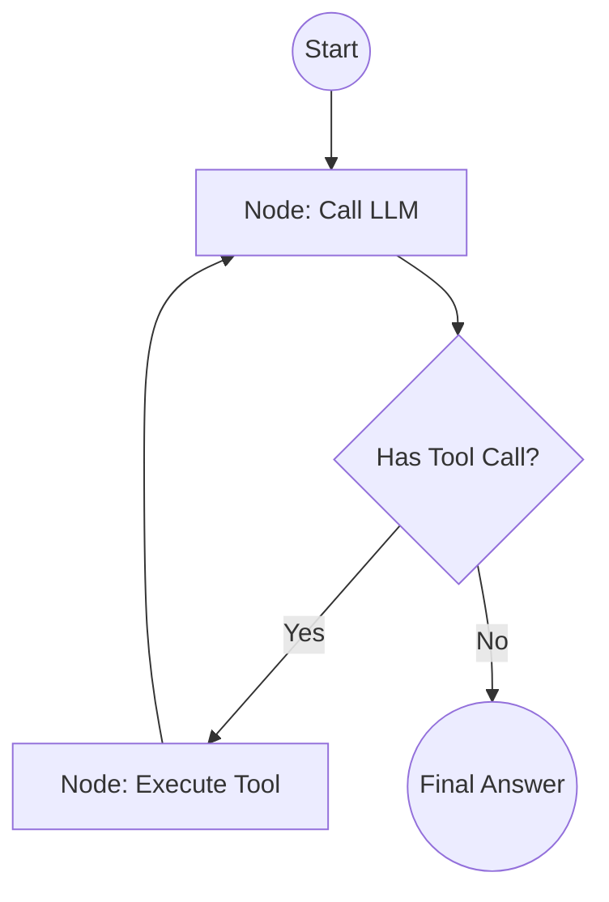

# 🦜 LangChain Agents: The Modular Orchestrator
> **Level:** Advanced | **Language:** Hinglish | **Goal:** Master the legacy and modern (LangGraph) ways of building agents using the world's most popular AI library.

---

## 🧭 1. Beginner-Friendly Hinglish Explanation
LangChain Agents ka matlab hai **"AI ke liye Lego Blocks"**.

- **The Concept:** LangChain ne AI ki har cheez (LLM, Database, Google Search, PDF Reader) ko ek "Component" (Block) bana diya hai.
- **The Execution:** Aap bas ye blocks jodte ho:
  1. **Prompt Template** (Instructions).
  2. **LLM** (The Brain).
  3. **Output Parser** (JSON nikaalne wala).
  4. **Tools** (Action lene wale).
- **The Modern Shift:** Pehle LangChain mein agents "Black Box" (Pre-built) hote the. Ab hum **LangGraph** use karte hain jahan hum ek "Map" (Graph) banate hain ki AI kab kya karega.

Ye framework unke liye hai jo har step par full control chahte hain.

---

## 🧠 2. Deep Technical Explanation
LangChain evolved from simple **Chains** (Linear) to **Agents** (Cyclic).

### 1. The Classic Agent Loop (AgentExecutor):
- **Input:** User query + List of tools.
- **Action:** LLM outputs an `AgentAction` (Tool name + Input).
- **Observation:** The code runs the tool and returns the `Observation`.
- **Iteration:** The LLM receives the observation and decides: "Next Action" or "Final Answer".

### 2. The Modern Era (LangGraph):
- **State:** A central object (usually a TypedDict) that stores the conversation history and tool outputs.
- **Nodes:** Python functions that perform a step (e.g., `call_model`, `call_tools`).
- **Edges:** Rules that define how to move between nodes (e.g., "If tool call found -> go to Tool Node").

### 3. Tool Binding:
LangChain uses `bind_tools()` to automatically convert Python functions (with type hints) into the JSON schemas expected by models like GPT-4 or Claude.

---

## 🏗️ 3. Architecture Diagrams (LangGraph State Flow)


---

## 💻 4. Production-Ready Code Example (A Basic LangGraph Agent)
```python
# 2026 Standard: Using LangGraph for a resilient agent loop

from langgraph.graph import StateGraph, END
from typing import TypedDict, Annotated, List

# 1. Define State
class AgentState(TypedDict):
    messages: Annotated[List[str], "The conversation history"]

# 2. Define Nodes
def call_model(state: AgentState):
    # Logic to call LLM and get response
    return {"messages": ["Assistant: I will search for that."]}

def call_tool(state: AgentState):
    # Logic to execute search
    return {"messages": ["Tool Result: Found 5 links."]}

# 3. Build Graph
workflow = StateGraph(AgentState)
workflow.add_node("agent", call_model)
workflow.add_node("tools", call_tool)

workflow.set_entry_point("agent")
workflow.add_conditional_edges("agent", lambda x: "tools" if "search" in x["messages"][-1] else END)
workflow.add_edge("tools", "agent")

app = workflow.compile()
```

---

## 🌍 5. Real-World Use Cases
- **Complex RAG:** An agent that decides *whether* to search the vector DB, the web, or just answer from memory.
- **Data Pipelines:** Agents that extract data from an API, clean it with Python, and then save it to SQL.
- **Human-in-the-loop Workflows:** Using LangGraph to "Pause" execution and wait for a human to approve a sensitive tool call.

---

## ❌ 6. Failure Cases
- **Recursion Limit:** The agent gets stuck in a loop and hits the default limit (e.g., 25 steps).
- **State Bloat:** Storing too much data in the `AgentState`, exceeding the context window of the LLM.
- **Parsing Errors:** The LLM outputs a tool call in a format the parser doesn't understand.

---

## 🛠️ 7. Debugging Guide
| Symptom | Cause | Fix |
| :--- | :--- | :--- |
| **Agent is stuck in 'Model' node** | No conditional edge reached | Check the **Edge Function** logic to ensure it correctly identifies tool calls. |
| **Old results are missing** | State not being updated | Ensure nodes return a **Dictionary** that merges with the global state correctly. |

---

## ⚖️ 8. Tradeoffs
- **Legacy AgentExecutor vs. LangGraph:** Executor is easier to start; LangGraph is much easier to maintain and debug for production.
- **Python vs. JavaScript:** LangChain is available in both, but the Python ecosystem for data/AI is much richer.

---

## 🛡️ 9. Security Concerns
- **Prompt Injection:** Attackers bypassing the "Guardrail" nodes in your graph. **Fix: Add a 'Safety Filter' node at the beginning.**
- **Tool Shadowing:** Malicious input that makes the agent call `system_reset()` instead of `search_topic()`.

---

## 📈 10. Scaling Challenges
- **Serialization:** Saving and loading complex graph states from a database (Checkpoints).
- **Parallel Nodes:** Running multiple tool calls at once in LangGraph.

---

## 💸 11. Cost Considerations
- **LangSmith Overhead:** While tracing is great, it can be expensive for high-volume apps. Use **Sampling**.

---

## 📝 12. Interview Questions
1. What is the benefit of using a Graph over a simple while loop?
2. How do you handle "State" in LangGraph?
3. What is a "Conditional Edge"?

---

## ⚠️ 13. Common Mistakes
- **Over-complicating the Graph:** Creating 50 nodes for a 2-step process.
- **Ignoring the Parser:** Not handling cases where the LLM fails to output valid JSON.

---

## ✅ 14. Best Practices
- **Use PydanticAI:** If your agents are simple, PydanticAI is often cleaner than LangChain.
- **Checkpointing:** Always use a `Checkpointer` (Redis/Postgres) so your agents can survive server restarts.
- **Modular Nodes:** Keep every node function small and testable.

---

## 🚀 15. Latest 2026 Industry Patterns
- **Multi-Agent Graphs:** A single LangGraph where different nodes are powered by different models (e.g., GPT-4 for planning, Llama-3 for tools).
- **Time-Travel Debugging:** Using LangGraph's state history to "Rewind" an agent and try a different action.
- **Agentic Memory (Store):** LangChain's new managed memory layer that handles RAG and short-term state automatically.
