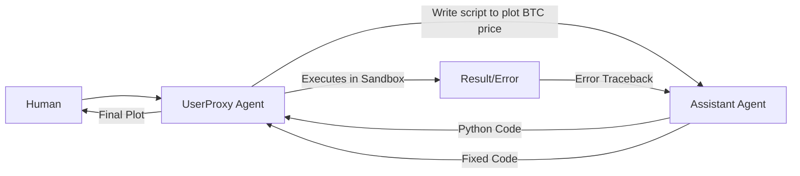

# 🤖 Microsoft AutoGen: Conversational Agent Orchestration
> **Level:** Advanced | **Language:** Hinglish | **Goal:** Master the framework designed for complex multi-agent conversations, code execution, and customizable agent interactions.

---

## 🧭 1. Beginner-Friendly Hinglish Explanation
AutoGen ka matlab hai **"Agents ka Group Chat"**.

- **The Concept:** AutoGen is philosophy par chalta hai ki AI agents aapas mein "Baat" karke problem solve kar sakte hain.
- **The Execution:** Isme hum do (ya zyada) agents banate hain jo aapas mein chat karte hain.
  - **UserProxy Agent:** Ye aapka (Human) representative hai. Ye code run kar sakta hai aur doosre agents ko feedback de sakta hai.
  - **Assistant Agent:** Ye dimaag hai jo code likhta hai aur sawalon ke jawab deta hai.
- **The Flow:** 
  1. UserProxy sawal puchta hai.
  2. Assistant code likhta hai.
  3. UserProxy code run karta hai (Sandbox mein).
  4. Agar error aaya, toh UserProxy Assistant ko batata hai, "Bhai, error hai, fix karo."

Ye system "Self-healing code" ke liye sabse best hai.

---

## 🧠 2. Deep Technical Explanation
AutoGen (Microsoft Research) is based on the **Conversational Programming** paradigm.

### 1. Key Agent Types:
- **AssistantAgent:** Typically uses an LLM. It acts as a solver, planner, or critic.
- **UserProxyAgent:** Acts as a human surrogate. Crucially, it can **Execute Code** and trigger tool calls automatically or with human approval.
- **GroupChatManager:** A specialized agent that coordinates a conversation between $3+$ agents, deciding who speaks next.

### 2. Termination Conditions:
In AutoGen, the chat continues until a specific condition is met (e.g., the word "TERMINATE" appears in a message).

### 3. Code Execution:
Unlike other frameworks, AutoGen has first-class support for **Docker-based Code Execution**, making it much safer to run AI-generated scripts.

---

## 🏗️ 3. Architecture Diagrams (Conversational Flow)


---

## 💻 4. Production-Ready Code Example (A Self-Correcting Coder)
```python
# 2026 Standard: AutoGen multi-agent setup

from autogen import AssistantAgent, UserProxyAgent

# 1. Create the Coder
assistant = AssistantAgent(
    name="Coder",
    llm_config={"config_list": [{"model": "gpt-4o", "api_key": "sk-..."}]}
)

# 2. Create the Executor (UserProxy)
user_proxy = UserProxyAgent(
    name="Executor",
    human_input_mode="NEVER", # Auto-run code
    code_execution_config={"work_dir": "coding", "use_docker": True}
)

# 3. Start the Conversation
user_proxy.initiate_chat(
    assistant,
    message="Download the stock data of NVDA and save it as a CSV file."
)
```

---

## 🌍 5. Real-World Use Cases
- **Autonomous Debugging:** An agent that reads a GitHub issue, writes a fix, runs the tests, and iterates until they pass.
- **Mathematical Problem Solving:** Using Python's `math` libraries to verify complex calculations.
- **Competitive Analysis:** Multiple agents (Researcher, Critic, Summarizer) debating the strengths and weaknesses of a product.

---

## ❌ 6. Failure Cases
- **The "Infinite Chat" Loop:** Two agents keep praising each other's work without finishing.
- **Execution Hallucination:** Assistant agent writes code for a library that isn't installed in the UserProxy's environment.
- **Non-deterministic Flow:** In a Group Chat, the "Manager" might pick the wrong agent to speak next, breaking the logical sequence.

---

## 🛠️ 7. Debugging Guide
| Symptom | Cause | Fix |
| :--- | :--- | :--- |
| **Code fails with 'ModuleNotFound'** | Sandbox lacks libraries | Add a list of libraries to the `code_execution_config`. |
| **Agents are repetitive** | Context window is too small | Use the **'Compressive Memory'** feature to summarize the chat history. |

---

## ⚖️ 8. Tradeoffs
- **Chat-based vs Task-based:** AutoGen is highly flexible but harder to control than the rigid sequential tasks of CrewAI.
- **Local vs API Models:** AutoGen works great with local models (Ollama/LM Studio) but requires fine-tuning for complex multi-agent logic.

---

## 🛡️ 9. Security Concerns (Critical)
- **Arbitrary Code Execution:** UserProxy runs code. **ALWAYS** use `use_docker=True` in production to prevent the agent from wiping your hard drive.
- **Prompt Injection:** An agent being tricked into running a "Malicious command" that was hidden in a web search result.

---

## 📈 10. Scaling Challenges
- **State Serialization:** It's hard to "Pause" an AutoGen chat and resume it days later.
- **Group Chat Complexity:** Managing $10+$ agents in one conversation often leads to "Noise" and confusion.

---

## 💸 11. Cost Considerations
- **High Token Consumption:** Multi-turn chats between 2-3 agents can easily cost $\$0.50$ per session. Use **GPT-4o-mini** for intermediate steps.

---

## 📝 12. Interview Questions
1. What is the role of a `UserProxyAgent` in AutoGen?
2. How does AutoGen handle code execution safety?
3. What is the difference between a 2-agent chat and a `GroupChat`?

---

## ⚠️ 13. Common Mistakes
- **No termination signal:** Forgetting to tell the agent to say "TERMINATE" when done, leading to wasted tokens.
- **Running as Root:** Not using a non-root user in the Docker container.

---

## ✅ 14. Best Practices
- **Define a 'Critic' Agent:** Always have one agent whose only job is to find flaws in the Assistant's code.
- **Use JSON for Data:** Force agents to share structured data in their chat messages.
- **Limit 'Max Rounds':** Cap the conversation at 10-15 messages.

---

## 🚀 15. Latest 2026 Industry Patterns
- **AutoGen Studio:** A low-code UI for designing and testing AutoGen agents visually.
- **Multi-modal Conversations:** Agents sharing images and screenshots in their "Group Chat" to debug UI issues.
- **Federated AutoGen:** Agents running on different servers (Cloud and Local) talking to each other securely via encrypted tunnels.
