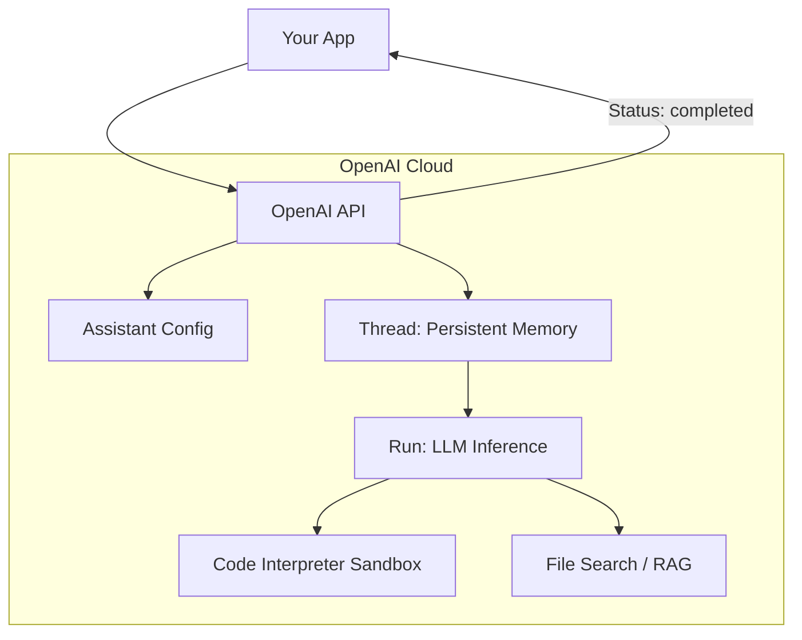

# ☁️ OpenAI Assistants API: The Managed Agent Cloud
> **Level:** Advanced | **Language:** Hinglish | **Goal:** Master the use of OpenAI's hosted infrastructure for building persistent, stateful agents with built-in tools like Code Interpreter and File Search.

---

## 🧭 1. Beginner-Friendly Hinglish Explanation
OpenAI Assistants API ka matlab hai **"OpenAI ka Ready-made Agent"**.

- **The Problem:** Agar aap normal GPT use karte ho, toh aapko "Memory" aur "Files" khud manage karni padti hain.
- **The Solution:** OpenAI ne ek pura "Backend" bana diya hai.
  - **Threads:** Ye "Conversations" ko yaad rakhta hai (aapko history save nahi karni padti).
  - **Code Interpreter:** AI khud code run kar sakta hai bina aapke computer ko touch kiye.
  - **File Search:** AI hazaron PDFs mein se info dhoond sakta hai (Built-in RAG).

Ye framework un logo ke liye best hai jo "Infrastructure" ki tension nahi lena chahte aur fast product launch karna chahte hain.

---

## 🧠 2. Deep Technical Explanation
The Assistants API is a **Stateful Orchestration Layer** hosted by OpenAI.

### 1. The Hierarchy:
- **Assistant:** The global configuration (Model, Instructions, Tools).
- **Thread:** A persistent session between a user and an assistant.
- **Message:** An individual turn in a thread.
- **Run:** The process of the Assistant "Thinking" and "Acting" on a thread.

### 2. Built-in Tools:
- **Code Interpreter:** A secure, sandboxed Python environment that handles data analysis, chart generation, and file processing.
- **File Search (v2):** A managed RAG system that automatically chunks, embeds, and indexes your files (up to $10,000$ files per assistant).

### 3. Function Calling:
You can define your own tools (e.g., `send_email`), and the API will pause the **Run** and wait for you to provide the tool output.

---

## 🏗️ 3. Architecture Diagrams (The Managed Flow)


---

## 💻 4. Production-Ready Code Example (Creating & Running an Assistant)
```python
# 2026 Standard: Interacting with the Assistants API (v2)

from openai import OpenAI
client = OpenAI()

# 1. Create the Assistant
assistant = client.beta.assistants.create(
  name="Data Analyst",
  instructions="Analyze CSV files and provide visual insights.",
  tools=[{"type": "code_interpreter"}],
  model="gpt-4o"
)

# 2. Create a Thread
thread = client.beta.threads.create()

# 3. Add a Message
message = client.beta.threads.messages.create(
  thread_id=thread.id,
  role="user",
  content="Plot the revenue growth from the attached file."
)

# 4. Run the Assistant
run = client.beta.threads.runs.create_and_poll(
  thread_id=thread.id,
  assistant_id=assistant.id
)

# 5. Get the Result
if run.status == 'completed':
  messages = client.beta.threads.messages.list(thread_id=thread.id)
  print(messages.data[0].content[0].text.value)
```

---

## 🌍 5. Real-World Use Cases
- **B2B SaaS Support:** An assistant that remembers a customer's full history and can search through technical manuals.
- **Financial Analysts:** Uploading $100$ annual reports and asking for a comparison table.
- **Educational Tutors:** Creating a persistent "Study Buddy" that tracks a student's progress over a whole semester.

---

## ❌ 6. Failure Cases
- **Status Stuck:** A "Run" gets stuck in `queued` or `in_progress` due to server load.
- **File Search Hallucination:** The RAG system retrieves the wrong chunk of text, and the model confidently gives a wrong answer.
- **Context Limit:** Even though threads are persistent, they still have a limit (e.g., $128k$ tokens). If exceeded, old messages are truncated.

---

## 🛠️ 7. Debugging Guide
| Symptom | Cause | Fix |
| :--- | :--- | :--- |
| **'Requires Action' Status** | Function Call triggered | You must execute the local function and call `submit_tool_outputs`. |
| **RAG isn't finding data** | Poor chunking | Check the **Vector Store** configuration and ensure files are in supported formats (PDF, TXT, DOCX). |

---

## ⚖️ 8. Tradeoffs
- **Ease vs. Flexibility:** Very easy to start; hard to customize the underlying RAG or Sandbox logic.
- **Cost:** You pay for the model tokens + per-assistant/per-vector-store storage fees.

---

## 🛡️ 9. Security Concerns
- **Data Residence:** Your files and chat history are stored on OpenAI's servers. **Not suitable for highly regulated industries (HIPAA/GDPR) without enterprise agreements.**
- **Thread Hijacking:** If a `thread_id` is leaked, an attacker can read the entire conversation history.

---

## 📈 10. Scaling Challenges
- **Rate Limits:** Running 1000 concurrent "Runs" might hit OpenAI's Tier limits.
- **Latency:** The "Create and Poll" pattern is slower than a raw Chat Completion call.

---

## 💸 11. Cost Considerations
- **Vector Store Fees:** $\$0.10$ per GB per day.
- **Code Interpreter Fees:** $\$0.03$ per session.
- **Token Usage:** Be careful with long threads; every "Run" re-processes the thread history.

---

## 📝 12. Interview Questions
1. What is the difference between a "Thread" and a "Run"?
2. How does the "Code Interpreter" tool handle generated images?
3. What happens when a Thread exceeds the model's context window?

---

## ⚠️ 13. Common Mistakes
- **Creating a new Assistant for every user:** You should create one Assistant and many Threads.
- **Not handling `requires_action`:** Thinking the API will call your local database automatically.

---

## ✅ 14. Best Practices
- **Use Streaming:** Use the `stream` parameter to show the user the agent's progress in real-time.
- **Manage Vector Stores:** Group related files into Vector Stores and attach them to the assistant as needed.
- **Clean up Threads:** Delete old threads to keep your account clean (though OpenAI manages this partially).

---

## 🚀 15. Latest 2026 Industry Patterns
- **Assistant-to-Assistant Handoff:** Using "File Search" to pass massive context between different specialized assistants.
- **Vision-enabled Assistants:** Uploading images/videos to a thread for the assistant to analyze.
- **Enterprise-Grade Sandbox:** Running the Assistants API logic on-premise using **Azure OpenAI Service**.
