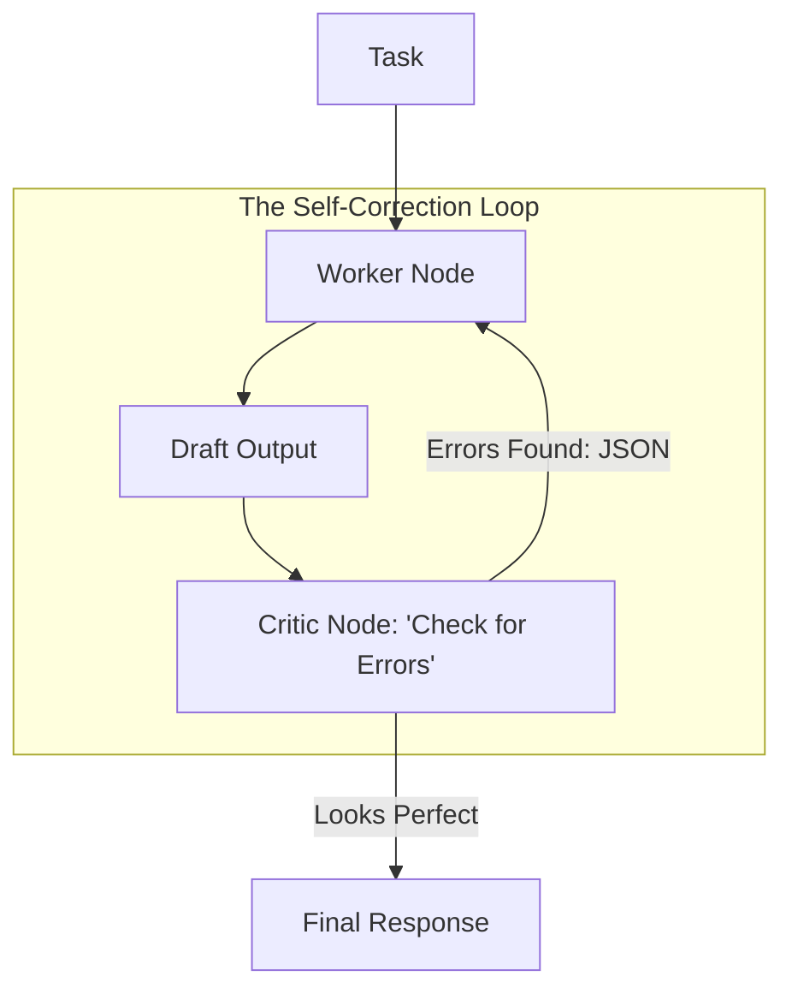

# 🔄 Agent Self-Correction Mechanisms: The Art of Reflection
> **Level:** Advanced | **Language:** Hinglish | **Goal:** Master the "Self-Correction" loops where agents detect their own mistakes in reasoning or execution and fix them before the final output.

---

## 🧭 1. Beginner-Friendly Hinglish Explanation
Self-Correction ka matlab hai **"Apni galti khud pakadna"**.

- **The Problem:** AI kabhi-kabhi confidence ke saath "Galt" baat bol deta hai (Hallucination).
- **The Solution:** Humein AI ko ek **"Reviewer"** ki tarah treat karna chahiye.
  - Pehle wo ek "Draft" banata hai.
  - Phir wo khud se sawal karta hai: "Kya ye logic sahi hai? Kya maine tools sahi use kiye?"
  - Agar use galti dikhti hai, toh wo "Draft" ko edit karta hai.
- **The Analogy:** Ye bilkul waisa hai jaise aap ek email likhte ho aur "Send" dabane se pehle use ek baar dobara padhte ho.

Isse AI ki reliability $2x$ badh jati hai.

---

## 🧠 2. Deep Technical Explanation
Self-correction is implemented through **Reflexion**, **Self-Critique**, and **Multi-step Verification**.

### 1. The 'Self-Reflect' Loop:
1. **Initial Output:** Agent generates a response.
2. **Reflection Prompt:** "Review the above response for accuracy, safety, and conciseness. Identify any errors."
3. **Refined Output:** Agent rewrite based on its own critique.

### 2. External Verification (The Best Way):
Instead of just "Thinking," the agent uses **Tools** to verify:
- **Python Sandbox:** Run the code to see if it actually works.
- **Search Tool:** Cross-reference a fact with a trusted website.
- **SQL Validator:** Check if the generated query is syntactically correct.

### 3. Search-based Self-Correction (RAG):
The agent generates an answer, then searches its internal docs to see if the answer matches the "Ground Truth."

---

## 🏗️ 3. Architecture Diagrams (The Self-Correction Graph)


---

## 💻 4. Production-Ready Code Example (A Python Error-Correction Loop)
```python
# 2026 Standard: Automatically fixing code errors

async def self_healing_coder(task):
    code = await coder_agent.generate(task)
    
    for i in range(3): # Max 3 retries
        # 1. Try to run the code
        result, error = sandbox.run(code)
        
        if not error:
            return code # Success!
        
        # 2. Feed the error back to the LLM
        print(f"⚠️ Error detected: {error}. Agent is fixing it...")
        code = await coder_agent.fix(code, error)
        
    return "❌ Failed to self-correct after 3 attempts."

# Insight: Giving the 'Traceback' to the LLM 
# helps it fix the bug in $< 10$ seconds.
```

---

## 🌍 5. Real-World Use Cases
- **Autonomous DB Queries:** Agent writes SQL -> Runs it -> Gets "Column Not Found" error -> Fixes SQL and re-runs.
- **Scientific Writing:** Agent writes a statement -> Searches Google Scholar -> Realizes it was wrong -> Rewrites with citation.
- **Creative Design:** Agent creates a website layout -> Realizes "Contrast is too low" -> Updates CSS.

---

## ❌ 6. Failure Cases
- **The "Sycophancy" Error:** The agent thinks its original answer was perfect even when it was wrong.
- **Correction Hallucination:** The agent "Corrects" a right answer into a wrong one.
- **Infinite Looping:** The agent keeps finding "Tiny" mistakes and never stops editing.

---

## 🛠️ 7. Debugging Guide
| Symptom | Cause | Fix |
| :--- | :--- | :--- |
| **Agent is getting stuck in a loop** | Threshold too high | Tell the **Critic** to ignore "Stylistic" errors and only focus on "Functional" errors. |
| **Agent is ignoring its own critique** | Weak Prompting | Use a **Separate Model** (e.g., GPT-4o) to critique a smaller model (e.g., Llama-3). |

---

## ⚖️ 8. Tradeoffs
- **Latency vs. Reliability:** Self-correction can double the response time. Use it only for "High Stakes" tasks (like Coding or Finance).

---

## 🛡️ 9. Security Concerns
- **Logic Manipulation:** A malicious "Correction" prompt that tells the agent to "Correct" its security guardrails and remove them.

---

## 📈 10. Scaling Challenges
- **Token Usage:** $3$ rounds of self-correction use $3x$ the tokens. **Solution: Use a 'Fast' model for the draft and a 'Smart' model only for the final check.**

---

## 💸 11. Cost Considerations
- **Cost-per-Correct-Task:** It's cheaper to pay $3x$ for one "Perfect" answer than to pay $1x$ for an answer that the human has to spend 10 minutes fixing.

---

## 📝 12. Interview Questions
1. How do you implement a "Self-Correction" loop in LangGraph?
2. What is the difference between "Internal Reflection" and "External Verification"?
3. When should you *NOT* use self-correction? (Answer: Low-latency tasks like Chat).

---

## ⚠️ 13. Common Mistakes
- **No 'Max-Retries':** Letting the agent run forever if it can't find a solution.
- **No 'Error-Context':** Telling the agent "Your answer is wrong" without telling it *why* it is wrong.

---

## ✅ 14. Best Practices
- **Step-by-Step Critique:** Tell the agent to "List 3 potential weaknesses" in its answer.
- **Use 'Unit Tests':** For math and code, always use deterministic tests as the source of correction.
- **Final Polish:** Use a separate agent for "Tone" and "Formatting" after the "Logic" is corrected.

---

## 🚀 15. Latest 2026 Industry Patterns
- **Reinforcement Learning (RL) for Correction:** Training models specifically to be good at "Fixing their own errors" (e.g., OpenAI o1 model).
- **Consensus-based Correction:** Three different models generate an answer; they "Debate" each other until they agree on the correct one.
- **Visual-Self-Correction:** Agents that "Look" at the UI they just built and realize "This button is too small" and fix it.
