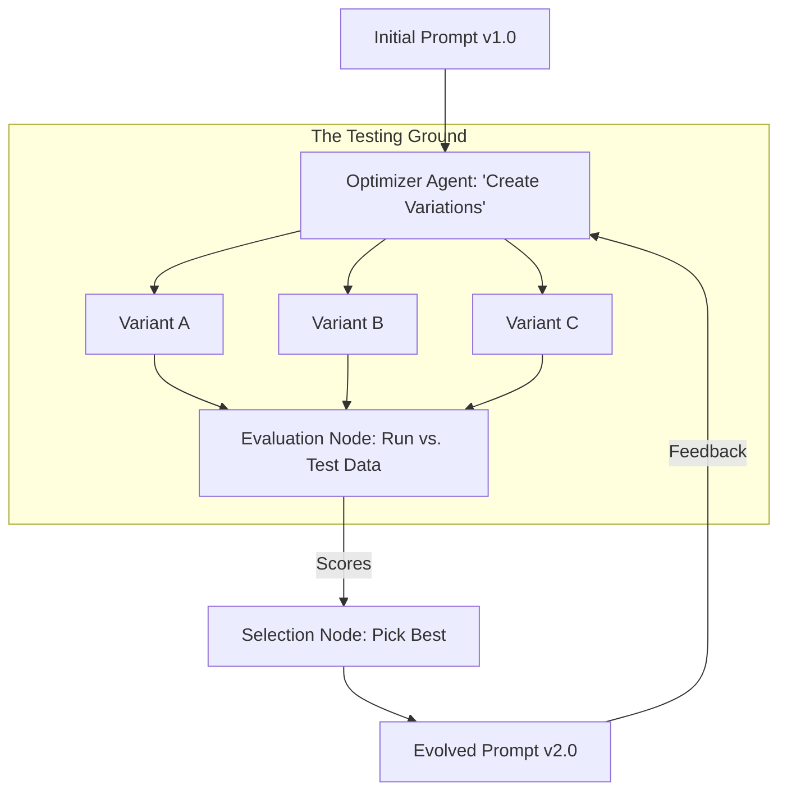

# 🧬 Evolving Agent Prompts: The Survival of the Smartest
> **Level:** Advanced | **Language:** Hinglish | **Goal:** Master the techniques for automatically optimizing system prompts over time using evolutionary algorithms, DSPy, and feedback loops.

---

## 🧭 1. Beginner-Friendly Hinglish Explanation
Evolving Agent Prompts ka matlab hai **"Prompts ka Auto-Update hona"**.

- **The Problem:** Ek system prompt likhna "Art" hai. Aapko pata nahi hota ki "Be professional" bolne se better answer aayega ya "Speak like a Senior Engineer" bolne se.
- **The Solution:** Humein prompts ko "Evolve" karna chahiye.
  - Hum ek prompt ki 5 "Variations" banate hain.
  - Hum unhe 100 sawalon par test karte hain.
  - Jo variation sabse "Best" perform karti hai, hum use select kar lete hain.
  - Phir hum us "Best" variation ke aur versions banate hain.
- **The Concept:** Ye bilkul "Evolution" (Biology) jaisa hai—jo sabse fit hai, wahi bachega.

In 2026, experts prompts "Likhte" nahi hain, wo prompts ko **"Optimize"** karte hain.

---

## 🧠 2. Deep Technical Explanation
Prompt evolution is moving from manual "Trial and Error" to **Algorithmic Prompt Engineering (APE)** and **DSPy (Declarative Self-improving Language Programs)**.

### 1. The Optimization Loop:
1. **Mutation:** An "Optimizer Agent" creates small changes in the prompt (e.g., adding a few-shot example, changing the persona).
2. **Backtesting:** Running the new prompt against a "Golden Dataset" of expert-verified answers.
3. **Metric Calculation:** Scoring the output (Accuracy, Latency, Cost).
4. **Selection:** Keeping the top $K$ prompts for the next generation.

### 2. DSPy Framework:
DSPy replaces "Hard-coded Prompts" with **Modules and Signatures**. The framework "Compiles" your code into the best possible prompt by trying thousands of variations automatically.

### 3. Prompt versioning:
Treating prompts as "Code." Every evolved prompt should have a version number (e.g., `v2.4-optimized`) and be stored in a **Prompt Registry**.

---

## 🏗️ 3. Architecture Diagrams (The Evolutionary Optimizer)


---

## 💻 4. Production-Ready Code Example (A Simple Prompt Mutator)
```python
# 2026 Standard: Using an LLM to optimize another LLM's prompt

async def optimize_prompt(base_prompt, failure_examples):
    # The 'Meta-Optimizer' prompt
    meta_prompt = f"""
    Current Prompt: {base_prompt}
    Failures identified: {failure_examples}
    
    Task: Rewrite the prompt to be more 'Robust' and avoid the above failures. 
    Maintain the core persona but improve instructions.
    """
    
    new_prompt = await meta_llm.run(meta_prompt)
    return new_prompt

# Insight: Using 'Failure Examples' is the most 
# effective way to guide the evolution.
```

---

## 🌍 5. Real-World Use Cases
- **Enterprise Search:** An agent that evolves its RAG retrieval prompt every week based on what users are clicking.
- **Translation Services:** Evolving a prompt to capture the "Local Slang" of a region by analyzing user corrections.
- **Sales Bots:** Evolving the "Opening Line" of a chat to see which one leads to more sales.

---

## ❌ 6. Failure Cases
- **Overfitting:** The prompt becomes perfect for the "Test Dataset" but fails miserably on "New/Real" user questions.
- **Instruction Bloat:** The prompt keeps getting longer and longer, wasting tokens without adding much value.
- **The "Lost Persona":** After 10 generations, the agent stops being "Friendly" and becomes a "Robot" because the optimizer focused only on "Speed."

---

## 🛠️ 7. Debugging Guide
| Symptom | Cause | Fix |
| :--- | :--- | :--- |
| **Performance is flatlining** | Lack of 'Diversity' in mutations | Tell the **Optimizer** to "Be more creative" or "Try a completely different strategy." |
| **Costs are rising** | Prompt is getting too long | Add a **'Token Limit' constraint** to the optimization metric. |

---

## ⚖️ 8. Tradeoffs
- **Manual vs. Auto:** Manual is faster for small tasks; Auto is $10x$ better for large-scale production.
- **Optimization Time:** Evolving a prompt can take 2-4 hours of GPU/API time.

---

## 🛡️ 9. Security Concerns
- **Guardrail Erosion:** During evolution, the agent might find a prompt that is "High Accuracy" but accidentally removes the "Security Filters." **Always run a 'Safety Scan' on evolved prompts.**

---

## 📈 10. Scaling Challenges
- **Massive Datasets:** Running 10 prompt variants against 1000 test cases = 10,000 LLM calls. **Solution: Use a 'Representative Sample' for early generations.**

---

## 💸 11. Cost Considerations
- **Optimizer Tokens:** The cost of the "Meta-LLM" doing the optimization. Use a **Cheaper Model** (GPT-4o-mini) for early iterations.

---

## 📝 12. Interview Questions
1. What is "Prompt Optimization"?
2. How does DSPy differ from traditional LangChain prompting?
3. What is a "Golden Dataset" in the context of prompt engineering?

---

## ⚠️ 13. Common Mistakes
- **No 'Control' Group:** Not comparing the new prompt against the old one to see if it's *actually* better.
- **Testing on 'Training' Data:** Evaluating the prompt on the same examples you used to optimize it.

---

## ✅ 14. Best Practices
- **Version Everything:** Use a `prompt_id` and `timestamp` for every run.
- **Few-shot Injection:** Let the optimizer choose *which* examples to put in the prompt.
- **Human-in-the-loop:** The "Final Winner" should always be read and approved by a human engineer.

---

## 🚀 15. Latest 2026 Industry Patterns
- **Adaptive Prompts:** The agent detects the user's "Skill Level" and switches to a different "Evolved Prompt" optimized for that level (e.g., 'Pro' vs. 'Beginner' mode).
- **Multi-objective Evolution:** Optimizing for **Accuracy, Speed, AND Cost** simultaneously using Pareto-front algorithms.
- **Prompt-to-Fine-tune Pipeline:** Once a prompt is evolved to perfection, use its outputs to **Fine-tune** a much smaller model for production.
