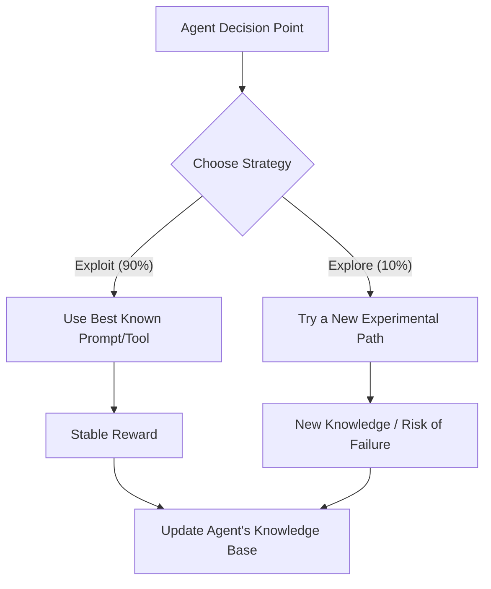

# 🔍 Exploration vs. Exploitation: The Agent's Dilemma
> **Level:** Advanced | **Language:** Hinglish | **Goal:** Master the fundamental trade-off in reinforcement learning and agentic behavior: deciding when to use "What works" (Exploit) vs. trying "Something new" (Explore).

---

## 🧭 1. Beginner-Friendly Hinglish Explanation
Exploration vs. Exploitation ka matlab hai **"Purana vs. Naya"**.

- **Exploitation (Purana):** Aap wahi karte ho jo aapko pata hai ki "Kaam karega".
  - *Example:* Aap hamesha wahi "Restaurant" jate ho jahan ka khana aapko pasand hai.
  - *In AI:* Agent wahi tool ya prompt use karta hai jo pichli baar successful tha.
- **Exploration (Naya):** Aap risk lete ho aur kuch naya try karte ho, ye soch kar ki shayad kuch "Behtar" mil jaye.
  - *Example:* Aap ek naya restaurant try karte ho. Shayad khana bura ho, par shayad wo pichle wale se bhi accha ho!
  - *In AI:* Agent naye tools ya different reasoning paths try karta hai accuracy badhane ke liye.

Ek accha AI agent in dono ke beech ka **"Balance"** banakar chalta hai.

---

## 🧠 2. Deep Technical Explanation
In agentic systems, this dilemma is often managed via **Temperature**, **Top-p**, or **Multi-Armed Bandit (MAB)** algorithms.

### 1. The Trade-off:
- **Exploitation:** Maximizes **Expected Reward** in the short term. High reliability, low innovation.
- **Exploration:** Maximizes **Information Gain** in the long term. High risk, high potential for breakthrough improvements.

### 2. Implementation Strategies:
- **Epsilon-Greedy ($\epsilon$-greedy):** Most of the time ($1 - \epsilon$), the agent takes the best known action. Occasionally ($\epsilon$), it takes a random action.
- **Thompson Sampling:** A probabilistic approach where the agent samples from its "Belief" about each action's reward.
- **UCB (Upper Confidence Bound):** The agent picks the action that has the highest "Potential" (including the uncertainty).

### 3. Application in Prompting:
- **Low Temperature ($0.0$):** High Exploitation (Deterministic).
- **High Temperature ($0.8+$):** High Exploration (Creative/Random).

---

## 🏗️ 3. Architecture Diagrams (The Choice Node)


---

## 💻 4. Production-Ready Code Example (An Epsilon-Greedy Dispatcher)
```python
# 2026 Standard: Deciding between 'Proven' and 'Experimental' prompts

import random

def get_agent_response(task, epsilon=0.1):
    if random.random() > epsilon:
        # 1. EXPLOIT: Use the top-performing 'System Prompt'
        print("🤖 Exploiting: Using the golden prompt.")
        return model.run(task, prompt=golden_prompt)
    else:
        # 2. EXPLORE: Try a newly generated 'Candidate Prompt'
        print("🧪 Exploring: Trying an experimental variation.")
        experimental_prompt = prompt_generator.run(task)
        return model.run(task, prompt=experimental_prompt)

# Insight: Exploratory runs are essential for 'A/B Testing' 
# your agent in production.
```

---

## 🌍 5. Real-World Use Cases
- **Ad Campaigns:** An agent spends $90\%$ of the budget on the "Best performing ad" (Exploit) and $10\%$ testing "New creative ideas" (Explore).
- **Stock Trading:** Using proven strategies (Exploit) while allocating a small fund to test new "Alpha" strategies (Explore).
- **Web Research:** Using a trusted site (Wikipedia) vs. clicking a "New Blog" that might have better current info.

---

## ❌ 6. Failure Cases
- **The "Stagnation" Failure:** Agent only Exploits. It never learns that a new model (like Llama-4) is better than its current one.
- **The "Chaos" Failure:** Agent Explores too much. It keeps trying "Stupid" ideas and failing $50\%$ of user requests.
- **Cold Start Problem:** In the beginning, the agent has $0$ knowledge, so it *must* explore, but it has no idea where to start.

---

## 🛠️ 7. Debugging Guide
| Symptom | Cause | Fix |
| :--- | :--- | :--- |
| **Agent is making too many mistakes** | High Exploration ($\epsilon$ too high) | Decrease $\epsilon$ to force the agent to use proven paths more often. |
| **Agent feels 'Outdated'** | Zero Exploration | Set a **'Scheduled Exploration'** phase (e.g., test 1% of traffic with new prompts). |

---

## ⚖️ 8. Tradeoffs
- **Regret vs. Reward:** Regret is the "Opportunity Cost" of not picking the best action. Exploration reduces total regret over time but increases it in the short term.

---

## 🛡️ 9. Security Concerns
- **Exploration Exploitation (Pun intended):** An attacker providing high "Rewards" for a bad action during the agent's exploration phase to "Train" it to be harmful.

---

## 📈 10. Scaling Challenges
- **Large Action Spaces:** If an agent has $1000$ tools, exploring them all will take forever. **Solution: Group tools into 'Categories' and explore categories first.**

---

## 💸 11. Cost Considerations
- **Wasteful Exploration:** Trying things that are "Obviously" going to fail. **Solution: Use a 'Constraint-based Exploration' where the agent only tries things that pass a basic safety check.**

---

## 📝 12. Interview Questions
1. What is the "Exploration-Exploitation" trade-off in Reinforcement Learning?
2. How does the "Temperature" parameter relate to this dilemma?
3. Explain the "Epsilon-Greedy" algorithm.

---

## ⚠️ 13. Common Mistakes
- **Exploiting too early:** Deciding a tool is "Best" after only 2 successful runs.
- **Fixed Epsilon:** Using the same exploration rate forever. (It should usually **Decay** over time).

---

## ✅ 14. Best Practices
- **Epsilon Decay:** Start with $\epsilon = 0.5$ (High exploration) and reduce it to $\epsilon = 0.01$ as the agent becomes an expert.
- **Simulated Annealing:** A fancy way of saying "Cool down the exploration" as time passes.
- **Log Rewards:** Always track *why* an action was considered successful.

---

## 🚀 15. Latest 2026 Industry Patterns
- **Active Discovery:** Agents that "Ask" to explore (e.g., "I know how to do this in Python, but can I try doing it in Rust to see if it's faster?").
- **Meta-Exploration:** An agent that decides its own "Exploration Rate" based on how fast the world (or the code) is changing.
- **Safety-Constrained Exploration:** Using a "Safety Model" to veto any exploratory action that looks risky.
