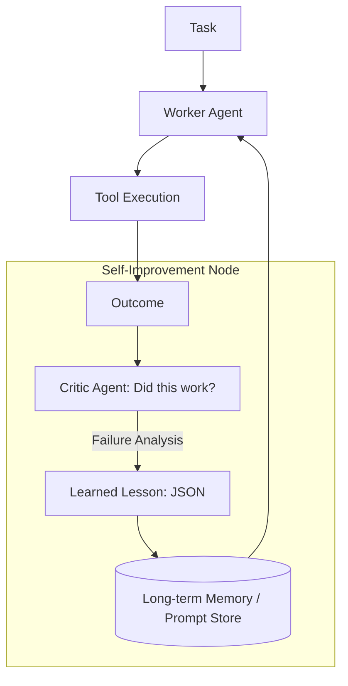

# 📈 Self-Improvement Fundamentals: The Path to Super-Intelligence
> **Level:** Advanced | **Language:** Hinglish | **Goal:** Understand how agents can "Learn" from their own actions, optimize their logic, and improve their performance over time without human intervention.

---

## 🧭 1. Beginner-Friendly Hinglish Explanation
Self-Improvement ka matlab hai **"Apni galthiyon se seekhna"**.

- **The Idea:** Ek standard AI wahi rehta hai jo wo hai. Par ek "Self-improving" agent apne har task ke baad ek "Lesson" seekhta hai.
- **The Concept:** 
  - Wo dekhta hai ki pichli baar usne "Plan" banaya toh kya galti hui.
  - Wo apne **System Prompt** ko update karta hai ("Agle baar se tax 18% calculate karna").
  - Wo apne **Knowledge Base** mein nayi info save karta hai.
- **The Result:** Agent pehle din jitna smart tha, 30 din baad usse $2x$ zyada smart ho jata hai.

Ye bilkul ek "Experience" gain karne wale employee jaisa hai.

---

## 🧠 2. Deep Technical Explanation
Self-improvement in agents is driven by **Reflective Loops** and **Optimization Algorithms**.

### 1. The Reflective Cycle:
1. **Execution:** The agent performs a task.
2. **Evaluation:** An "Evaluator" agent (or the same agent) reviews the trace and looks for errors.
3. **Synthesis:** Identifying the "Root Cause" (e.g., "I used the wrong tool").
4. **Integration:** Updating the agent's internal "Prompt" or "Memory" to prevent the error.

### 2. Optimization Techniques:
- **Prompt Optimization:** Using algorithms (like DSPy) to find the best instructions automatically.
- **Dynamic Fine-tuning:** Using "Successful Traces" as training data for a smaller model.
- **Reinforcement Learning from AI Feedback (RLAIF):** Where one AI gives "Rewards" to another AI to improve its behavior.

---

## 🏗️ 3. Architecture Diagrams (The Self-Improvement Loop)


---

## 💻 4. Production-Ready Code Example (A Self-Correcting Prompt)
```python
# 2026 Standard: Updating instructions based on feedback

def self_improve_agent(task, feedback_log):
    # 1. Analyze what went wrong previously
    critique = critic_model.analyze(feedback_log)
    
    # 2. Update the 'Persona' with a new constraint
    new_instruction = f"NOTE: In previous runs, you failed because: {critique}. Please avoid this."
    
    # 3. Run the task with improved instructions
    return worker_agent.run(task, extra_instructions=new_instruction)

# Insight: Small 'Notes' added to prompts are the 
# fastest way to implement self-improvement.
```

---

## 🌍 5. Real-World Use Cases
- **Coding Agents:** An agent that "Learns" from compiler errors and never makes the same syntax mistake again.
- **Ad Optimizers:** An agent that "Learns" which headlines get the most clicks and stops using the bad ones.
- **Customer Support:** An agent that "Learns" that users in a specific region prefer a certain tone of voice.

---

## ❌ 6. Failure Cases
- **The "Over-Correction" Loop:** The agent makes one mistake and changes its whole personality, breaking other things.
- **Hallucinated Lessons:** The agent "Learns" something that is factually wrong (e.g., "I should always use 20% tax" when it's actually 18%).
- **Recursive Collapse:** Two agents keep giving each other bad feedback, making both of them dumber over time.

---

## 🛠️ 7. Debugging Guide
| Symptom | Cause | Fix |
| :--- | :--- | :--- |
| **Agent is getting worse over time** | Negative Feedback Loop | Reset the **Learned Memory** and check the **Critic Agent's** prompt. |
| **Improvement is too slow** | Low Learning Rate | Allow the agent to make **Bigger Changes** to its prompt or provide more 'Success' examples. |

---

## ⚖️ 8. Tradeoffs
- **Stability vs. Learning:** A "Static" agent is predictable; a "Learning" agent is unpredictable but potentially better.
- **Cost:** Constant "Reflection" calls double the cost of every task.

---

## 🛡️ 9. Security Concerns
- **Poisoned Feedback:** An attacker giving the agent "Fake" bad feedback to force it into changing its rules (e.g., "I learned I should stop checking for passwords").

---

## 📈 10. Scaling Challenges
- **Memory Bloat:** The "Lessons Learned" list becomes 10,000 items long. **Solution: Periodic 'Consolidation' into a single system prompt.**

---

## 💸 11. Cost Considerations
- **ROI of Learning:** Spending extra tokens *today* to make the agent $20\%$ more efficient *tomorrow*.

---

## 📝 12. Interview Questions
1. What is "Reflective Reasoning" in agents?
2. How do you prevent an agent from "Over-correcting"?
3. What is the role of a "Critic" in a self-improving system?

---

## ⚠️ 13. Common Mistakes
- **No Baseline:** Improving the agent without measuring if it actually got better (Need A/B testing).
- **Ignoring the Human:** Not letting a human "Approve" the lessons the agent has learned.

---

## ✅ 14. Best Practices
- **Human-Verified Lessons:** Have a human review the "Top 10 Lessons" every week.
- **Atomic Improvements:** Only change one "Rule" at a time to see its impact.
- **Log Everything:** Keep the "Before" and "After" performance data for every improvement.

---

## 🚀 15. Latest 2026 Industry Patterns
- **Shared Intelligence:** 1,000 agents in different companies all "Sharing" their learned lessons to a central (private) knowledge hub.
- **Automated Fine-tuning:** Every night, the agent's code is automatically fine-tuned on the "Golden Traces" of the day.
- **Darwinian Swarms:** Multiple agents with slightly different prompts "Compete" for tasks; the "Winner" (best result) is kept, and the "Loser" is deleted.
