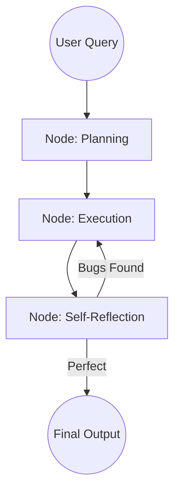

# 🔄 Agentic Workflow Fundamentals: Designing the Flow
> **Level:** Fundamentals | **Language:** Hinglish | **Goal:** Master the structural design of agent interactions, moving beyond simple chat to reliable, repeatable business processes.

---

## 🧭 1. Beginner-Friendly Hinglish Explanation
Agentic Workflow ka matlab hai AI ka **"Work-Process"**.

- **The Problem:** Ek simple prompt ("Ek website banao") aksar fail ho jata hai kyunki ye bahut bada task hai.
- **The Solution:** Humein task ko ek "Workflow" mein todna padta hai.
  1. Step 1: Requirements likho.
  2. Step 2: Code likho.
  3. Step 3: Galthiyan (Bugs) check karo.
  4. Step 4: Finalize karo.
- **The Difference:** Normal workflow "Fixed" hota hai. Agentic workflow "Smart" hota hai—agar Step 3 mein galti milti hai, toh AI wapas Step 2 par chala jata hai khud ko theek karne.

Workflow hi wo cheez hai jo AI ko **"Reliable"** (Bharosemand) banati hai.

---

## 🧠 2. Deep Technical Explanation
Agentic workflows shift the focus from **Model Capability** to **System Architecture**. As Andrew Ng famously said, "Better workflows outperform better models."

### 1. The Core Patterns:
- **Reflection:** The agent looks at its own work and improves it.
- **Tool Use:** The agent identifies when it needs external data/actions.
- **Planning:** The agent breaks a goal into sub-tasks.
- **Multi-agent Collaboration:** Different agents specialize in different parts of the workflow.

### 2. Statefulness:
A workflow is essentially a **State Machine**. At each step, the system must know:
- What has been accomplished so far?
- What is the current "State" of the variables?
- What is the next logical node in the graph?

### 3. Error Recovery:
Unlike traditional code that crashes on error, agentic workflows use **Feedback Loops** to retry or pivot when a step fails.

---

## 🏗️ 3. Architecture Diagrams (The Feedback Workflow)


---

## 💻 4. Production-Ready Code Example (A Simple Iterative Workflow)
```python
# 2026 Standard: Designing a workflow for reliable writing

def content_workflow(topic):
    # 1. Draft
    draft = writer.generate(f"Write a draft about {topic}")
    
    # 2. Review Loop
    for i in range(3): # Max 3 refinements
        feedback = critic.analyze(draft)
        if "NO_ISSUES" in feedback:
            break
        print(f"🔄 Refinement Round {i+1}...")
        draft = writer.generate(f"Improve this draft based on feedback: {feedback}\nDraft: {draft}")
        
    return draft

# Insight: Iteration (Refinement) is better than a 
# single high-quality prompt $90\%$ of the time.
```

---

## 🌍 5. Real-World Use Cases
- **B2B Lead Gen:** Scrape Website -> Extract Contact -> Verify Email -> Write Personalized Outreach -> Save to CRM.
- **Automated Coding:** Write Code -> Run Unit Tests -> If Fail: Fix Code -> If Pass: Submit PR.
- **Financial Reporting:** Fetch Data -> Calculate Ratios -> Generate Charts -> Human Review -> Final PDF.

---

## ❌ 6. Failure Cases
- **The Infinite Loop:** The critic always finds a tiny "Flaw," and the writer keeps rewriting forever. **Fix: Set a hard limit on iterations.**
- **Instruction Drift:** After 5 rounds of feedback, the agent forgets the original user goal.
- **Context Bloat:** Each refinement round adds to the token history, making the final call very expensive.

---

## 🛠️ 7. Debugging Guide
| Symptom | Cause | Fix |
| :--- | :--- | :--- |
| **Final output is worse than draft** | Critique was too harsh/vague | Improve the **Critic's Prompt** to be specific and helpful. |
| **Workflow is too slow** | Too many sequential steps | **Parallelize** steps that don't depend on each other (e.g., searching two different sites). |

---

## ⚖️ 8. Tradeoffs
- **Speed vs. Quality:** More loops = Better quality but higher latency and cost.
- **Static vs. Dynamic:** Fixed steps are easier to test; Dynamic planning is more flexible but unpredictable.

---

## 🛡️ 9. Security Concerns
- **Data Leakage in Loops:** If a workflow passes data through multiple external APIs, ensure each step is encrypted and sanitized.
- **Prompt Injection:** An attacker providing input that "Hijacks" the workflow to skip the "Critique/Safety" step.

---

## 📈 10. Scaling Challenges
- **State Persistence:** Managing 10,000 active workflows at once in a database like Postgres or Redis.
- **Queueing:** What happens if the LLM provider hits a rate limit in the middle of a workflow?

---

## 💸 11. Cost Considerations
- **Model Routing:** Use a cheap model (8B) for "Review" and an expensive one (400B) for "Writing".

---

## 📝 12. Interview Questions
1. Why are "Agentic Workflows" often better than single-shot prompts?
2. Explain the "Reflection" pattern in workflows.
3. How do you prevent an agent from getting stuck in an infinite refinement loop?

---

## ⚠️ 13. Common Mistakes
- **No Exit Condition:** Not defining what "Good Enough" looks like.
- **Manual Chaining:** Writing 10 nested `if-else` blocks instead of using a proper graph framework (like LangGraph).

---

## ✅ 14. Best Practices
- **Small Steps:** Each node in the workflow should do only one thing.
- **Log the State:** Always save the "Intermediate Outputs" so you can see where the workflow failed.
- **Human Interjection:** For high-stakes workflows, add a "Human Approval" step before the final action.

---

## 🚀 15. Latest 2026 Industry Patterns
- **Flow Engineering:** A new job role focused entirely on designing these graphs and loops for maximum reliability.
- **Autonomous Recovery:** Workflows that can "Self-heal" by trying an alternative model if the primary one fails.
- **Visual Programming for AI:** Tools like **LangFlow** and **Flowise** becoming the standard for designing production workflows.
