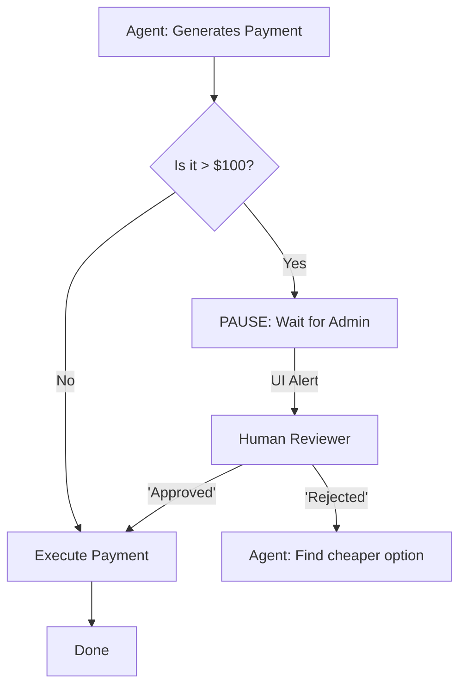

# 👤 Human-in-the-Loop (HITL) Workflows: The Safety Switch
> **Level:** Advanced | **Language:** Hinglish | **Goal:** Master the integration of human oversight into autonomous agent processes to ensure safety, quality, and control.

---

## 🧭 1. Beginner-Friendly Hinglish Explanation
Human-in-the-Loop (HITL) ka matlab hai AI ke kaam mein **"Insaan ka dakhal"**.

- **The Problem:** AI autonomus toh hai, par wo "Dumb" galthiyan kar sakta hai. 
  - Wo galat email bhej sakta hai.
  - Wo galat payment kar sakta hai.
  - Wo delete nahi karne wali files uda sakta hai.
- **The Solution:** Humein workflow mein ek "Checkpost" lagana padta hai.
  - AI plan banata hai.
  - AI ruk jata hai aur Insaan (Human) ko message bhejta hai: "Kya main ye karun?"
  - Insaan 'Approve' ya 'Reject' karta hai.
  - AI aage badhta hai.

HITL ka matlab hai AI "Pilot" hai, par Human "Captain" hai jo final decision leta hai.

---

## 🧠 2. Deep Technical Explanation
HITL is a **State Machine Interruption** pattern.

### 1. Types of HITL Interactions:
- **Approval (Gatekeeping):** The agent stops and waits for a boolean (Yes/No) before executing a sensitive tool.
- **Editing (Co-creation):** The human modifies the agent's output before it is finalized or used in the next step.
- **Instruction (Steering):** The human provides feedback during an execution loop to change the agent's direction.

### 2. Implementation Logic:
The agentic system must support **Persistence (Checkpointing)**.
1. The agent reaches a "Break" node.
2. The current state is saved to a database.
3. An event (Webhook/Notification) is sent to the human.
4. The system waits (Idle) until the human provides input.
5. The state is reloaded, and execution resumes.

### 3. Active Learning:
The human's corrections can be fed back into the agent's long-term memory to improve future performance (The **"Teach me once"** pattern).

---

## 🏗️ 3. Architecture Diagrams (The HITL Break)


---

## 💻 4. Production-Ready Code Example (Using LangGraph Interrupts)
```python
# 2026 Standard: Implementing a breakpoint for human approval

from langgraph.graph import StateGraph

def call_sensitive_tool(state):
    # This node will only be reached after approval
    return {"messages": ["System: Payment successful."]}

# 1. Define the workflow
workflow = StateGraph(MyState)
# ... add nodes ...

# 2. Compile with an interrupt
app = workflow.compile(
    interrupt_before=["call_sensitive_tool"] # Pause here!
)

# 3. Usage logic
# run = app.invoke(input) 
# --> Execution STOPS before 'call_sensitive_tool'
# --> Developer can inspect state, then resume
```

---

## 🌍 5. Real-World Use Cases
- **Medical AI:** AI suggests a diagnosis; a doctor must confirm before it's added to the patient's record.
- **Autonomous Coding:** AI writes a PR; a human dev reviews and clicks "Merge".
- **Marketing Automation:** AI generates 100 social media posts; a manager selects the best 5.

---

## ❌ 6. Failure Cases
- **Human Bottleneck:** The agent is fast, but it stays "Paused" for 3 days waiting for a busy manager. **Fix: Set 'Auto-escalation' or 'Timeouts'.**
- **Rubber Stamping:** Humans get tired and just click "Approve" without looking, leading to the same errors as no HITL.
- **Ambiguous Feedback:** Human says "Make it better" but the agent doesn't understand *how* to change the state.

---

## 🛠️ 7. Debugging Guide
| Symptom | Cause | Fix |
| :--- | :--- | :--- |
| **Agent loses context after resume** | State not serialized correctly | Ensure your **Checkpointer** is saving the full message history to a persistent DB (Postgres/Redis). |
| **Human can't see the 'Why'** | Reasoning hidden | Always provide the **Agent's Thought Process** (Trace) to the human in the approval UI. |

---

## ⚖️ 8. Tradeoffs
- **Safety vs. Latency:** Total safety (HITL) means the process can't be $100\%$ automated/instant.
- **Cost of Human Time:** If a human spends 5 minutes reviewing every 1-minute AI task, is the AI actually saving money?

---

## 🛡️ 9. Security Concerns
- **Social Engineering:** The agent being so "Polite" and "Convincing" that it tricks the human into approving a malicious action.
- **Impersonation:** An attacker providing the "Approval" instead of the authorized human. **Fix: Use MFA (Multi-factor Auth) for sensitive approvals.**

---

## 📈 10. Scaling Challenges
- **Massive Approval Queues:** A single admin managing approvals for 1000 agents. **Solution: Dynamic routing to different humans based on expertise.**

---

## 💸 11. Cost Considerations
- **Human Labor is Expensive:** Optimize HITL by only triggering it for **Uncertainty** (e.g., if LLM confidence is $< 80\%$) or **High Stakes**.

---

## 📝 12. Interview Questions
1. What is an "Interrupt" in an agentic workflow?
2. How do you implement "State Persistence" for long-running human reviews?
3. When should you NOT use Human-in-the-loop?

---

## ⚠️ 13. Common Mistakes
- **No 'Reason for Rejection':** Rejecting a task without telling the AI *why*, so it makes the same mistake again.
- **Hardcoded Approvals:** Not allowing the human to "Edit" the plan, only to say "Yes/No".

---

## ✅ 14. Best Practices
- **Show the Work:** Provide the human with a "Summary" and a "Source Link" for every decision.
- **Tiered Approvals:** $\$10$ (Auto-approve), $\$100$ (Manager), $\$1000$ (VP).
- **Audit Logs:** Record who approved what and when for legal compliance.

---

## 🚀 15. Latest 2026 Industry Patterns
- **Active Steering:** Humans interacting with an agent's "Thought Stream" in real-time like a co-pilot.
- **Approval-as-a-Service:** Outsourcing AI human review to specialized platforms (like Scale AI or Labelbox).
- **Behavioral Cloning from HITL:** Using human approvals/edits to fine-tune the agent's policy so it eventually needs fewer approvals.
