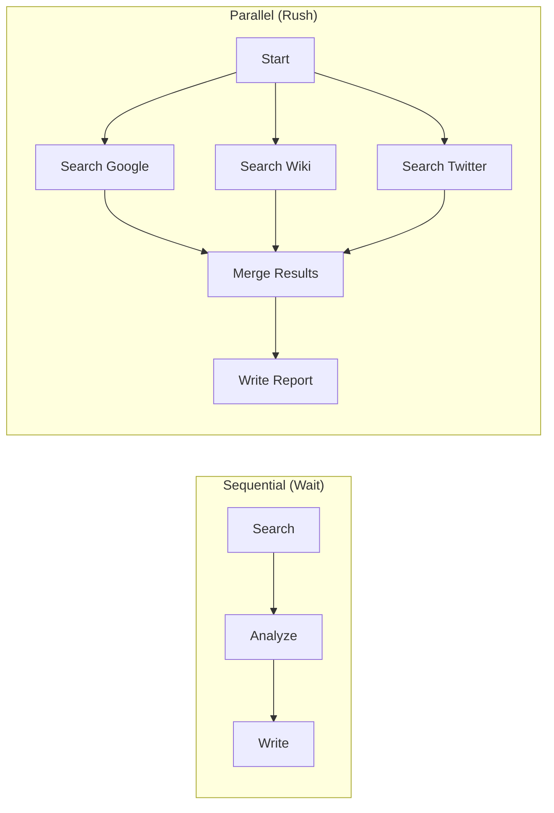

# ⚡ Sequential vs. Parallel Workflows: Speed vs. Logic
> **Level:** Advanced | **Language:** Hinglish | **Goal:** Master the art of optimizing agentic flows for either maximum reliability (Sequential) or maximum speed (Parallel).

---

## 🧭 1. Beginner-Friendly Hinglish Explanation
Sequential aur Parallel ka matlab hai **"Ek-ke-baad-ek"** vs **"Ek-saath"**.

- **Sequential (Line):** 
  - Pehle Researcher data nikaalta hai -> Phir Writer report likhta hai. 
  - Ye zaroori hai agar Writer ko data ke bina kaam shuru nahi karna chahiye.
  - **Dhang:** Slow, par organized.
- **Parallel (Group):**
  - Ek saath 5 agents 5 alag-alag websites search karte hain.
  - Sab apna data lekar aate hain aur ek "Summarizer" unhe merge kar deta hai.
  - **Dhang:** Fast, par thoda complex.

Sahi AI engineer wo hai jo decide kare ki kab "Wait" karna hai aur kab "Race" lagani hai.

---

## 🧠 2. Deep Technical Explanation
The choice between Sequential and Parallel is a balance of **Data Dependency** and **Resource Optimization**.

### 1. Sequential Workflows (DAG - Directed Acyclic Graph):
- **When to use:** When Step $N+1$ depends entirely on the output of Step $N$.
- **Logic:** `Output_A = Agent_A(Input); Output_B = Agent_B(Output_A)`.
- **Primary Benefit:** Higher accuracy because every step builds on a verified foundation.

### 2. Parallel Workflows (Fan-out / Fan-in):
- **When to use:** When tasks are independent (e.g., searching different keywords, analyzing different files).
- **Logic:** `Outputs = await Promise.all([Agent_1(), Agent_2(), Agent_3()])`.
- **Primary Benefit:** Massive reduction in **Latency (Time-to-first-token)**.

### 3. Mixed Workflows (The Hybrid):
Most production systems are hybrid: Parallelize the data gathering, then Sequentially analyze the result.

---

## 🏗️ 3. Architecture Diagrams (Flow Comparison)


---

## 💻 4. Production-Ready Code Example (Implementing Parallelism)
```python
# 2026 Standard: Running agents in parallel using Python's asyncio

import asyncio

async def fetch_competitor_data(company):
    print(f"🕵️ Researching {company}...")
    # Simulate API call
    return await researcher.arun(f"Find strategy for {company}")

async def run_parallel_workflow(companies):
    # 1. Start all research tasks at once (Fan-out)
    tasks = [fetch_competitor_data(c) for c in companies]
    all_results = await asyncio.gather(*tasks)
    
    # 2. Sequential Analysis (Fan-in)
    print("📊 Merging data...")
    final_report = analyst.run(f"Summarize these findings: {all_results}")
    return final_report

# Insight: Parallelism can cut execution time from 60s down to 15s.
```

---

## 🌍 5. Real-World Use Cases
- **Sequential:** Coding (Write -> Lint -> Test -> Fix). You can't test what hasn't been written.
- **Parallel:** News aggregation (Fetch from 50 sources at once).
- **Hybrid:** Legal discovery (Parallelly search 1000 docs for keywords -> Sequentially read the top 5 for risk).

---

## ❌ 6. Failure Cases
- **Parallel Race Conditions:** Two parallel agents trying to update the same row in a database at the exact same time.
- **Sequential Bottleneck:** Agent 1 takes 5 minutes to finish, making Agent 2 and 3 sit idle.
- **Dependency Missing:** Parallelizing things that *should* be sequential (e.g., trying to write a conclusion before the intro is done).

---

## 🛠️ 7. Debugging Guide
| Symptom | Cause | Fix |
| :--- | :--- | :--- |
| **Workflow is slow** | Unnecessary sequencing | Identify nodes that don't share data and **Parallelize** them. |
| **Data is corrupted** | Race condition in Parallel node | Use **Atomic Updates** or a **State Manager** with locking mechanisms. |

---

## ⚖️ 8. Tradeoffs
- **Latency vs. Cost:** Parallel workflows often use more concurrent API tokens, which can hit rate limits faster.
- **Simplicity vs. Performance:** Sequential code is much easier to write and debug.

---

## 🛡️ 9. Security Concerns
- **Orchestration Overflow:** Starting 10,000 parallel agents could be used as a DDoS attack against an internal API.
- **Data Isolation:** Ensure parallel agents don't "Leak" data into each other's memory buffers.

---

## 📈 10. Scaling Challenges
- **Concurrency Limits:** Most LLM providers (OpenAI/Anthropic) have limits on how many requests you can send at the exact same millisecond.

---

## 💸 11. Cost Considerations
- **Token Efficiency:** Parallel agents often repeat the "System Prompt" $N$ times. Use **Prompt Caching** to avoid paying for the same rules 50 times.

---

## 📝 12. Interview Questions
1. When should you use a Parallel workflow instead of Sequential?
2. What is a "Fan-in" pattern?
3. How do you handle rate limits when running 10 agents in parallel?

---

## ⚠️ 13. Common Mistakes
- **Sync in Async:** Using synchronous code inside an `asyncio` loop, which blocks all other agents.
- **No Timeouts:** A single failing parallel task making the whole `gather()` call wait forever.

---

## ✅ 14. Best Practices
- **Use `asyncio` / `Promise.all`:** For non-blocking I/O.
- **Set Individual Timeouts:** Every parallel task should have its own timeout (e.g., 30s).
- **Batching:** If you have 100 tasks, don't run them all at once. Run them in batches of 10.

---

## 🚀 15. Latest 2026 Industry Patterns
- **Speculative Parallelism:** Running 3 different agents with 3 different prompts in parallel, then picking the "Best" result automatically.
- **Dynamic Parallelization:** An agent that decides *on the fly* how many parallel workers it needs to solve a problem.
- **Serverless Agent Swarms:** Spawning 1000 AWS Lambda functions, each containing a small agent, to process massive data in parallel.
