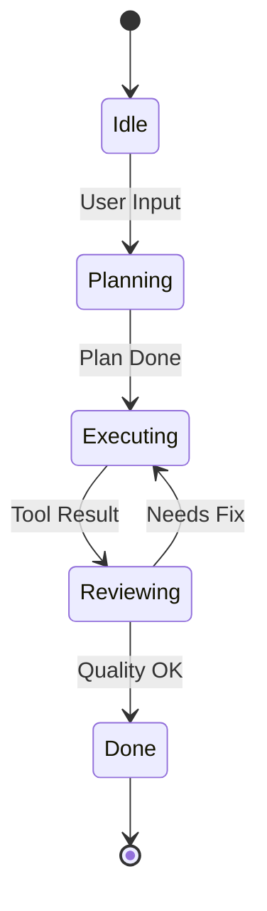

# 🔄 Agent State Transitions: The Logic of Change
> **Level:** Intermediate | **Language:** Hinglish | **Goal:** Master the mathematics and logic behind how an agent moves from one state to another based on its actions and environment feedback.

---

## 🧭 1. Beginner-friendly Hinglish Explanation
State Transition ka matlab hai "Halat ka badalna". Sochiye ek agent "Searching" state mein hai. Jaise hi use result mil jata hai, wo "Writing" state mein chala jata hai. Ye bilkul ek **Game Character** ki tarah hai: "Idle" -> "Running" -> "Attacking". AI Agents mein hume ye states clearly define karni padti hain taaki hume hamesha pata ho ki agent abhi kya kar raha hai aur wo "Next" kahan jayega. Isse agent ka behavior predictable aur reliable banta hai.

---

## 🧠 2. Deep Technical Explanation
State transitions are defined using **Finite State Machines (FSM)** or **State Graphs**:
1. **State ($S$):** The current configuration (e.g., `PLANNING`, `EXECUTING`, `REVIEWING`).
2. **Event/Trigger ($E$):** An external or internal signal (e.g., `Tool_Success`, `User_Abort`).
3. **Transition Function ($T$):** $T(S, E) \rightarrow S'$—The logic that determines the next state $S'$ based on current state and event.
4. **Action ($A$):** The code that runs during the transition (e.g., `save_to_db()`).
**Modern Standard:** Using **LangGraph** where every node is a state and every edge is a transition logic.

---

## 🏗️ 3. Real-world Analogies
State Transitions ek **Traffic Signal** ki tarah hain.
- **Red State:** Wait karo.
- **Trigger:** Timer 60s ho gaya.
- **Transition:** Green State par jao.
- **Action:** Gadiyaan chalao.

---

## 📊 4. Architecture Diagrams (The State Machine)


---

## 💻 5. Production-ready Examples (The Transition Logic)
```python
# 2026 Standard: Conditional Transitions in LangGraph
def route_next_step(state):
    if state['error_count'] > 3:
        return "human_help"
    if "FINAL" in state['last_message']:
        return "end"
    return "continue"

# In the graph
workflow.add_conditional_edges("exec_node", route_next_step)
```

---

## ❌ 6. Failure Cases
- **Unreachable State:** Agent aisi state mein phans gaya hai jahan se bahar nikalne ka koi trigger hi nahi hai (The "Black Hole" state).
- **Infinite Oscillations:** Agent baar-baar "State A" aur "State B" ke beech ghoom raha hai bina progress ke.

---

## 🛠️ 7. Debugging Section
- **Symptom:** Agent stops working without finishing the task.
- **Check:** **Transition Table**. Kya har possible "Event" (like `Tool_Error`) ke liye koi aglee state defined hai? Agar nahi, toh system crash ho jayega. Use **Default Fallback States**.

---

## ⚖️ 8. Tradeoffs
- **Complex Graphs:** Highly accurate par maintain karna mushkil.
- **Simple Chains:** Easy to build par unexpected errors handle nahi kar sakte.

---

## 🛡️ 9. Security Concerns
- **State Injection:** Attacker agent ko aisi state mein force kar sakta hai jahan security checks skip ho jayein (e.g., jumping from `Input` directly to `Execute`).

---

## 📈 10. Scaling Challenges
- Thousands of states ko manage karna requires **State Persistence** in a DB so the transitions can happen across different server restarts.

---

## 💸 11. Cost Considerations
- Har transition point par reasoning (LLM call) mehengi padti hai. Use **Hard-coded IF-ELSE** for simple transitions and LLM only for complex routing.

---

## ⚠️ 12. Common Mistakes
- State transition diagrams na banana (System becomes a "Black Box").
- "Error" ko ek state na maanna.

---

## 📝 13. Interview Questions
1. What is the advantage of using a 'State Machine' architecture for long-running agents?
2. How do you prevent 'State Bloat' in complex agentic workflows?

---

## ✅ 14. Best Practices
- Every state should have a **Timeout**.
- Every transition should be **Logged** for auditing.

---

## 🚀 15. Latest 2026 Industry Patterns
- **Hiearchical State Machines:** Graphs ke andar graphs. Ek "Research State" apne aap mein ek poora multi-agent workflow ho sakta hai.
- **Visual State Orchestration:** Developers using Drag-and-drop tools to design agent state transitions in real-time.
