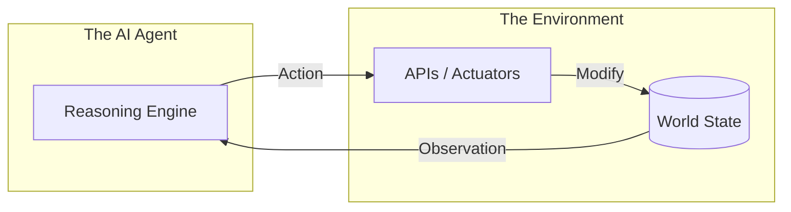

# 🌐 Environment Fundamentals: Where Agents Live and Act
> **Level:** Fundamentals | **Language:** Hinglish | **Goal:** Understand the "World" in which an agent operates, its boundaries, rules, and how it provides feedback to the agent's actions.

---

## 🧭 1. Beginner-Friendly Hinglish Explanation
Environment ka matlab hai **"AI ki Duniya"**.

- **The Concept:** Ek AI agent akela kaam nahi karta, wo kisi jagah par "Interact" karta hai.
- **The Environment:** 
  - Agar agent **Customer Support** ka hai, toh uska environment hai "Zendesk" ya "Slack."
  - Agar agent **Coder** hai, toh uska environment hai "VS Code" aur "Terminal."
  - Agar agent **Researcher** hai, toh uska environment hai "Google" aur "Websites."
- **Why it Matters:** Agent ko pata hona chahiye ki uski duniya mein kya rules hain (e.g., "Aap file delete nahi kar sakte") aur use "Aas-paas" (Observation) kya dikh raha hai.

Environment hi tay karta hai ki agent "Action" kya le sakta hai.

---

## 🧠 2. Deep Technical Explanation
The environment is the **External System** that the agent observes and modifies. It is defined by its **State Space**, **Observation Space**, and **Action Space**.

### 1. Types of Environments:
- **Digital Environments:** Software APIs, Operating Systems, Browsers.
- **Physical Environments:** Real-world sensors and actuators (Robotics).
- **Virtual/Simulated Environments:** Sandboxes, simulators (Gazebo, MuJoCo), or dummy APIs for testing.

### 2. Interaction Loop:
The agent interacts with the environment in a **Cycle**:
1. **Perceive:** Get an "Observation" from the environment.
2. **Think:** Process the observation and decide an action.
3. **Act:** Execute the "Action" through an actuator or API.
4. **Respond:** The environment changes its "State" and gives a new observation.

### 3. Deterministic vs. Stochastic:
- **Deterministic:** Same action always leads to the same result (e.g., a math API).
- **Stochastic:** Actions have uncertain outcomes (e.g., the stock market or a browser that might lag).

---

## 🏗️ 3. Architecture Diagrams (The Agent-Environment Interface)


---

## 💻 4. Production-Ready Code Example (Defining an Environment)
```python
# 2026 Standard: A clean environment interface (Gym-style)

class DigitalEnvironment:
    def __init__(self, sandbox_id):
        self.state = "IDLE"
        self.sandbox = sandbox_id

    def get_observation(self):
        # Read the current status of the world
        return self.sandbox.get_status()

    def step(self, action):
        # Execute action and return (New Observation, Reward, Done_flag)
        result = self.sandbox.execute(action)
        return result

# Insight: Modularizing the 'Environment' allows you to 
# swap 'Real API' with 'Test Mock' easily.
```

---

## 🌍 5. Real-World Use Cases
- **Autonomous Browsing:** The agent's environment is the **DOM (HTML)** of a website. It "Clicks" and "Types."
- **Smart Homes:** The environment is the network of IoT devices (Lights, AC, Security).
- **Trading Bots:** The environment is the **Exchange API** (Binance, NYSE) and its real-time data stream.

---

## ❌ 6. Failure Cases
- **Environment Drift:** The website changed its layout (UI), and the agent's tools can no longer "Find" the button.
- **Hidden State:** The agent doesn't have all the info (e.g., trying to book a flight without knowing the user's passport number).
- **Infinite Action Space:** Giving an agent "Total access" to a terminal without constraints, leading to it deleting the whole OS.

---

## 🛠️ 7. Debugging Guide
| Symptom | Cause | Fix |
| :--- | :--- | :--- |
| **Agent is taking wrong actions** | Observation is too noisy | Filter the **Observation Data** (e.g., remove irrelevant HTML tags) before sending it to the agent. |
| **Actions are failing with timeouts** | Environment is unresponsive | Implement **'Retry Logic'** and **'Health Checks'** for the environment APIs. |

---

## ⚖️ 8. Tradeoffs
- **Simulation vs. Production:** Testing in a simulation is safe but might not capture real-world "Messiness."
- **Observability:** How much data should the agent see? Too much = Token waste; Too little = Bad decisions.

---

## 🛡️ 9. Security Concerns
- **Environment Poisoning:** An attacker modifying the environment (e.g., a fake website) to trick the agent into a harmful action.
- **Privilege Escalation:** An agent using an environment tool to gain higher permissions than intended.

---

## 📈 10. Scaling Challenges
- **Concurrent Environments:** Running 10,000 parallel sandboxes for 10,000 users. **Solution: Use lightweight containers like Docker or MicroVMs.**

---

## 💸 11. Cost Considerations
- **Environment Maintenance:** The cost of keeping a browser or a specialized API running 24/7.

---

## 📝 12. Interview Questions
1. What is the difference between a "Fully Observable" and "Partially Observable" environment?
2. How do you handle "Non-deterministic" responses from an environment?
3. What is an "Action Space"?

---

## ⚠️ 13. Common Mistakes
- **Assuming the Environment is Static:** Forgetting that things change *while* the agent is thinking.
- **Hard-coding Selectors:** Using fixed IDs in a web environment that might change tomorrow.

---

## ✅ 14. Best Practices
- **Standardized Interfaces:** Use **OpenAI Gym** or **Gymnasium** patterns for consistency.
- **Strict Sandboxing:** Always isolate the environment to prevent the agent from hurting the "Host" system.
- **Rich Observations:** Provide the agent with context, not just raw data (e.g., "The button is visible" vs. just "HTML code").

---

## 🚀 15. Latest 2026 Industry Patterns
- **Embodied Environments:** Agents moving from 2D screens to 3D virtual worlds (Omniverse) to learn physical tasks.
- **Multi-Agent Environments:** Shared environments where 10 agents work together on a single codebase or marketplace.
- **Self-Healing Environments:** Environments that can "Reset" themselves automatically if the agent breaks something during an experiment.
