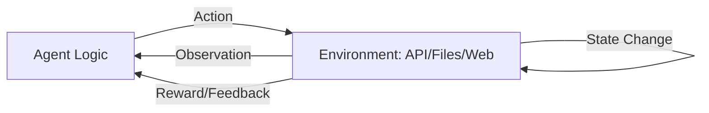

# 🌍 Environment Interactions: The Agent's Playground
> **Level:** Beginner | **Language:** Hinglish | **Goal:** Master the concepts of how AI agents perceive, modify, and react to the digital or physical world they inhabit.

---

## 🧭 1. Beginner-friendly Hinglish Explanation
Environment ka matlab hai "Agent ki duniya". Agar agent ek "File Manager" hai, toh files uski environment hain. Agar wo ek "Twitter Bot" hai, toh Twitter uski duniya hai. Interactions ka matlab hai is duniya se baat karna. Agent do tarah se interact karta hai: **Perception** (Duniya ko dekhna, jaise file read karna) aur **Action** (Duniya ko badalna, jaise file delete karna). Sahi interaction tabhi hoti hai jab agent ko apni "Limits" aur "Permissions" ka pata ho.

---

## 🧠 2. Deep Technical Explanation
Environment interaction is modeled as a **Markov Decision Process (MDP)** or a simple **Request-Response** loop:
1. **Sensors (Perception):** Methods for the agent to pull data from the environment (e.g., API `GET` calls, scraping, database queries).
2. **Effectors (Actions):** Methods for the agent to push changes (e.g., API `POST` calls, `git commit`, `sql insert`).
3. **Observation Space:** The set of all possible things the agent can "see".
4. **Action Space:** The set of all possible actions the agent can take.
**Challenge:** Modern environments are often **Non-deterministic**, meaning the same action might produce different results due to external factors (e.g., internet lag).

---

## 🏗️ 3. Real-world Analogies
Environment Interaction ek **Video Game** (jaise Mario) ki tarah hai.
- **Environment:** Game level (platforms, enemies).
- **Perception:** Screen dekhna ki enemy kahan hai.
- **Action:** Jump ya Fire button dabana.
- **Result:** Mario ki position change hoti hai ya enemy mar jata hai.

---

## 📊 4. Architecture Diagrams (The Agent-Env Loop)


---

## 💻 5. Production-ready Examples (The Environment Interface)
```python
# 2026 Standard: Defining an Environment Class
class DigitalEnvironment:
    def __init__(self, workspace_path):
        self.root = workspace_path

    def get_observation(self):
        # Read the current state (list files)
        import os
        return os.listdir(self.root)

    def execute_action(self, command, params):
        # Modify the state
        if command == "create_file":
            with open(f"{self.root}/{params['name']}", 'w') as f:
                f.write(params['content'])
        return "SUCCESS"
```

---

## ❌ 6. Failure Cases
- **Stale Observation:** Agent ko lag raha hai file exist karti hai, par kisi aur process ne use delete kar diya (Race condition).
- **Infinite Effect:** Agent ne aisi action li jisne environment ko crash kar diya (e.g., infinite file creation).

---

## 🛠️ 7. Debugging Section
- **Symptom:** Agent says "I can't see the file" even when it's there.
- **Check:** **Permissions and Paths**. Kya environment class ke paas us folder ki read permission hai? Use **Absolute Paths** instead of relative paths to avoid confusion.

---

## ⚖️ 8. Tradeoffs
- **High Fidelity vs Low Cost:** Poori environment ka status baar-baar check karna accurate hai par slow. Sirf "Relevant" parts check karna fast hai par "Stale data" ka risk hai.

---

## 🛡️ 9. Security Concerns
- **Environment Escaping:** Agent ko instruction dekar sandbox se bahar nikalne ki koshish karna (e.g., using `../` in file paths). Always **Sanitize Paths**.

---

## 📈 10. Scaling Challenges
- Thousands of agents interacting with one environment (e.g., a shared DB) causes **Resource Contention**. Use **Database Locks** and **Queues**.

---

## 💸 11. Cost Considerations
- Har environment check (API call) tokens aur dollars consume karti hai. Optimize by caching the environment state for a few seconds.

---

## ⚠️ 12. Common Mistakes
- Environment ko "Static" maanna. (Always assume it can change independently).
- No cleanup (Leaving temp files everywhere).

---

## 📝 13. Interview Questions
1. What is the difference between a 'Fully Observable' and 'Partially Observable' environment?
2. How do you handle non-deterministic outcomes in an agent's action execution?

---

## ✅ 14. Best Practices
- Implement a **'Reset'** function to restore the environment to a clean state.
- Log every single action and the observation received after it for auditing.

---

## 🚀 15. Latest 2026 Industry Patterns
- **Digital Twins as Environments:** Agents jo asli factory ya system ki "Digital Copy" mein pehle test hote hain (Simulation) asli action lene se pehle.
- **Multi-Modal Environments:** Environments jo text ke saath video aur audio streams bhi as observations deti hain.
