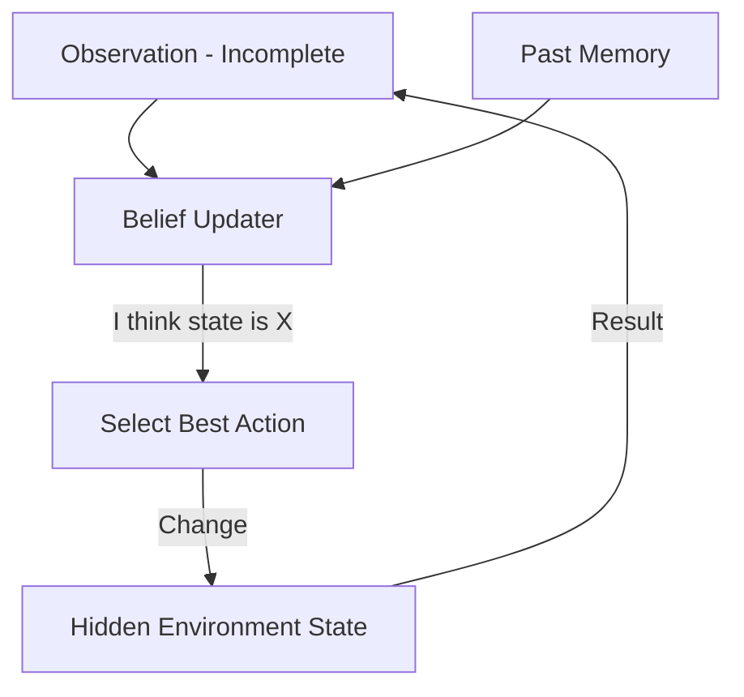

# 🙈 Handling Partial Observability: Acting with Incomplete Info
> **Level:** Advanced | **Language:** Hinglish | **Goal:** Master the strategies for agents to make decisions when they cannot see the full state of the environment.

---

## 🧭 1. Beginner-friendly Hinglish Explanation
Partial Observability ka matlab hai "Andhera hona" ya "Adhuri jankari". Sochiye aap ek kamre mein hain aur light chali gayi. Aapko poora kamra nahi dikh raha, par aapko pata hai ki darwaza kahan tha aur sofa kahan hai (Memory). AI Agents ke liye bhi yahi hai. Aksar agent ko saara data ek saath nahi milta (jaise kisi user ka bank balance ya private file). Agent ko "Guess" karna padta hai ya "Sawal puchna" padta hai taaki wo adhuri info ke saath bhi sahi faisla le sake.

---

## 🧠 2. Deep Technical Explanation
In **Partially Observable Markov Decision Processes (POMDPs)**, the agent does not know the state $s_t$ directly. Instead, it receives an observation $o_t$ which is a noisy or incomplete hint about the state.
1. **Belief State:** The agent maintains a probability distribution over all possible states (e.g., "I am 70% sure the file is in Folder A").
2. **Hidden State Management:** Using **Recurrent Neural Networks (RNNs)** or **Transformers with Memory** to remember past observations to infer the current hidden state.
3. **Active Sensing:** The agent takes an action specifically to "Gather Information" (e.g., calling `ls` or `whoami`) rather than to achieve the goal directly.

---

## 🏗️ 3. Real-world Analogies
Partial Observability ek **Card Game (Poker)** ki tarah hai.
- Aapko apne cards dikhte hain par doosron ke nahi (Partial info).
- Aap unke "Betting patterns" (Observations) se andaza lagate hain ki unke paas kya cards ho sakte hain (Belief state).

---

## 📊 4. Architecture Diagrams (The Belief Loop)


---

## 💻 5. Production-ready Examples (Information Gathering Tool)
```python
# 2026 Standard: Handling Missing Info
def execute_task(task):
    if not has_required_info(task):
        # Action specifically for gathering info
        print("Information missing. Executing search...")
        missing_data = search_tool.get(task.required_field)
        update_belief_state(missing_data)
    
    # Now execute with (hopefully) full info
    return run_final_action(task)
```

---

## ❌ 6. Failure Cases
- **The Guessing Game:** Agent ne adhuri info par "Guess" kiya aur wo galat nikla (e.g., deleted the wrong file because it assumed the name).
- **Infinite Exploration:** Agent sirf info hi dhoondhta reh gaya aur asli kaam kabhi shuru hi nahi kiya.

---

## 🛠️ 7. Debugging Section
- **Symptom:** Agent says "Task done" but it failed because it used default/placeholder values.
- **Check:** **Input Validation**. Agar info missing hai, toh agent ko "Abort and Ask" mode mein hona chahiye, na ki "Assume and Run" mode mein.

---

## ⚖️ 8. Tradeoffs
- **Certainty vs Speed:** 100% info ke liye wait karna (Safe but slow) vs partial info par kaam shuru karna (Fast but risky).

---

## 🛡️ 9. Security Concerns
- **Deceptive Environments:** Attacker deliberately "Hide" kar sakta hai important flags (like `is_admin`) taaki agent galat belief state bana le aur unsafe action execute kar de.

---

## 📈 10. Scaling Challenges
- Millions of "Belief States" ko manage karna context memory mein difficult hai. Use **Bayesian Networks** or specialized probability stores.

---

## 💸 11. Cost Considerations
- Extra "Information Gathering" steps tokens aur time consume karte hain. Use them only for **High-risk variables**.

---

## ⚠️ 12. Common Mistakes
- Placeholder data ko "Sach" (Truth) maan lena.
- Observation history ko ignore karna (Treating every step as a new world).

---

## 📝 13. Interview Questions
1. How does a 'Belief State' help an agent navigate a partially observable environment?
2. What is the difference between an MDP and a POMDP?

---

## ✅ 14. Best Practices
- Every agent should have a **'Certainty Threshold'**. If it's less than 80% sure about a fact, it must use an "Info Gathering" tool.
- Log the "Confidence Score" alongside every autonomous decision.

---

## 🚀 15. Latest 2026 Industry Patterns
- **Hypothesis-Driven Planning:** Agents jo multiple "Possible Worlds" simulate karte hain aur aisi action lete hain jo sabse "Least Risky" ho.
- **Collaborative Sensing:** Ek agent doosre agent se "Ankhon" (Camera/API) ki tarah help leta hai to see hidden parts of the world.
