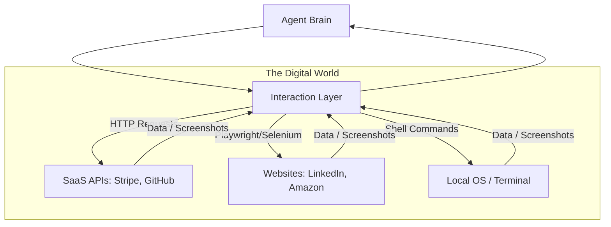

# 🖥️ Interacting with Digital Environments: API and Browser Mastery
> **Level:** Advanced | **Language:** Hinglish | **Goal:** Master the techniques for agents to navigate, scrape, and interact with websites, SaaS platforms, and operating systems using APIs and browser automation.

---

## 🧭 1. Beginner-Friendly Hinglish Explanation
Interacting with Digital Environments ka matlab hai **"AI ka Computer chalana"**.

- **The Concept:** Agent sirf baatein nahi karta, wo software chalata hai.
- **The Ways:**
  - **API Interaction:** Agent dusre software se "Piche ke darwaze" (API) se baat karta hai (Fast and Clean).
  - **Browser Interaction:** Agent ek browser kholta hai, buttons click karta hai, aur form bharta hai (Bilkul insaan ki tarah).
  - **OS Interaction:** Agent terminal mein commands chala kar files create ya delete karta hai.
- **The Goal:** AI ko "Autonomous" banana taki wo aapka ticket book kar sake ya GitHub par code push kar sake.

Digital environment mein agent ke "Hath" (Hands) uske **Tools** hote hain.

---

## 🧠 2. Deep Technical Explanation
Agents interact with digital worlds through **Structured APIs** (JSON) or **Unstructured UIs** (HTML/Visual).

### 1. Browser-based Interaction (The LAM approach):
- **DOM Parsing:** Converting HTML into a clean tree for the LLM to understand.
- **Accessibility Tree:** Using the `Aria-labels` and roles to help the AI find buttons (this is much cleaner than raw HTML).
- **Computer-Use APIs (Claude):** Sending screenshots to a Multi-modal model to get `[x, y]` click coordinates.

### 2. API-based Interaction (The Standard):
- **Swagger/OpenAPI Integration:** Giving the agent a JSON file that describes all available API endpoints.
- **Dynamic Parameter Filling:** The agent extracting data from a user prompt to fill an API's required fields.

### 3. File System & CLI:
- **Bash/Zsh Tools:** Allowing the agent to run commands in a sandboxed shell.
- **File I/O:** Reading, writing, and editing code or text files.

---

## 🏗️ 3. Architecture Diagrams (The Digital Bridge)


---

## 💻 4. Production-Ready Code Example (A Browser 'Click' Tool)
```python
# 2026 Standard: Using Playwright for Autonomous Browsing

from playwright.sync_api import sync_playwright

def browser_click_tool(selector):
    with sync_playwright() as p:
        browser = p.chromium.launch(headless=True)
        page = browser.new_page()
        page.goto("https://example.com")
        
        # Agent provides the selector
        page.click(selector)
        
        # Take a screenshot for the agent to 'See' the result
        screenshot = page.screenshot()
        browser.close()
        return "Action successful", screenshot

# Insight: Always return a 'Screenshot' so the agent 
# can verify if it clicked the right thing.
```

---

## 🌍 5. Real-World Use Cases
- **Autonomous Lead Gen:** Agent goes to LinkedIn -> Searches for 'CTO' -> Clicks 'Connect' -> Sends a personalized message.
- **Auto-Billing:** Agent logs into an old electricity portal -> Finds the PDF bill -> Downloads it -> Pays it via Stripe API.
- **DevOps:** Agent monitors logs on CloudWatch -> Sees an error -> Restarts the server via AWS CLI.

---

## ❌ 6. Failure Cases
- **The "Pop-up" Trap:** A random "Cookie Consent" or "Ad" pop-up appears, and the agent gets stuck trying to click a button that's hidden.
- **Anti-Bot Protections:** Sites like Amazon blocking the agent because it's "Too fast" or doesn't solve Captchas.
- **Session Timeout:** The agent was "Thinking" for too long, and its login session expired.

---

## 🛠️ 7. Debugging Guide
| Symptom | Cause | Fix |
| :--- | :--- | :--- |
| **Agent says 'Button not found'** | UI changed / Dynamic IDs | Use **'Text-based selectors'** (e.g., `button:has-text("Submit")`) instead of ID selectors. |
| **Agent is clicking the wrong thing** | Overlapping elements | Provide a **'Vision-enhanced'** check where the agent reviews the screenshot before clicking. |

---

## ⚖️ 8. Tradeoffs
- **API (Fast/Reliable) vs. Browser (Flexible/Universal):** Use APIs whenever possible; browsers are a "Last Resort."
- **Headless vs. Headed:** Headless is faster and uses less RAM; Headed is better for debugging.

---

## 🛡️ 9. Security Concerns
- **Sensitive Data Leak:** The agent accidentally takes a screenshot of a "Password" or "Credit Card" field and sends it to the LLM. **Solution: Use 'Selective Masking' in the browser.**
- **Malicious Scripts:** A website running a script that tries to hijack the agent's browser session.

---

## 📈 10. Scaling Challenges
- **Resource Intensive:** Running 100 Chrome instances on one server will crash it. **Solution: Use 'Browserless' or 'Cloud Browsers' (like Browserbase).**

---

## 💸 11. Cost Considerations
- **Compute Cost:** Browsers use massive CPU and RAM compared to simple API calls.

---

## 📝 12. Interview Questions
1. How do you handle "Captchas" in an autonomous browsing agent?
2. What is the advantage of using the "Accessibility Tree" over raw HTML?
3. Explain the difference between "Heuristic Scraping" and "AI-driven Navigation."

---

## ⚠️ 13. Common Mistakes
- **No 'Wait' commands:** Clicking a button before the page has finished loading.
- **Ignoring 'Infinite Scroll':** The agent thinking it's at the end of the page when there's more data to load.

---

## ✅ 14. Best Practices
- **Use 'Stealth' plugins:** Avoid detection by masking the fact that you are an automated script.
- **Limit 'Max Steps':** Never let a browsing agent click more than 20 times per session to avoid loops.
- **Standardized Screen size:** Always use a fixed resolution (e.g., $1280 \times 800$) so the agent's "Visual understanding" is consistent.

---

## 🚀 15. Latest 2026 Industry Patterns
- **Computer-Use Native Models:** Models trained specifically to output keyboard and mouse commands (e.g. Claude 3.5 Sonnet).
- **Virtual Browsers:** Throwaway cloud browsers that live for only one task and then vanish.
- **OS-level Agents:** Agents that control your entire Macbook or Windows PC, moving windows and opening apps like a human.
