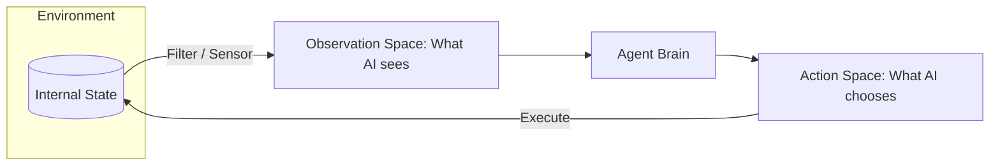

# 🔭 Observation Space vs. Action Space: The AI's Scope
> **Level:** Advanced | **Language:** Hinglish | **Goal:** Master the distinction between what an agent can "See" (Observation) and what it can "Do" (Action), and how to optimize both for agentic performance.

---

## 🧭 1. Beginner-Friendly Hinglish Explanation
Observation Space vs. Action Space ka matlab hai **"Dekhna vs. Karna"**.

- **Observation Space (Dekhna):** Ye wo saari info hai jo agent ko milti hai.
  - *Example:* Ek driver ke liye observation space hai: Rasta, Traffic signals, aur dusri gaadiyan.
  - *In AI:* Website ka text, database ke rows, ya user ka chat message.
- **Action Space (Karna):** Ye wo saari cheezein hain jo agent "Kar sakta hai."
  - *Example:* Driver ke liye action space hai: Steering modna, Brake lagana, ya Accelerator dabana.
  - *In AI:* Button click karna, SQL query run karna, ya email bhejna.

Zaroori baat ye hai ki agent ko wahi "Dikhna" chahiye jo uske "Kaam" ke liye zaroori ho.

---

## 🧠 2. Deep Technical Explanation
The success of an agent depends on how well these two spaces are defined and constrained.

### 1. Observation Space ($O$):
- **Discrete:** Finite set of values (e.g., "Page Loaded", "Error 404").
- **Continuous:** Range of values (e.g., Stock price, Confidence score).
- **Multi-modal:** Combination of text, images, and telemetry data.
- **Problem:** "Information Overload." If the space is too large, the agent gets "Lost in the tokens."

### 2. Action Space ($A$):
- **Atomic Actions:** Simple, single steps (e.g., `click_id(45)`).
- **Macro Actions:** Complex sequences treated as one (e.g., `checkout_process()`).
- **Parameterized Actions:** Actions that take inputs (e.g., `send_email(recipient, body)`).
- **Problem:** "Action Explosion." Too many options make it hard for the agent to pick the right one.

---

## 🏗️ 3. Architecture Diagrams (The Perceptual Cycle)


---

## 💻 4. Production-Ready Code Example (Defining Spaces)
```python
# 2026 Standard: Defining Spaces for an Agent

class StockAgentConfig:
    # 1. Observation Space: What we tell the LLM
    OBSERVATION_FIELDS = ["current_price", "rsi", "moving_average", "user_balance"]
    
    # 2. Action Space: The tools we give the LLM
    ACTION_TOOLS = {
        "buy": ["symbol", "amount"],
        "sell": ["symbol", "amount"],
        "hold": [],
        "research": ["company_name"]
    }

# Insight: Limiting the Action Space to only '4 Tools' 
# makes the agent $30\%$ more reliable than giving it 'Generic Python'.
```

---

## 🌍 5. Real-World Use Cases
- **Customer Support:** Observation = Ticket text + User history. Action = Reply, Escalate, or Close.
- **Data Analysis:** Observation = Column names + Sample data. Action = Run SQL, Generate Chart, or Export CSV.
- **Game AI:** Observation = Nearby enemies + Health. Action = Attack, Defend, or Run.

---

## ❌ 6. Failure Cases
- **The "Blind" Agent:** Action space allows "Delete User," but the observation space doesn't show "Who the user is."
- **The "Paralyzed" Agent:** Observation space shows a huge "Error," but the action space doesn't have a "Retry" or "Fix" tool.
- **Mismatch:** Agent sees an "Image" but only has "Text-based" tools (e.g., it sees a Captcha but can't solve it).

---

## 🛠️ 7. Debugging Guide
| Symptom | Cause | Fix |
| :--- | :--- | :--- |
| **Agent keeps picking wrong tools** | Action Space is too crowded | Group tools into **'Sub-menus'** (e.g., first pick 'Marketing Tools', then pick 'Email Tool'). |
| **Agent is confused by context** | Observation Space is messy | Use **'Semantic Filtering'** to remove boilerplate text (headers/footers) from the observations. |

---

## ⚖️ 8. Tradeoffs
- **Granularity:** Fine-grained actions (more control) vs. Coarse-grained actions (easier for AI to plan).
- **Observability:** Full observability (High cost/tokens) vs. Partial observability (Low cost/risk of mistakes).

---

## 🛡️ 9. Security Concerns
- **Action Hijacking:** An attacker providing an observation that "Tricks" the agent into using a dangerous action (e.g., `transfer_all_funds`).
- **Over-privileged Action Space:** Giving the agent tools it doesn't need for the specific task (e.g., a "Summarizer" agent having a "Delete Database" tool).

---

## 📈 10. Scaling Challenges
- **Dynamic Spaces:** Environments where the action space changes (e.g., new buttons appear on a webpage). **Solution: Use 'Discovery Tools' for the agent to find new actions.**

---

## 💸 11. Cost Considerations
- **Observation Filtering:** It is cheaper to pay a small model to "Filter" the observation than to send the raw data to a large model.

---

## 📝 12. Interview Questions
1. What is the "Curse of Dimensionality" in observation spaces?
2. How do you handle "Discrete" vs. "Continuous" actions in an LLM agent?
3. Why should you limit the Action Space for an agent?

---

## ⚠️ 13. Common Mistakes
- **Information Asymmetry:** The agent has the power to act but not the data to decide.
- **Implicit Actions:** Forgetting that "Waiting" or "Asking for help" is also an action.

---

## ✅ 14. Best Practices
- **Balanced Design:** For every action, ensure there is a corresponding observation to verify its success.
- **Layered Spaces:** Use a "Router" to switch between different specialized action spaces based on the task.
- **Schema-first:** Always define your Action Space using **JSON Schema** or **Pydantic** for reliability.

---

## 🚀 15. Latest 2026 Industry Patterns
- **Latent Spaces:** Agents that "Encode" the observation into a vector and "Decode" the action from another vector (Neural Agents).
- **Auto-evolving Spaces:** Agents that realize they are missing a tool and "Code" it for themselves during execution.
- **Visual-Action Alignment:** Multi-modal models that directly map "Pixels" to "Coordinates" without needing an HTML DOM.
