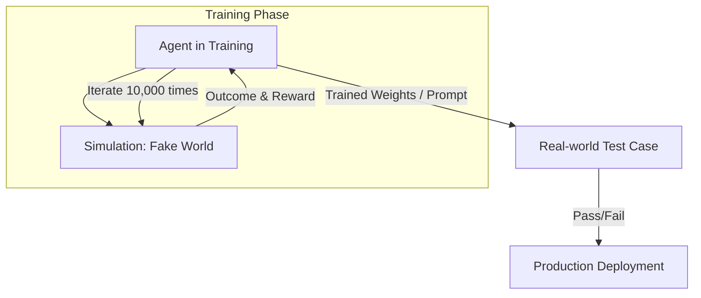

# 🎮 Simulated Environments for Training: The AI's Training Ground
> **Level:** Advanced | **Language:** Hinglish | **Goal:** Master the use of sandboxes, simulators, and "Digital Twins" to safely train, test, and evaluate agents before they interact with the real world.

---

## 🧭 1. Beginner-Friendly Hinglish Explanation
Simulated Environments ka matlab hai **"AI ka Practice Ground"**.

- **The Problem:** Aap ek naya "Trading Agent" ya "Robotic Arm" seedha real world mein nahi chala sakte. Agar wo galti karega, toh lakhon ka nuksan ho sakta hai.
- **The Solution:** Hum ek **"Fake World"** (Simulation) banate hain.
  - **The Sandbox:** Ek safe jagah jahan agent bina kisi dar ke galti kar sake.
  - **The Game:** AI ko games (jaise Minecraft) mein train kiya jata hai logic seekhne ke liye.
  - **The Mock API:** Real bank API ki jagah ek "Fake Bank" jise agent use kar sake.
- **The Result:** Agent simulation mein hazaaron baar practice karke "Expert" banta hai aur phir real world mein jata hai.

Simulation AI ke liye ek "Flight Simulator" jaisa hai.

---

## 🧠 2. Deep Technical Explanation
Simulated environments bridge the **Sim-to-Real Gap** by providing high-fidelity feedback loops.

### 1. Types of Simulators:
- **Physics Simulators:** Gazebo, MuJoCo, NVIDIA Isaac Sim (for robotics).
- **Task Sandboxes:** E2B, Docker, or MicroVMs (for code execution and terminal use).
- **Market/Logic Simulators:** Backtesting engines for finance or supply chain.
- **Agent-based Models (ABM):** Simulating a world where hundreds of agents interact (e.g., simulating a stock market crash).

### 2. High-Fidelity vs. Low-Fidelity:
- **Low-Fi:** Fast, cheap, covers basic logic. (e.g., a simple Python script).
- **High-Fi:** Slow, expensive, covers "Edge cases" (e.g., simulating 3D friction and gravity).

### 3. The 'Sim-to-Real' Gap:
The challenge where an agent works perfectly in a simulation but fails in the real world because the simulation was "Too Perfect." We fix this with **Domain Randomization** (adding noise to the simulation).

---

## 🏗️ 3. Architecture Diagrams (The Training Pipeline)


---

## 💻 4. Production-Ready Code Example (A Mock API Environment)
```python
# 2026 Standard: A 'Mock' environment for training a Banking Agent

class MockBankEnv:
    def __init__(self):
        self.accounts = {"USER_1": 1000.0}
        self.logs = []

    def execute_transaction(self, sender, amount):
        # 1. Simulate Success/Failure
        if self.accounts[sender] >= amount:
            self.accounts[sender] -= amount
            self.logs.append(f"Sent {amount}")
            return {"status": "SUCCESS", "balance": self.accounts[sender]}
        else:
            return {"status": "FAILED", "error": "Insufficient Funds"}

# Insight: Using a 'Mock' environment allows the agent 
# to 'Experience' failures without real-world consequences.
```

---

## 🌍 5. Real-World Use Cases
- **Self-Driving Cars:** Waymo/Tesla training for billions of miles in "Virtual Cities" before hitting the road.
- **Cybersecurity Agents:** Training agents to defend against "Fake Attacks" in a virtual network.
- **E-commerce Chatbots:** Testing the bot against 1000 "Angry Customer" AI personas to see how it reacts.

---

## ❌ 6. Failure Cases
- **Overfitting to Simulation:** The agent learns a "Cheat code" in the simulation that doesn't exist in the real world.
- **Missing Physics:** The simulation forgot that "Paper can catch fire," so the agent tries to use a paper plate as a stove lid.
- **Feedback Delay:** The simulation is too fast, and the agent isn't prepared for the 2-second "Latency" of real-world APIs.

---

## 🛠️ 7. Debugging Guide
| Symptom | Cause | Fix |
| :--- | :--- | :--- |
| **Agent is 'Perfect' in Sim, 'Useless' in Real** | Sim-to-Real Gap | Add **'Domain Randomization'** (e.g., vary the API response times, add random errors). |
| **Simulation is too slow** | High-fidelity overhead | Use a **'Surrogate Model'** (a faster AI that approximates the simulation's behavior). |

---

## ⚖️ 8. Tradeoffs
- **Real-world testing (Risky/Slow) vs. Simulation (Safe/Fast).**
- **Hand-coded Simulators (Reliable) vs. AI-generated Simulators (Flexible).**

---

## 🛡️ 9. Security Concerns
- **Sandbox Escapes:** A coding agent using its "Terminal" tool to hack the simulation and access the host machine. **Fix: Use 'Kernel-level Isolation'.**

---

## 📈 10. Scaling Challenges
- **Massive Parallelism:** Running 1000 simulations at once for Reinforcement Learning (RL). **Solution: Use 'GPU-accelerated Simulators' like Isaac Gym.**

---

## 💸 11. Cost Considerations
- **Compute vs. Risk:** It is $100x$ cheaper to pay for cloud GPUs than to pay for one "Accidental" server deletion in the real world.

---

## 📝 12. Interview Questions
1. What is "Sim-to-Real" transfer?
2. How do you handle "Edge cases" in a simulated environment?
3. What is "Domain Randomization"?

---

## ⚠️ 13. Common Mistakes
- **Making the Sim 'Too Easy':** Not including errors, timeouts, or bad data in the simulation.
- **No 'Human' in the Sim:** Forgetting that real environments include "Unpredictable Humans."

---

## ✅ 14. Best Practices
- **Standardized Benchmarks:** Use **Big-Bench** or **WebShop** to test your agents in standard simulations.
- **Adversarial Simulation:** Use a "Second AI" to try and make the simulation as difficult as possible for the first agent.
- **Checkpointing:** Save the agent's state in the simulation so you can "Rewind" and see where it went wrong.

---

## 🚀 15. Latest 2026 Industry Patterns
- **Generative Simulators:** Using models like **Sora** to generate "Infinite" custom video simulations for robot training.
- **Digital Twin Syncing:** A real-world factory sending live data to its "Simulation" so the agent can practice on *today's* actual problems.
- **Foundation Environments:** Pre-trained world models that already understand "Gravity," "Logic," and "Commerce," so you don't have to build them from scratch.
