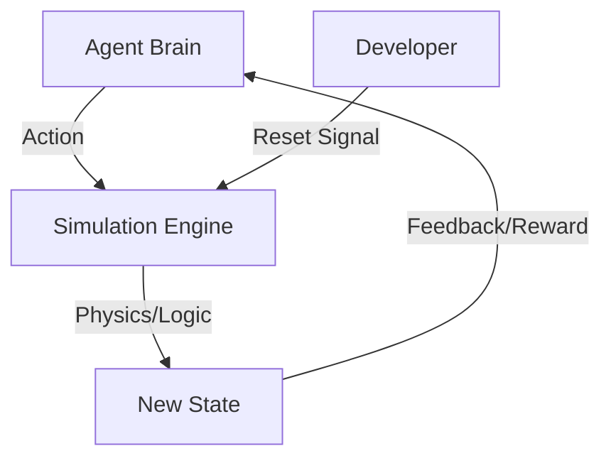

# 🎮 Simulation Environments: The Agent's Dojo
> **Level:** Intermediate | **Language:** Hinglish | **Goal:** Master the creation and usage of isolated, repeatable environments for training and testing AI agents safely.

---

## 🧭 1. Beginner-friendly Hinglish Explanation
Simulation Environments ka matlab hai "Agent ki Training Ground". Sochiye aap ek agent bana rahe hain jo computers ki settings theek kare. Agar aap use seedha apne asli laptop par chalayenge, toh wo galti se aapka data delete kar sakta hai. Isse behtar hai ki aap use ek "Virtual Machine" ya "Simulation" mein chalayein jo bilkul aapke laptop jaisa dikhta hai par "Nakli" hai. Agar wahan kuch crash bhi ho jaye, toh aap bas ek button dabakar use "Reset" kar sakte hain. Simulation agent ko "Galti karne ki aazadi" deta hai taaki wo bina kisi dar ke seekh sake.

---

## 🧠 2. Deep Technical Explanation
Simulation environments provide a controlled API for the agent:
1. **Reset-ability:** The environment can be returned to a known initial state $S_0$ instantly.
2. **Determinism:** Given the same actions, the simulation should ideally yield the same results (for debugging).
3. **Observation Granularity:** We can control exactly what data the agent sees (e.g., masking sensitive parts).
4. **Time Scaling:** Simulations can run faster than real-time (e.g., simulating 1 year of trading in 1 minute).
**Tools:** **Gymnasium (OpenAI Gym)**, **MuJoCo** (Physics), **Docker** (OS/Digital tasks).

---

## 🏗️ 3. Real-world Analogies
Simulation Environment ek **Crash Test Lab** ki tarah hai.
- Asli sadak par car crash karne ki jagah, hum lab mein nakli car aur dummies use karte hain (Simulation).
- Hum har angle se accident ko repeat kar sakte hain (Repeatability) bina kisi asli jaan ke khatre ke.

---

## 📊 4. Architecture Diagrams (The Dojo Flow)


---

## 💻 5. Production-ready Examples (The Docker Sandbox)
```python
# 2026 Standard: Using Docker as a Simulation Env
import docker

class AgentDojo:
    def __init__(self):
        self.client = docker.from_env()

    def run_simulation(self, script):
        # Create a fresh, isolated container
        container = self.client.containers.run(
            "python:3.10-slim",
            command=f"python -c '{script}'",
            detach=True,
            network_disabled=True # Pure isolation
        )
        return container.logs()

# Every test run gets a 100% clean, identical environment.
```

---

## ❌ 6. Failure Cases
- **Simulation Leakage:** Agent ne simulation se bahar nikal kar host machine ka access le liya.
- **Inaccurate Physics/Logic:** Simulation mein sab kaam kar raha hai par real world mein "Friction" ya "Network Lag" ki wajah se sab fail ho gaya.

---

## 🛠️ 7. Debugging Section
- **Symptom:** Agent is behaving perfectly but takes too long to train.
- **Check:** **Simulation Speed**. Kya aap headless mode use kar rahe hain? GUI (Graphics) disable karein aur physics frequency ko optimize karein to increase iterations per second.

---

## ⚖️ 8. Tradeoffs
- **High Realism:** Accurate par slow aur compute-intensive.
- **Low Realism (Abstractions):** Fast par real-world deploy mein fail hone ka risk.

---

## 🛡️ 9. Security Concerns
- **Malicious Simulations:** Attacker aisi simulation de sakta hai jo agent ko "Unsafe behaviors" sikhaaye (e.g., bias training).

---

## 📈 10. Scaling Challenges
- Running 10,000 simulations parallelly requires **Distributed Orchestration** (like Ray or Kubernetes).

---

## 💸 11. Cost Considerations
- GPU-based simulations are expensive. Use **Vectorized Environments** (where 1 GPU runs 1000 simulations at once) to save money.

---

## ⚠️ 12. Common Mistakes
- Randomness (Seed) set na karna (Experiments non-repeatable ho jate hain).
- Simulation aur Real World ke units alag rakhna (e.g., Metric vs Imperial).

---

## 📝 13. Interview Questions
1. Why is 'Parallelization' important in simulation-based training?
2. What is 'Domain Randomization' and how does it help bridge the sim-to-real gap?

---

## ✅ 14. Best Practices
- Always use a **Fixed Random Seed** for reproducible tests.
- Profile your simulation code to ensure it's not the bottleneck in training.

---

## 🚀 15. Latest 2026 Industry Patterns
- **AI-Generated Simulations:** Using LLMs to write the "Rules" and "Code" of the simulation itself based on real-world logs.
- **Cloud-Native Dojos:** Massive online simulation worlds where agents from different companies compete and learn from each other.
