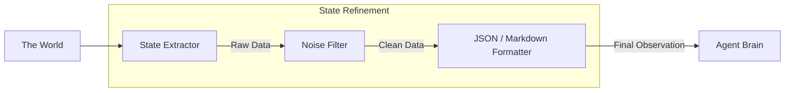

# 📑 State Representation: Capturing the Moment
> **Level:** Advanced | **Language:** Hinglish | **Goal:** Master how to represent the "Current Status" of an environment in a way that the agent can understand and act upon efficiently without token waste.

---

## 🧭 1. Beginner-Friendly Hinglish Explanation
State Representation ka matlab hai **"AI ko batana ki abhi kya ho raha hai"**.

- **The Problem:** Ek environment mein hazaaron details hoti hain. Agar aap agent ko sab kuch bataoge, toh wo confuse ho jayega aur tokens bhi waste honge.
- **The Solution:** Humein environment ko "Summarize" karke dena hota hai.
  - **Raw State:** Poori website ka HTML.
  - **Structured State:** "Aap login ho, cart mein 2 items hain, aur 'Checkout' button screen par hai."
- **The Goal:** Agent ko sirf wahi info dena jo uske agle "Action" ke liye zaroori hai.

State bilkul ek **"Snapshot"** ki tarah hai jo batata hai: "Abhi hum kahan khade hain?"

---

## 🧠 2. Deep Technical Explanation
State representation is the process of mapping the **Real Environment State** ($S$) to an **Agent Observation** ($O$).

### 1. Representation Formats:
- **Natural Language:** Describing the state in text (e.g., "The file 'test.py' exists and contains 10 lines.").
- **Structured (JSON/YAML):** Providing key-value pairs (e.g., `{"is_logged_in": true, "balance": 500}`).
- **Visual (Screenshots/Embeddings):** Sending a raw image or a vector representation to the agent.
- **Graph-based:** Representing relationships (e.g., User A is connected to File B).

### 2. State Types:
- **Global State:** Everything in the system (The agent rarely sees this).
- **Local/Partial State:** Only what's currently "Visible" to the agent.
- **Persistent State:** Information that stays across sessions (User preferences, long-term goals).

### 3. Dimensionality Reduction:
Filtering out the "Noise" (e.g., removing ads, tracking scripts, and decorative CSS from a web page state).

---

## 🏗️ 3. Architecture Diagrams (The State Pipeline)


---

## 💻 4. Production-Ready Code Example (A Pydantic State Object)
```python
# 2026 Standard: Representing state using structured models

from pydantic import BaseModel
from typing import List, Optional

class BrowserState(BaseModel):
    url: str
    title: str
    input_fields: List[str]
    buttons: List[str]
    cart_total: Optional[float] = 0.0
    error_message: Optional[str] = None

# Logic to generate the state
def get_clean_state(page):
    return BrowserState(
        url=page.url,
        title=page.title(),
        input_fields=["search", "email"], # Simplified
        buttons=["submit", "cancel"]
    ).model_dump_json()

# Insight: Giving the Agent 'JSON State' is $40\%$ more 
# accurate than giving it 'Raw HTML'.
```

---

## 🌍 5. Real-World Use Cases
- **Inventory Management:** Representing state as a list of `[Product_ID, Stock_Count, Is_Low]`.
- **Game Agents:** Representing the state as a 3D grid of blocks (Minecraft) or a 2D map (Starcraft).
- **E-mail Agents:** Representing state as a list of `[Unread_Messages, Sender_Priority, Keywords]`.

---

## ❌ 6. Failure Cases
- **Stale State:** The agent thinks the state is X, but the environment has already changed to Y. **Fix: Always 'Re-sync' state before every major action.**
- **Information Overload:** Providing the entire database schema as "State," causing the agent to forget the user's question.
- **State Shadowing:** Two different states looking identical to the agent (e.g., two pages with the same title).

---

## 🛠️ 7. Debugging Guide
| Symptom | Cause | Fix |
| :--- | :--- | :--- |
| **Agent is taking hallucinated actions** | Missing info in State | Check the **State Extractor** to see if a crucial variable (like `is_button_enabled`) was accidentally filtered out. |
| **High Token Costs** | State is too 'Wordy' | Switch from **Markdown/Natural Language** to a compact **JSON** or **Key-Value** format. |

---

## ⚖️ 8. Tradeoffs
- **Textual vs. Visual:** Text is cheaper and faster; Visual is more robust for "Complex UIs."
- **Completeness vs. Conciseness:** More info = better decisions; Less info = faster/cheaper.

---

## 🛡️ 9. Security Concerns
- **State Injection:** An attacker modifying the environment so that the "State Extractor" sends a malicious instruction as "State Data."
- **Leaking Secrets:** Including "API Keys" or "PII" in the state representation that gets sent to a third-party LLM.

---

## 📈 10. Scaling Challenges
- **Real-time Streaming States:** Handling states that change 60 times a second (e.g., video games). **Solution: Use 'Event-based State Updates' only when something important happens.**

---

## 💸 11. Cost Considerations
- **Context Window Management:** Large states eat up the context window, leaving no room for the agent to "Think."

---

## 📝 12. Interview Questions
1. How do you handle "Partially Observable" states?
2. What is the benefit of using JSON over raw text for state representation?
3. How do you detect "Stale State" in a distributed system?

---

## ⚠️ 13. Common Mistakes
- **Implicit State:** Assuming the agent "Knows" something that isn't explicitly in the state (e.g., "The user is logged in").
- **Ignoring History:** Representing only the *current* moment and forgetting *how* we got here.

---

## ✅ 14. Best Practices
- **Schema Grounding:** Provide a small "Description" of what each field in the JSON state means.
- **Diff-based State:** Only send the "Changes" from the last state to save tokens.
- **Validation:** Ensure the state being sent is actually correct (e.g., check that the URL matches).

---

## 🚀 15. Latest 2026 Industry Patterns
- **Latent State Representations:** Using an encoder to turn the environment into a "Vector" that the LLM processes directly.
- **Unified State Stores:** A central "State Manager" that multiple agents (frontend, backend, QA) all read from.
- **Semantic State Compression:** An agent that "Summarizes" the raw state into a 1-paragraph "Situation Report" for the main agent.
