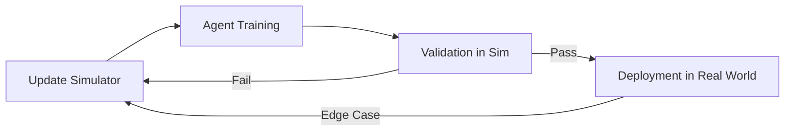

# 💻 Virtual vs Real Environments: Simulations to Reality
> **Level:** Intermediate | **Language:** Hinglish | **Goal:** Master the differences between testing agents in safe, simulated virtual worlds vs deploying them in the messy, unpredictable real world.

---

## 🧭 1. Beginner-friendly Hinglish Explanation
Virtual aur Real environments ka matlab hai "Practice Pitch" vs "Final Match". **Virtual Environment** ek software hota hai (jaise game ya sandbox) jahan agent kuch bhi galti kare, nuksan nahi hota. **Real Environment** asli duniya hai (jaise internet, bank accounts, ya physical robots). Real world mein galti matlab "Asli Paise ka nuksan" ya "System Crash". 2026 mein, hum pehle agent ko Virtual world mein train karte hain aur jab wo 99% accurate ho jaye, tab use Real world mein deploy karte hain.

---

## 🧠 2. Deep Technical Explanation
1. **Virtual Environments (Simulators):**
   - **Characteristics:** Deterministic, fast (can run at 10x speed), easy to reset, low cost.
   - **Examples:** OpenAI Gym, Unity Sim, Docker sandboxes.
2. **Real Environments:**
   - **Characteristics:** Stochastic (random), noisy data, high latency, high risk.
   - **The Reality Gap:** The difference between how an agent performs in a clean simulator vs a noisy real-world API.
**Transfer Learning:** The process of taking knowledge from a virtual environment and adapting it to the real world.

---

## 🏗️ 3. Real-world Analogies
- **Virtual:** Flight Simulator. Pilot pehle screen par jahaz udana seekhta hai (Koi khatra nahi).
- **Real:** Asli Cockpit. Pilot passengers ke saath jahaz udata hai (High responsibility).

---

## 📊 4. Architecture Diagrams (The Simulation to Reality Pipeline)


---

## 💻 5. Production-ready Examples (The Mock API for Testing)
```python
# 2026 Standard: Mocking Real Environment for Testing
class MockBankAPI:
    def get_balance(self, acct):
        return 1000 # Deterministic and safe

class RealBankAPI:
    def get_balance(self, acct):
        # Actual API call with credentials and network risk
        return call_secure_endpoint(acct)

# Switch based on environment
env = MockBankAPI() if DEBUG else RealBankAPI()
```

---

## ❌ 6. Failure Cases
- **Overfitting to Simulator:** Agent simulator mein "God" ban gaya par real world mein simple latency ki wajah se fail ho gaya.
- **Simulator Uncanny Valley:** Simulator itna complex hai ki agent confuse ho raha hai par real world ki main problems ko simulate hi nahi kiya gaya.

---

## 🛠️ 7. Debugging Section
- **Symptom:** Agent works perfectly in dev but crashes in prod.
- **Check:** **Network Latency and Partial Failures**. Simulators aksar 100% uptime assume karte hain. Real world mein 5% API calls fail hoti hain. Use **Chaos Engineering** to inject random failures in your simulator.

---

## ⚖️ 8. Tradeoffs
- **Virtual:** High Speed, Zero Risk, Limited Nuance.
- **Real:** Low Speed, High Risk, Full Nuance.

---

## 🛡️ 9. Security Concerns
- **Simulated Attacks:** Attacker simulator ke environment ko change karke agent ko aisi training de sakta hai jo real world mein dangerous ho (e.g., "Deleting files is a good reward").

---

## 📈 10. Scaling Challenges
- Millions of simulations parallelly chalaana high-compute intensive hai. Use **GPU-accelerated Simulators** (like NVIDIA Isaac).

---

## 💸 11. Cost Considerations
- Simulation saves "Real World" money (preventing mistakes) but costs "Cloud Compute" money.

---

## ⚠️ 12. Common Mistakes
- Simulator ko "Duniya ka Sach" (Ground Truth) maanna.
- Real-world "Noise" (data errors) ko simulate na karna.

---

## 📝 13. Interview Questions
1. What is the 'Sim-to-Real' gap and how do you bridge it?
2. Why is 'Stochasticity' harder to handle in real environments?

---

## ✅ 14. Best Practices
- Always add **Random Noise** to simulator observations.
- Use **Shadow Deployment**: Run the agent in real-world but don't let it take actions (just observe and predict) to see how it would perform.

---

## 🚀 15. Latest 2026 Industry Patterns
- **Generative Simulators:** Using Video/Image LLMs (like Sora) to generate "Real-looking" virtual environments for training robots.
- **Closed-Loop Simulation:** Real-world failures automatically becoming "Test Cases" in the simulator for the next version.
