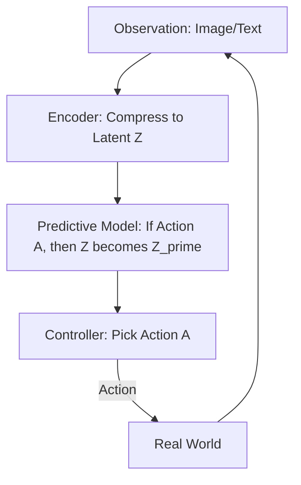

# 🧠 World Modeling for Agents: The Internal Map of Reality
> **Level:** Extreme Advanced | **Language:** Hinglish | **Goal:** Master the concept of "World Models"—how an agent builds an internal simulation of its environment to predict the future and plan complex actions.

---

## 🧭 1. Beginner-Friendly Hinglish Explanation
World Modeling ka matlab hai **"AI ke dimaag ka Naksha"**.

- **The Problem:** Agar AI ko kuch karna hai, toh kya wo har cheez "Live" try karega? Agar usne "Delete File" try kiya aur wo file zaroori thi, toh nuksan ho jayega.
- **The Solution:** AI apne dimaag mein ek **"Simulation"** (World Model) banata hai.
  - Wo sochta hai: "Agar main Button A dabau, toh kya hoga?"
  - Uska "World Model" batata hai: "Screen B khulegi."
- **The Concept:** AI real-world mein action lene se pehle apne dimaag mein use "Play" karke dekhta hai.

Ye bilkul waisa hai jaise aap chess khelte waqt agla move "Sochte" ho bina gote (piece) ko chuye.

---

## 🧠 2. Deep Technical Explanation
A World Model is a **Predictive Model** of the environment's dynamics. It usually consists of three parts:

### 1. Vision/Encoder (V):
Compresses the high-dimensional observation (e.g., a 1080p video frame) into a low-dimensional **Latent Space**.

### 2. Memory/RNN (M):
Predicts the next latent state based on the current state and the chosen action. This is the "Predictive Brain."

### 3. Controller (C):
Decides which action to take based on the "Future States" predicted by the Memory module.

### 4. Why it's the future (2026):
Instead of just "Reacting" to tokens, agents like **OpenAI o1** or **JEPA (Joint Embedding Predictive Architecture)** are learning to "Model" the physics and logic of the world, making them $10x$ better at complex planning.

---

## 🏗️ 3. Architecture Diagrams (The World Model Triad)


---

## 💻 4. Production-Ready Code Example (A Simple Latent Predictor)
```python
# 2026 Standard: Predicting the next state in a latent space

class WorldModel:
    def predict_next_state(self, current_latent, action):
        # This function 'Simulates' the world inside the brain
        predicted_latent = transformer_model.forward(current_latent, action)
        return predicted_latent

# Usage in Planning
def search_in_imagination(start_state, goal):
    for path in potential_actions:
        future_state = world_model.predict_next_state(start_state, path)
        if future_state == goal:
            return path # Found a winning move in 'Imagination'

# Insight: Real-world trials are expensive; 
# 'Imaginary' trials are free and fast.
```

---

## 🌍 5. Real-World Use Cases
- **Robotics:** A robot arm "Simulating" how to pick up a glass without breaking it before actually moving.
- **Game AI:** Agents in Minecraft building complex structures by "Planning" the blocks in their world model first.
- **Autonomous Driving:** Predicting where a pedestrian *will be* in 2 seconds based on their current direction.

---

## ❌ 6. Failure Cases
- **Model Inaccuracy:** The world model thinks "Fire is cold." The agent then tries to walk through fire and fails in the real world.
- **Compounding Error:** A tiny error in the first prediction grows into a huge error after 10 "Imaginary" steps.
- **Computational Cost:** Building a high-fidelity world model for a complex system (like a city) requires massive GPU power.

---

## 🛠️ 7. Debugging Guide
| Symptom | Cause | Fix |
| :--- | :--- | :--- |
| **Agent works in 'Imagination' but fails in 'Reality'** | Reality Gap | Collect more **Real-world Data** to re-train the World Model's encoder and predictor. |
| **Predictions are 'Blurry' or Vague** | Latent Space is too small | Increase the **Embedding Dimension** or use a more powerful Transformer for the predictive node. |

---

## ⚖️ 8. Tradeoffs
- **Model-Free (React) vs. Model-Based (Plan):** Model-free is fast and simple; Model-based is smart but complex.
- **Fidelity vs. Speed:** A "Perfect" world model is too slow for real-time action.

---

## 🛡️ 9. Security Concerns
- **Model Poisoning:** Giving the agent fake "Rules of the world" so its world model becomes biased or dangerous.
- **State Manipulation:** An attacker making the agent believe its world model is in a "Safe" state when it's actually in a "Critical" state.

---

## 📈 10. Scaling Challenges
- **Large Action Spaces:** If there are 1 million possible actions, the world model can't simulate them all. **Solution: Use 'Heuristic Pruning' or 'Monte Carlo Tree Search'.**

---

## 💸 11. Cost Considerations
- **Training Cost:** Training a world model (like **Sora** or **Gen-2**) costs millions of dollars in compute.

---

## 📝 12. Interview Questions
1. What is the "Reality Gap" in world modeling?
2. How does a "Latent Space" help in modeling complex environments?
3. Explain the V-M-C architecture.

---

## ⚠️ 13. Common Mistakes
- **Over-trusting the Model:** Forgetting to "Check" the real world frequently to see if the world model is still accurate.
- **Ignoring Physics:** Building a world model that doesn't understand "Cause and Effect."

---

## ✅ 14. Best Practices
- **Continuous Learning:** The world model should update itself every time its "Prediction" doesn't match the "Reality."
- **Use Hierarchical Models:** Have a "High-level" model for big goals and a "Low-level" model for tiny movements.
- **Stochastic Predictions:** Instead of predicting one future, predict a "Probability Distribution" of futures.

---

## 🚀 15. Latest 2026 Industry Patterns
- **Video Generation as World Models:** Using models like **Sora** as the world model for robots (Visual dreaming).
- **Self-Supervised World Models:** Agents that learn how the world works by just "Watching" millions of hours of YouTube videos.
- **Universal World Models:** A single model that understands the physics of "Everything"—from liquid flow to human social interaction.
