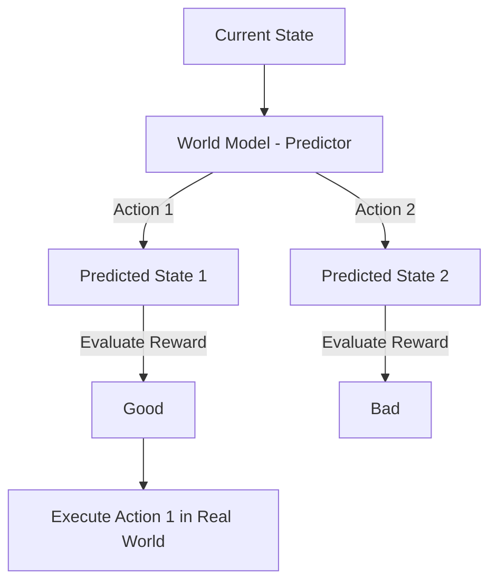

# 🗺️ World Models for Agents: The Internal Simulator
> **Level:** Advanced | **Language:** Hinglish | **Goal:** Master the concepts of how AI agents build an internal mental map of the world to predict consequences before taking actions.

---

## 🧭 1. Beginner-friendly Hinglish Explanation
World Model ka matlab hai "Agent ke dimaag ke andar ka sheesha". Sochiye aap aankhein band karke soch sakte hain ki "Agar main glass phenkunga toh wo toot jayega". Aapko glass phenkne ki zarurat nahi hai use janne ke liye. AI Agent ke liye World Model wahi "Andruni Soch" hai. Wo action lene se pehle "Simulate" karta hai ki uska kya asar hoga. Isse agent be-fuzool ki galtiyan karne se bachta hai aur smart decisions leta hai.

---

## 🧠 2. Deep Technical Explanation
A World Model is an internal representation of the environment's dynamics:
1. **Transition Model:** $P(s_{t+1} | s_t, a_t)$—Predicting the next state $s_{t+1}$ given current state $s_t$ and action $a_t$.
2. **Reward Model:** Predicting the reward or utility of reaching a state.
3. **Observation Model:** Predicting what the environment will look like in the future.
**Key Paper:** **"World Models" (Ha & Schmidhuber)**—where an agent is trained inside its own hallucination of the world. In 2026, agents use World Models to perform "Monte Carlo Tree Search" (MCTS) for complex planning.

---

## 🏗️ 3. Real-world Analogies
World Model ek **Chess player** ki tarah hai.
- Player board par move karne se pehle dimaag mein 5 moves aage ka sochta hai (Simulation).
- "Agar main ye karunga, toh wo ye karega, fir ye hoga".
- Jab dimaag mein plan "Success" lagta hai, tab wo asli move chalta hai.

---

## 📊 4. Architecture Diagrams (The Predictive Brain)


---

## 💻 5. Production-ready Examples (Predictive Reasoning Prompt)
```python
# 2026 Standard: Simulating Outcome before Execution
def simulate_outcome(current_state, proposed_action):
    prompt = f"""
    Current World State: {current_state}
    Proposed Action: {proposed_action}
    Predict:
    1. What will be the new state of the world?
    2. What are the potential risks?
    3. Is this action likely to succeed?
    """
    prediction = world_model_llm.invoke(prompt)
    return prediction

# The agent only calls the real API if prediction is positive.
```

---

## ❌ 6. Failure Cases
- **Over-Confidence:** Agent ke world model ko lag raha hai action work karega par real world dynamics alag hain (Model bias).
- **Infinite Simulation:** Agent sirf soch hi raha hai aur "Analysis Paralysis" mein phans gaya hai, kabhi action hi nahi le raha.

---

## 🛠️ 7. Debugging Section
- **Symptom:** Agent is surprised by the tool's result.
- **Check:** **Model Accuracy**. Kya world model ko latest API documentation pata hai? Agar documentation purani hai, toh predictions hamesha galat honge. Use **Dynamic RAG** to update the World Model's knowledge.

---

## ⚖️ 8. Tradeoffs
- **High Simulation Depth:** Better plans par high latency aur cost.
- **Low Simulation Depth:** Fast actions par high error rate.

---

## 🛡️ 9. Security Concerns
- **Hallucinated Safety:** Agent ka world model use bol raha hai ki "Ye command safe hai" (hallucination), par asli mein wo system ko crash kar deti hai. Always use **Hardcoded Guardrails** in addition to the World Model.

---

## 📈 10. Scaling Challenges
- Millions of states ko dimaag mein rakhna impossible hai. Use **Latent Space Representations** (Compressing state into a vector) instead of raw text description.

---

## 💸 11. Cost Considerations
- Har simulation ek extra LLM call hai. Optimize by simulating only for **High-stakes Actions** (e.g., deleting data, spending money).

---

## ⚠️ 12. Common Mistakes
- World model ko hamesha "Perfect" maanna. (Always assume the model can be wrong).
- Feedback loop na banana (Asli result ko world model update karne ke liye use na karna).

---

## 📝 13. Interview Questions
1. What is the role of a 'Transition Function' in a world model?
2. How does a world model reduce the 'Sample Complexity' of an agent?

---

## ✅ 14. Best Practices
- Every prediction should have a **'Confidence Score'**. If confidence is low, the agent should ask for human help.
- Periodically "Train" the world model on real-world logs of the agent.

---

## 🚀 15. Latest 2026 Industry Patterns
- **Generative World Models:** Agents jo video generation models (jaise Sora) use karte hain to visualize the future state of a physical environment.
- **Unified World Models:** Ek hi bada model jo multiple agents share karte hain as a "Common Knowledge Graph".
