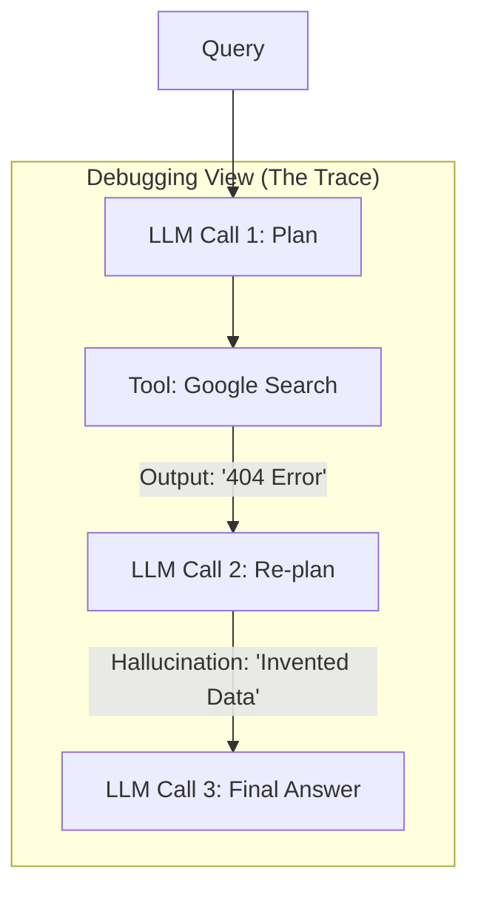

# 🔍 Debugging Agentic Systems: Finding the Ghost in the Machine
> **Level:** Advanced | **Language:** Hinglish | **Goal:** Master the techniques for identifying why an agent failed, where it hallucinated, and how to fix its reasoning loops.

---

## 🧭 1. Beginner-Friendly Hinglish Explanation
Debugging ka matlab hai **"Galti dhoondna aur use theek karna"**.

- **The Problem:** AI agents ke saath problem ye hai ki wo "Black Box" hote hain. Agar wo galat answer dein, toh aapko pata nahi chalta ki:
  - Kya tool galat tha?
  - Kya reasoning galat thi?
  - Kya memory mein koi purani galat baat thi?
- **The Solution:** Humein agent ki **"Internal Thinking"** ko track karna padta hai.
  - Logs dekho: AI ne kya socha?
  - Trace dekho: Pehle kya hua aur baad mein kya?
  - Replay karo: Same sawal ko dobara run karke dekho.

Debugging ek "Detective" (Jasoos) banne jaisa hai jo agent ke dimaag ke andar jaakar galti dhoondta hai.

---

## 🧠 2. Deep Technical Explanation
Debugging agents is unique because of **Non-determinism** (The same input can give different results).

### 1. The Observability Stack (2026):
- **Traces:** A waterfall view of every LLM call, tool call, and state change (LangSmith / Arize Phoenix).
- **Spans:** Timing data for each step. Which part is slow?
- **Metadata:** Tagging runs with `git_commit`, `model_version`, and `user_id`.

### 2. Common Debugging Techniques:
- **Prompt Isolation:** Take the failing step's prompt and run it alone in a Playground to see if the LLM can solve it without the full agent loop.
- **State Inspection:** Look at the **JSON State** right before the failure. Was the context window full? Was a variable named incorrectly?
- **Temperature Testing:** Set `temperature=0` to see if the error is consistent. If it only happens at `temp=0.7`, it's a "Hallucination" issue.

---

## 🏗️ 3. Architecture Diagrams (The Debugging Trace)


---

## 💻 4. Production-Ready Code Example (Using Logging for Debugging)
```python
# 2026 Standard: Implementing structured logging in an agent

import logging
import json

# Set up a logger that captures the agent's 'Internal Thoughts'
logger = logging.getLogger("AgentDebugger")

def run_agent_step(task):
    logger.info(f"🚀 Starting task: {task}")
    
    # 1. Log the RAW prompt sent to LLM
    prompt = build_prompt(task)
    logger.debug(f"📝 Raw Prompt: {prompt}")
    
    # 2. Log the Model's Reasoning
    response = llm.generate(prompt)
    logger.info(f"🧠 Agent Reasoning: {response.thought}")
    
    # 3. Log the Tool Call
    if response.tool_call:
        logger.warning(f"🛠️ Executing Tool: {response.tool_call.name} with {response.tool_call.args}")

# Insight: Using 'DEBUG' for prompts and 'INFO' for reasoning 
# keeps your logs clean but searchable.
```

---

## 🌍 5. Real-World Use Cases
- **Enterprise Search:** Debugging why an agent didn't find a document that clearly exists in the database.
- **Workflow Automation:** Finding out why a "Manager Agent" decided to skip a "QA Step" in the middle of a project.
- **Customer Support:** Investigating why an agent used an "Unprofessional Tone" with a specific customer.

---

## ❌ 6. Failure Cases
- **The Heisenbug:** An error that disappears when you try to debug it (because the LLM output is random).
- **Silent Tool Failure:** A tool returns an empty list `[]`, and the agent assumes there is no data instead of an error.
- **System Message Override:** The agent's "Backstory" is so strong it ignores your "Safety" instructions.

---

## 🛠️ 7. Debugging Guide
| Symptom | Cause | Fix |
| :--- | :--- | :--- |
| **Agent is in an infinite loop** | No 'Termination' token | Check if the agent is outputting `FINAL_ANSWER` or `TERMINATE`. |
| **Agent halluncinates a tool** | Tool name in prompt is vague | Rename the tool to something unique (e.g., `execute_sql_query_v2`). |

---

## ⚖️ 8. Tradeoffs
- **Verbose vs. Concise Logs:** Verbose is better for debugging; Concise is better for performance and storage costs.
- **Production vs. Dev Debugging:** In production, you must redact PII (Personal Info) from logs.

---

## 🛡️ 9. Security Concerns
- **Log Leakage:** Storing raw LLM prompts in logs might expose API keys or user secrets. **Fix: Use a 'Log Masker'.**
- **Debug Mode Abuse:** Leaving "Debug Mode" on in production can be used by attackers to see the system's internal prompts.

---

## 📈 10. Scaling Challenges
- **Massive Trace Volumes:** In a system with 1 million users, you can't log everything. **Solution: Sampling (Log only $1\%$ of successful runs and $100\%$ of failed runs).**

---

## 💸 11. Cost Considerations
- **Tracing Platforms:** Services like LangSmith charge for "Traces." Use open-source alternatives like **Langfuse** for large-scale internal apps.

---

## 📝 12. Interview Questions
1. How do you handle non-deterministic bugs in AI agents?
2. What is a "Trace" and why is it better than a standard log file?
3. How do you debug a context window overflow?

---

## ⚠️ 13. Common Mistakes
- **Not looking at the 'Actual' Prompt:** Relying on the code logic instead of seeing what the LLM actually received.
- **Ignoring the Tool Output:** Assuming the tool worked perfectly just because there was no exception.

---

## ✅ 14. Best Practices
- **Standardize on 'JSON Mode':** It's $10x$ easier to debug structured JSON than messy natural language.
- **Use 'Trace IDs':** Link every log entry back to a single unique session ID.
- **Replay Tool:** Build a tool that can take a failed session ID and "Re-run" it with exactly the same parameters.

---

## 🚀 15. Latest 2026 Industry Patterns
- **LLM-assisted Debugging:** Using an AI agent to "Debug" another AI agent. (The "Debugger Agent").
- **Visual Debuggers:** Browsers for agent traces that let you "Step through" each thought like a VS Code debugger.
- **Negative Prompting for Fixes:** When an agent fails, add a "DO NOT DO X" instruction to the prompt for just that session.
