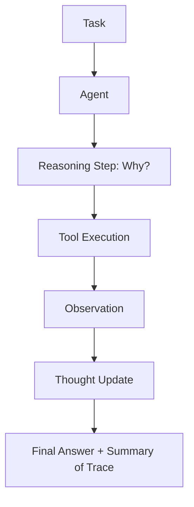

# 🔍 Agent Transparency and Explainability: Building Trust
> **Level:** Intermediate | **Language:** Hinglish | **Goal:** Master the techniques for making an agent's internal reasoning, tool usage, and decision-making processes clear and understandable to humans.

---

## 🧭 1. Beginner-friendly Hinglish Explanation
Transparency aur Explainability ka matlab hai "Agent ka dimaag khol kar dikhana". Sochiye ek bank ne aapka loan reject kar diya aur bola "AI ne kaha hai". Aap gussa honge. Par agar AI bataye: "Aapka loan reject hua kyunki pichle 6 mahine mein aapka balance low tha aur aapne 2 payments miss ki", toh aap use samajh payenge. AI Agents mein hamesha "Kyu?" (Why?) ka jawab hona chahiye. Agent ko dikhana chahiye ki wo kya soch raha hai aur kis basis par faisla le raha hai. Isse users ka "Trust" (Bharosa) badhta hai.

---

## 🧠 2. Deep Technical Explanation
Explainability in agents is implemented through **Chain-of-Thought (CoT)** and **Trace Visualization**:
1. **Internal Monologue:** The agent writes its thoughts in a hidden or visible field before taking an action.
2. **Provenance Tracking:** Documenting exactly which data source (RAG) or tool result led to a specific conclusion.
3. **Saliency Maps (for Visual/Complex models):** Highlighting which parts of the input were most important for the decision.
4. **Natural Language Summarization:** Translating technical logs into a human-readable "Executive Summary" of actions.
**Standard:** Every agent response should ideally include a `reasoning` field in the JSON schema.

---

## 🏗️ 3. Real-world Analogies
Explainability ek **Open-Kitchen Restaurant** ki tarah hai.
- Aap dekh sakte hain chef (Agent) kaunse ingredients use kar raha hai aur khana kaise bana raha hai.
- Agar kuch galat ho, toh aap beech mein bol sakte hain.
- "Closed Kitchen" (Black Box) mein aapko sirf final plate milti hai, jisse trust kam hota hai.

---

## 📊 4. Architecture Diagrams (The Transparent Trace)


---

## 💻 5. Production-ready Examples (The Explainable Schema)
```python
# 2026 Standard: Transparent JSON Response
{
  "thought": "I need to check the company's revenue to calculate the P/E ratio.",
  "action": "search_financials",
  "action_input": {"ticker": "AAPL"},
  "explanation": "Calculated the P/E ratio by dividing current price ($150) by EPS ($5) found in the 10-K report."
}
```

---

## ❌ 6. Failure Cases
- **Post-hoc Rationalization:** Agent ne galti ki, aur jab poocha gaya toh usne "Jhooti explanation" (Hallucination) bana di apni galti chhupane ke liye.
- **TMI (Too Much Information):** Agent ne 10 pages ke technical logs dikha diye, jisse user confuse ho gaya.

---

## 🛠️ 7. Debugging Section
- **Symptom:** The agent's explanation doesn't match its action.
- **Check:** **Thought Persistence**. Kya agent pichli "Thought" bhool gaya? Ensure the `reasoning` history is passed in the context window. Use a **Critic Agent** to verify if the explanation is honest.

---

## ⚖️ 8. Tradeoffs
- **Transparency vs Speed:** Explain karne mein extra tokens aur time lagta hai.
- **Transparency vs IP:** Agar agent sab kuch bata dega, toh shayad company ka "Secret Logic" leak ho jaye.

---

## 🛡️ 9. Security Concerns
- **Explanation Exploitation:** Attacker agent ki "Thought process" dekh kar pehchan sakta hai ki kahan security filters hain aur unhe kaise bypass karna hai.

---

## 📈 10. Scaling Challenges
- Millions of users ke liye detailed logs store karna and visualize karna (e.g., using LangSmith) expensive hai. Use **Sampling** (explain only 5% of runs).

---

## 💸 11. Cost Considerations
- Detailed reasoning 20-30% extra tokens use karti hai. Use it only for **Financial, Legal, or Medical** agents.

---

## ⚠️ 12. Common Mistakes
- Explainability ko sirf "Logs" samajhna. (Explanations must be for humans, not just developers).
- Error messages ko transparent na rakhna.

---

## 📝 13. Interview Questions
1. What is 'Chain-of-Thought' and how does it help with explainability?
2. How do you detect if an agent is lying in its explanation (Self-Rationalization)?

---

## ✅ 14. Best Practices
- Provide a **'Toggle View'**: Simple view for users, "Expert View" with detailed logs for developers.
- Every explanation must cite its **Sources** (Links, documents, API names).

---

## 🚀 15. Latest 2026 Industry Patterns
- **Interactive Explainability:** Users "Why?" pooch sakte hain kisi bhi step par and the agent gives a detailed breakdown.
- **Visual Reasoning Graphs:** Real-time dashboards jo dikhate hain ki agent ka dimaag kaise nodes ke beech move kar raha hai.
