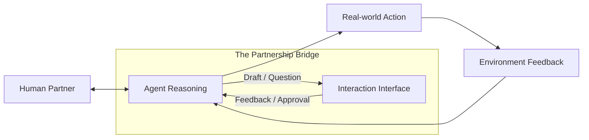

# 🤝 Collaboration Fundamentals: The Human-Agent Partnership
> **Level:** Fundamentals | **Language:** Hinglish | **Goal:** Understand the core principles of how humans and AI agents work together as a team, moving from "Tools" to "Teammates."

---

## 🧭 1. Beginner-Friendly Hinglish Explanation
Collaboration ka matlab hai **"Milkar kaam karna"**.

- **The Shift:** Pehle AI sirf "Command" sunta tha. Ab AI ek **"Partner"** ki tarah hai.
- **The Concept:** 
  - **Task Sharing:** Kuch kaam insaan karega (Creativity, Ethics), kuch AI karega (Data, Speed).
  - **Dynamic Handover:** Jab AI ko doubt ho, toh wo insaan se puche. Jab insaan busy ho, toh AI handle kare.
  - **Feedback:** AI ko batana ki "Tumne ye accha kiya, par ye theek karo."
- **The Result:** Akela insaan slow hai, akela AI galthiyan karta hai. Dono milkar "Unstoppable" hain.

Collaboration AI ko "Safe" aur insaan ko "Powerful" banata hai.

---

## 🧠 2. Deep Technical Explanation
Human-AI Collaboration (HAI) is governed by **Mixed-Initiative Interaction** and **Shared Mental Models**.

### 1. The Interaction Spectrum:
- **Human-Driven:** AI only acts when asked.
- **Agent-Driven:** AI takes charge and only alerts human for approvals.
- **Collaborative:** Both can initiate tasks and suggest changes.

### 2. Shared Context:
For a partnership to work, the agent must understand the human's **Intent**, **Preferences**, and **Constraints**. This is stored in a **Co-pilot Memory Store**.

### 3. Allocation of Autonomy:
Deciding which tasks are **"Autonomous"** (e.g., booking a meeting) and which are **"Supervised"** (e.g., spending $\$1000$).

---

## 🏗️ 3. Architecture Diagrams (The Collaborative Loop)


---

## 💻 4. Production-Ready Code Example (A 'Request Approval' Pattern)
```python
# 2026 Standard: Implementing a collaboration checkpoint

def process_expensive_task(agent, task, threshold=100):
    cost_estimate = agent.estimate_cost(task)
    
    if cost_estimate > threshold:
        # 1. Collaboration Handover
        print(f"💰 Task cost is ${cost_estimate}. Requesting human approval...")
        user_choice = human_gate.ask(f"Do you want to spend ${cost_estimate} for '{task}'?")
        
        if user_choice == "YES":
            return agent.execute(task)
        else:
            return "❌ Task cancelled by human partner."
    else:
        # 2. Fully Autonomous execution
        return agent.execute(task)

# Insight: Clear 'Boundaries' for autonomy build 
# long-term trust between human and agent.
```

---

## 🌍 5. Real-World Use Cases
- **AI Pair Programming:** A developer writing code while the agent suggests fixes and writes tests in real-time.
- **Medical Diagnosis:** An agent analyzing scans and "Discussing" its findings with a doctor before a final report.
- **Enterprise Planning:** A CEO and an agent "Brainstorming" the 2027 strategy using real-time market data.

---

## ❌ 6. Failure Cases
- **The "Nudge" Fatigue:** The agent asks for approval for every tiny thing, making the human want to turn it off.
- **Over-Reliance:** The human stops checking the AI's work, leading to a disaster when the AI eventually fails.
- **Communication Gap:** The agent takes an action but doesn't "Explain" why, leaving the human confused.

---

## 🛠️ 7. Debugging Guide
| Symptom | Cause | Fix |
| :--- | :--- | :--- |
| **Human is ignoring the AI** | Low-quality suggestions | Tweak the **'Confidence Threshold'**; the AI should only speak up when its confidence is $> 90\%$. |
| **AI is 'Interrupting' too much** | Poor turn-taking logic | Implement **'Passive Observations'** where the AI only shows suggestions in a sidebar instead of a pop-up. |

---

## ⚖️ 8. Tradeoffs
- **Full Autonomy (Fast/Cheap/Risky) vs. Collaboration (Slow/Expensive/Safe).**
- **Explicit Feedback (Clear) vs. Implicit Learning (Natural).**

---

## 🛡️ 9. Security Concerns
- **Social Engineering:** An agent "Tricking" its human partner into giving it access to sensitive systems.
- **Shared Account Vulnerability:** If the human's account is hacked, the attacker can also control the powerful agent.

---

## 📈 10. Scaling Challenges
- **One Human, 100 Agents:** How can one person manage a "Team" of agents without getting overwhelmed? **Solution: Use a 'Manager Agent' as the single point of contact.**

---

## 💸 11. Cost Considerations
- **Human Time Cost:** If an agent takes 10 minutes of a human's time to "Explain" itself, it might be more expensive than just doing the task manually.

---

## 📝 12. Interview Questions
1. What is "Human-in-the-loop" (HITL)?
2. How do you design an agent that "Learns" from its human partner's corrections?
3. What is a "Shared Mental Model"?

---

## ⚠️ 13. Common Mistakes
- **No 'Undo' Button:** Not letting the human reverse an agent's action.
- **Technical Jargon:** The agent explaining its reasoning in "Tokens" or "Code" instead of "Natural Language."

---

## ✅ 14. Best Practices
- **Explicit Handovers:** Always be clear about "Who has the ball" (Human or AI).
- **Proactive Reporting:** The agent should give a "Weekly Summary" of its autonomous actions.
- **Mutual Trust:** The human should be able to "See" the agent's logic (Transparency).

---

## 🚀 15. Latest 2026 Industry Patterns
- **Empathy-Aware Collaboration:** Agents that detect the human's "Stress levels" and offer more help when the human is overwhelmed.
- **Multi-modal Collaboration:** Human "Pointing" at a screen and saying "Fix this," and the agent understanding the visual context.
- **Bidirectional Learning:** The human learns new skills from the agent while the agent learns the human's style.
