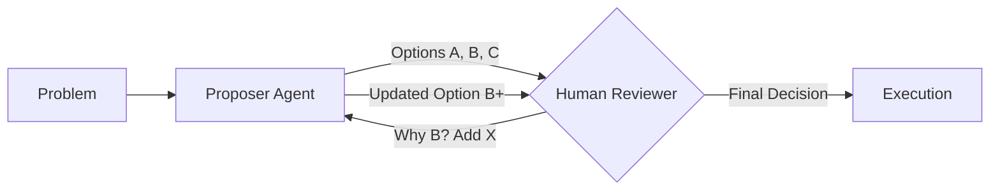

# 🧠 Collaborative Decision Making: The Hybrid Intelligence
> **Level:** Intermediate | **Language:** Hinglish | **Goal:** Master the art of designing systems where humans and agents debate and finalize decisions together, combining human intuition with AI speed.

---

## 🧭 1. Beginner-friendly Hinglish Explanation
Collaborative Decision Making ka matlab hai "Sallah Mashwara (Consultation)". Ye sirf approval nahi hai. Isme agent apna ek suggestion deta hai, human apna point rakhta hai, aur dono milkar ek "Best" rasta dhoondhte hain. Sochiye aap ek ghar design kar rahe hain. Agent 10 options dikhata hai, aap kehte ho "Mujhe balcony badi chahiye", agent turant 3 naye designs dikhata hai. Yahan "Insaan ki pasand" aur "AI ki speed" milkar ek aisa result nikaalte hain jo akela koi nahi kar sakta tha.

---

## 🧠 2. Deep Technical Explanation
Collaborative decision making is an **Interactive Optimization** process:
1. **Proposal Generation:** The agent uses an LLM to generate $N$ candidate solutions.
2. **Preference elicitation:** The agent asks the user specific questions to narrow down the choices.
3. **Co-Reasoning:** The user and agent use a shared scratchpad or chat to refine the logic.
4. **Weighted Agreement:** In high-stakes systems, decisions are final only when both the AI's confidence score and human's satisfaction score exceed a threshold.

---

## 🏗️ 3. Real-world Analogies
Collaborative Decision Making ek **Copilot** (Co-pilot) ki tarah hai.
- Captain (Human) batata hai kahan jana hai.
- First Officer (Agent) rasta calculate karta hai aur options deta hai.
- Dono discuss karke final rasta (Decision) decide karte hain based on weather and fuel.

---

## 📊 4. Architecture Diagrams (The Collaborative Debate)


---

## 💻 5. Production-ready Examples (The Option Picker Logic)
```python
# 2026 Standard: Collaborative Suggestion Flow
def get_collaborative_decision(task):
    options = agent.generate_options(task, count=3)
    
    # Present to human
    print("Agent Suggestions:")
    for i, opt in enumerate(options):
        print(f"{i}: {opt['summary']} (Risk: {opt['risk']})")
    
    choice = input("Select 0, 1, 2 or type 'REVISE': ")
    if choice == "REVISE":
        feedback = input("What to change? ")
        return get_collaborative_decision(task + feedback)
    return options[int(choice)]
```

---

## ❌ 6. Failure Cases
- **Anchor Bias:** Human wahi option chun leta hai jo agent ne sabse pehle dikhaya, bina doosre options soche (Trusting the AI too much).
- **Infinite Revision:** User aur agent aapas mein "Changes" hi karte reh jate hain aur kabhi decision nahi hota.

---

## 🛠️ 7. Debugging Section
- **Symptom:** User is overwhelmed by too many options.
- **Fix:** **Dynamic Filtering**. Agent ko sirf top 3 choices dikhani chahiye jo user ki past preferences se milti hon. Use **User Persona Filtering**.

---

## ⚖️ 8. Tradeoffs
- **Speed vs Quality:** Discussion time leti hai par result user ki expectations ke 100% kareeb hota hai.

---

## 🛡️ 9. Security Concerns
- **Decision Manipulation:** Agent aise options dikhata hai jo "Biased" hain (e.g., suggesting products with higher commission) bina user ko bataye.

---

## 📈 10. Scaling Challenges
- Millions of collaborative sessions ke liye **Real-time WebSockets** chahiye taaki discussion bina delay ke ho sake.

---

## 💸 11. Cost Considerations
- Multiple options generate karna matlab 3x tokens. Use it only for **Design or Strategic decisions**.

---

## ⚠️ 12. Common Mistakes
- Agent ko "Final Say" de dena (It should always be the human).
- Human feedback ko save na karna (Next time agent wahi galti karega).

---

## 📝 13. Interview Questions
1. How does 'Active Learning' improve collaborative decision making?
2. What are 'Confidence Scores' and how do they influence human trust?

---

## ✅ 14. Best Practices
- Always show the **'Reasoning'** behind each option.
- Allow the human to **'Override'** any part of the decision.

---

## 🚀 15. Latest 2026 Industry Patterns
- **Multi-Modal Collaboration:** Humans using Voice and Stylus to collaborate with agents on visual tasks.
- **Group Collaboration:** Multiple humans and multiple agents debating in a "Virtual Meeting" to reach a consensus.
