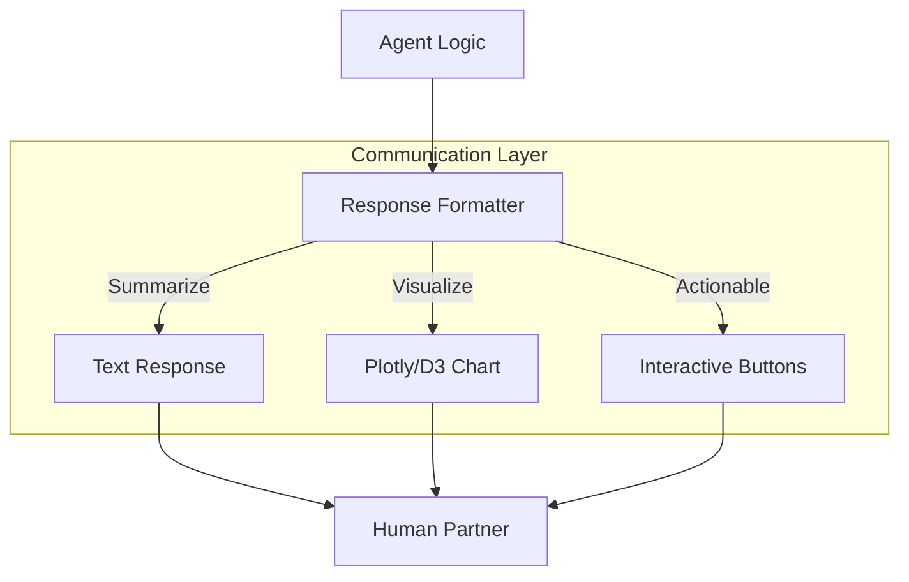

# 🗣️ Communication Protocols with Humans: Language and Clarity
> **Level:** Advanced | **Language:** Hinglish | **Goal:** Master the techniques for agents to communicate effectively with humans, ensuring clarity, brevity, and emotional intelligence in every interaction.

---

## 🧭 1. Beginner-Friendly Hinglish Explanation
Communication Protocols ka matlab hai **"Insaan se baat karne ke tareeke"**.

- **The Problem:** AI aksar ya toh "Zaroorat se zyada" bolta hai ya phir bahut "Technically" baat karta hai.
- **The Solution:** Humein AI ke liye kuch "Rules" (Protocols) chahiye:
  - **Brevity:** Sirf wahi bolo jo zaroori hai.
  - **Clarification:** Agar baat samajh na aaye, toh bina sharmaye puche.
  - **Tone:** Insaan ki "Haalat" (Mood) dekh kar baat karna.
  - **Progress Update:** Kaam karte waqt batana: "Abhi main Step 2 par hoon."
- **The Goal:** AI ke saath baat karna ek "Bojh" nahi, balki "Smooth" hona chahiye.

Acche communication se **Trust** banta hai.

---

## 🧠 2. Deep Technical Explanation
Effective human-agent communication relies on **Conversation Design**, **Context Window Management**, and **Signal-to-Noise Ratio (SNR)**.

### 1. Structure of a Protocol:
- **Greeting:** Establishing the intent.
- **Status Reporting:** "I have successfully fetched the data."
- **Request for Input:** "Which of these 3 options do you prefer?"
- **Acknowledgement:** "Got it, proceeding with Option 2."

### 2. Handling Ambiguity:
Using **Active Listening** patterns. If a user says "Send it," the agent must verify: "Who should I send the report to? (A) Manager, (B) Team, (C) Save as Draft."

### 3. Multi-modal Communication:
Using text, charts, and buttons (UI) together. A chart can explain $1000$ words of data in one second.

---

## 🏗️ 3. Architecture Diagrams (The Communication Stack)


---

## 💻 4. Production-Ready Code Example (A Clarification Loop)
```python
# 2026 Standard: Handling vague instructions with a 'Clarifier'

def communication_manager(user_input):
    confidence = analyzer.check_clarity(user_input)
    
    if confidence < 0.7:
        # Protocol: Ask for clarification instead of guessing
        return "🤔 I'm not entirely sure. Did you mean 'Update the file' or 'Create a new one'?"
    
    # Proceed with execution if clear
    return execute_task(user_input)

# Insight: Asking 'One' question prevents 'Ten' mistakes.
```

---

## 🌍 5. Real-World Use Cases
- **Customer Support:** Agent says "I've escalated your ticket to an engineer, you'll hear back in 2 hours." (Managing expectations).
- **Project Management:** Agent sends a daily "Summary of Actions" to the team Slack.
- **Personal Assistant:** Agent asking "Should I book the flight with a window seat as usual?" (Using memory in communication).

---

## ❌ 6. Failure Cases
- **The "Over-Explainer":** Agent writes 5 paragraphs for a "Yes/No" question.
- **The "Silent" Agent:** Agent is working for 5 minutes but doesn't tell the user anything, so the user thinks it crashed. **Fix: Use 'Streaming' or 'Status Messages'.**
- **Tone-Deafness:** Agent using "Jokes" when the user is reporting a serious financial loss.

---

## 🛠️ 7. Debugging Guide
| Symptom | Cause | Fix |
| :--- | :--- | :--- |
| **User keeps repeating the same question** | Agent's answer was too vague | Use **'Explicit Acknowledgement'** (e.g., "I have noted that you want X"). |
| **User feels overwhelmed** | Too much info at once | Use **'Progressive Disclosure'** (Show a summary first, then a 'Show More' button). |

---

## ⚖️ 8. Tradeoffs
- **Brevity vs. Detail:** Short is fast, but long is more informative.
- **Natural Language vs. Structured UI:** Buttons are faster to click; Text is more flexible.

---

## 🛡️ 9. Security Concerns
- **Social Engineering:** An agent revealing "System Prompts" or "Internal Logic" because the user asked "Nicely."
- **PII Leakage:** Accidentally mentioning another user's name in a conversation.

---

## 📈 10. Scaling Challenges
- **Cultural Communication:** Communicating with users from 10 different countries with different "Politeness" standards.

---

## 💸 11. Cost Considerations
- **Greeting Tokens:** Even "Hello, how can I help you?" costs money. At scale (1M users), this can be $\$1000s$. **Solution: Use 'Static/Cached' greetings.**

---

## 📝 12. Interview Questions
1. How do you handle "Vague" user instructions?
2. What is "Progressive Disclosure" in UI design for agents?
3. How do you implement "Streaming" to reduce perceived latency?

---

## ⚠️ 13. Common Mistakes
- **No 'Status' Updates:** Leaving the user in the dark while the agent is processing a heavy task.
- **Technical jargon:** "I am currently performing a Cosine Similarity search over your Vector DB." (User: "What?").

---

## ✅ 14. Best Practices
- **Confirm Destructive Actions:** Always ask "Are you sure you want to delete this?"
- **Summarize Results:** Don't just say "Done"; say "Done. I have updated 5 files and fixed 2 bugs."
- **Adaptive Tone:** If the user is short and direct, the agent should be short and direct.

---

## 🚀 15. Latest 2026 Industry Patterns
- **Proactive Interjections:** The agent noticing the human is about to make a mistake and saying "Wait, are you sure about this?"
- **Voice-First Protocols:** Designing communication for "Hands-free" use (Siri/Alexa 2.0).
- **Hinglish-Native Agents:** Agents that naturally switch between English and Hindi based on the user's current flow.
