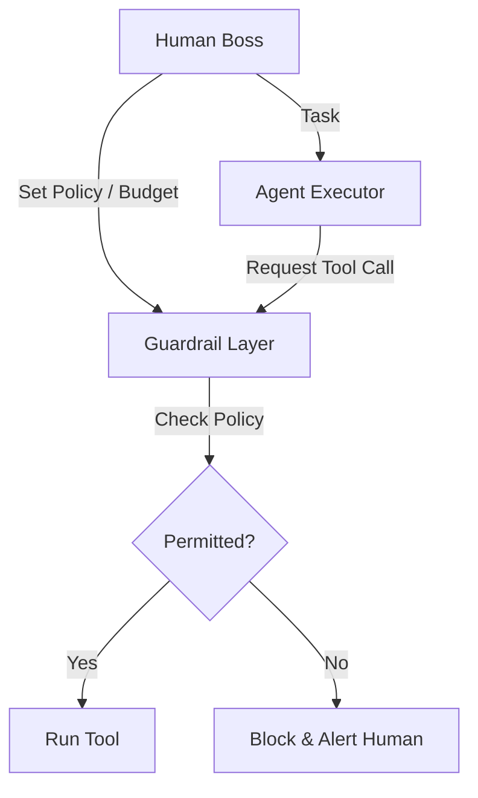

# 🎮 Delegation and Control: Who's the Boss?
> **Level:** Intermediate | **Language:** Hinglish | **Goal:** Master the balance between giving agents freedom (Delegation) and keeping them under human authority (Control).

---

## 🧭 1. Beginner-friendly Hinglish Explanation
Delegation aur Control ka matlab hai "Zimmedari dena aur Hathiyar apne paas rakhna". Sochiye aapne ek driver rakha. Aapne use car ki chabi di (Delegation). Par aapne car mein ek "Speed Governor" lagaya hai aur aap jab chahein brake maar sakte hain (Control). AI Agents mein bhi hum unhe "Tools" aur "Budget" dete hain (Delegation), par hum unhe aisi "Limits" mein rakhte hain ki wo kuch bada nuksan na kar sakein. Sahi delegation wahi hai jahan agent aapse baar-baar na puche, par control wahi hai jahan wo aapki marzi ke khilaf na jaye.

---

## 🧠 2. Deep Technical Explanation
Delegation is managed through **Capability Scoping** and **Policy Enforcement**:
1. **Delegation Level (Level 1-5):**
   - **Level 1:** Only suggestions (No action).
   - **Level 5:** Fully autonomous (High risk).
2. **Access Control (RBAC):** Giving the agent a specific API key with limited permissions (e.g., Read-only access to DB).
3. **Execution Guardrails:** A middle layer that checks every action before it hits the real world.
4. **The Kill Switch:** A global interrupt that stops all agent processes immediately.

---

## 🏗️ 3. Real-world Analogies
Delegation aur Control ek **Credit Card for Kids** ki tarah hai.
- Aapne bacche ko card diya (Delegation).
- Par uski limit ₹1000 hai aur wo sirf grocery store par chalega (Control).

---

## 📊 4. Architecture Diagrams (The Guarded Delegation)


---

## 💻 5. Production-ready Examples (The Budget Guardrail)
```python
# 2026 Standard: Token/Budget Constraint
class ControlLayer:
    def __init__(self, max_tokens=5000):
        self.used_tokens = 0
        self.max_tokens = max_tokens

    def validate_action(self, action_cost):
        if self.used_tokens + action_cost > self.max_tokens:
            return False, "BUDGET_EXCEEDED"
        self.used_tokens += action_cost
        return True, "OK"

# The agent must check this layer before every LLM call.
```

---

## ❌ 6. Failure Cases
- **The Spendthrift Agent:** Agent ne ek hi raat mein $500 ki API calls kar di kyunki koi "Budget Control" nahi tha.
- **Micro-management:** Control itna tight hai ki agent har 1 second mein "Permission" maang raha hai, making it useless.

---

## 🛠️ 7. Debugging Section
- **Symptom:** Agent is being blocked for valid actions.
- **Check:** **Policy Granularity**. Shayad aapki policy bahut "Generic" hai (e.g., "Block all Python scripts"). Ise fine-tune karein (e.g., "Allow Python only in sandbox").

---

## ⚖️ 8. Tradeoffs
- **High Freedom:** Fast completion, High Risk of error.
- **High Control:** High Safety, Low efficiency.

---

## 🛡️ 9. Security Concerns
- **Privilege Escalation via Agent:** Ek attacker agent ko use karke system ka "Admin" access le sakta hai agar delegation logic weak hai. Use **Least Privilege Principle**.

---

## 📈 10. Scaling Challenges
- Thousands of agents ki policies ko "Real-time" update karna and synchronize karna mushkil hai. Use **Centralized Policy Servers** (like OPA - Open Policy Agent).

---

## 💸 11. Cost Considerations
- Guardrail checks extra latencey aur compute add karte hain. Optimize by using **Regex/Heuristic checks** instead of LLM-based checks for simple rules.

---

## ⚠️ 12. Common Mistakes
- Agent ko apni hi chabi (Admin access) de dena.
- Kill-switch na banana.

---

## 📝 13. Interview Questions
1. What is the 'Principle of Least Privilege' in agentic systems?
2. How do you implement 'Soft' vs 'Hard' constraints for an autonomous agent?

---

## ✅ 14. Best Practices
- Every autonomous task must have a **Max Step Limit** (e.g., max 20 steps).
- Periodically **Renew Permissions** (Short-lived tokens).

---

## 🚀 15. Latest 2026 Industry Patterns
- **Policy-as-Code for Agents:** Developers writing Rego/YAML files to define what an agent can and cannot do across the entire company.
- **Dynamic Delegation:** Agents jo "Trust score" earn karte hain. Jitna accha perform karenge, utni zyada delegation unhe milti jayegi.
