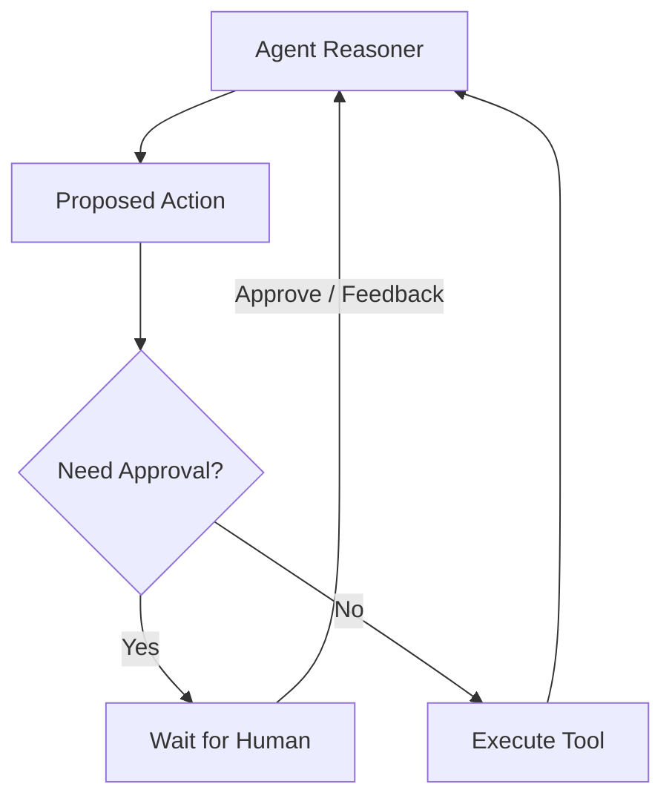

# 🤝 HITL (Human-in-the-Loop) Fundamentals: The Safety Net
> **Level:** Beginner | **Language:** Hinglish | **Goal:** Master the core concepts of building agent systems where humans periodically review, approve, or correct an agent's actions.

---

## 🧭 1. Beginner-friendly Hinglish Explanation
HITL ka matlab hai "Agent ko akele mat chhodo". Sochiye aapne ek naye driver ko car di. Aap bagal wali seat par baithte hain aur break par pair rakhte hain (Safety net). Agar wo galti kare, toh aap handle sambhaal lete hain. AI Agents mein HITL wahi hai. Agent kaam karta hai, par critical steps par (jaise paise transfer karna ya email bhejna) wo ruk jata hai aur aapse "Permission" mangta hai. Isse "Autonomous" power bhi milti hai aur "Safety" bhi bani rehti hai.

---

## 🧠 2. Deep Technical Explanation
Human-in-the-Loop (HITL) architecture involves breaking the autonomous loop for human validation:
1. **Interrupt Pattern:** The agent graph reaches a node that requires approval and enters a `WAIT` state.
2. **State Persistence:** The agent's memory and current plan are saved to a database.
3. **Human Interface:** A UI or CLI where the human can see the agent's "Thought" and "Proposed Action".
4. **Resumption:** Based on human input (`Approve`, `Reject`, `Correct`), the agent resumes from the saved state.
**Modern Standard:** Using **LangGraph's Checkpointers** to implement seamless interrupts and resumes.

---

## 🏗️ 3. Real-world Analogies
HITL ek **Office Manager** ki tarah hai.
- Intern (Agent) report banata hai.
- Manager (Human) use check karta hai aur sign (Approval) karta hai.
- Bina sign ke report client ko nahi jati.

---

## 📊 4. Architecture Diagrams (The Interrupt Loop)


---

## 💻 5. Production-ready Examples (The Interrupt Logic)
```python
# 2026 Standard: HITL with LangGraph
workflow.add_node("human_review", lambda x: x) # Dummy node for waiting

# Define a conditional edge that stops for human review
def should_review(state):
    if state['action_risk'] == "HIGH":
        return "human_review"
    return "execute_tool"

# The graph will pause at 'human_review' until an external input is provided.
```

---

## ❌ 6. Failure Cases
- **Human Fatigue:** Agent har choti baat par approval maang raha hai, jisse human pareshan hokar bina dekhe "Approve" dabane lagta hai (Rubber stamping).
- **Stalled Workflows:** Human busy hai aur agent 3 ghante se wait kar raha hai, jisse business process slow ho gaya.

---

## 🛠️ 7. Debugging Section
- **Symptom:** Agent is not pausing even for high-risk actions.
- **Check:** **Condition Logic**. Kya `action_risk` correctly calculate ho raha hai? Check if the interrupt signal is being bypassed by a default route. Use **Breakpoint Debugging** in your graph.

---

## ⚖️ 8. Tradeoffs
- **Full Autonomy:** High Speed, High Risk.
- **Strict HITL:** Low Speed, Low Risk (Maximum Safety).

---

## 🛡️ 9. Security Concerns
- **Social Engineering:** Agent itni convincing baatein karta hai ki human bina security check kiye use "Permission" de deta hai to access sensitive data.

---

## 📈 10. Scaling Challenges
- 10,000 agents ke liye human reviewers dhoondhna impossible hai. Use **HITL by Exception** (Only top 1% riskiest tasks go to humans).

---

## 💸 11. Cost Considerations
- Human time is the most expensive resource. Minimize human involvement by using **Automated Guardrails** for 90% of tasks.

---

## ⚠️ 12. Common Mistakes
- Context na dikhana human ko (Human ko samajh hi nahi aa raha ki agent ne ye action kyu li).
- "Undo" functionality na rakhna.

---

## 📝 13. Interview Questions
1. What is an 'Interrupt' in a stateful agent graph?
2. How do you decide which actions require Human-in-the-loop?

---

## ✅ 14. Best Practices
- Provide a **'Thought'** summary to the human: "I want to do X because of Y".
- Implement **Timeouts** for human approval (e.g., if no reply in 1 hour, escalate or abort).

---

## 🚀 15. Latest 2026 Industry Patterns
- **Multi-Level Approval:** Simple tasks approved by a Junior Agent, complex ones by a Senior Human.
- **Interactive Correction:** Humans jo agent ke code ya plan ko "Live" edit kar sakte hain resume karne se pehle.
